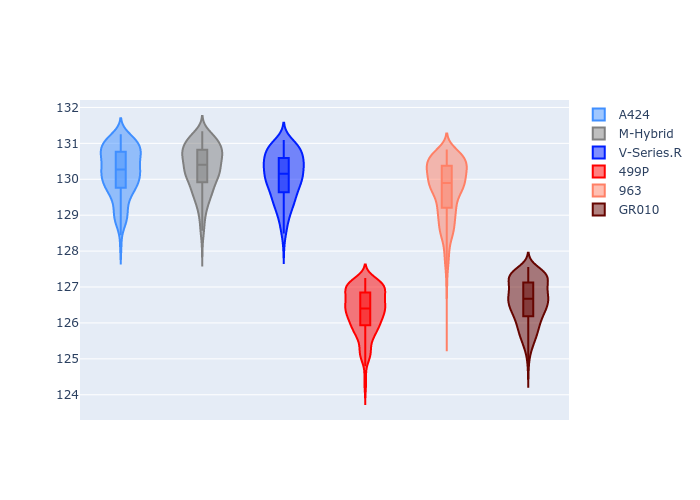
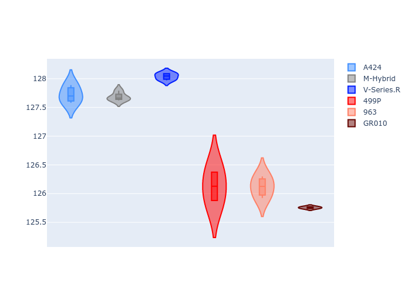
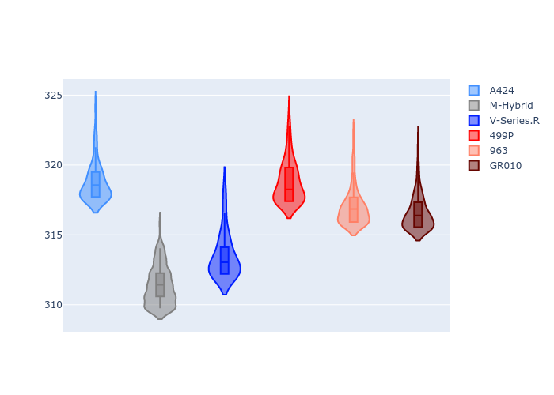
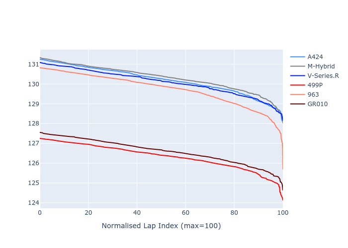

# Combined Plots

## Metadata

- BoP Accuracy: 90.07%
- Overall BoP Grade: A2
- Track: REFERENCETRACK
- Threshhold: 0.0kph
- Average Laptime: 2:09.79
- Average Quali Laptime: 2:06.91
- Laptime Std Dev: 0.41 seconds
- Filtered Average Topspeed: 315.62kph

## BoP Table
| Manufacturer   | Car        | Weight   | Power   | PINC   | E/Stint   | FDS   | RDP    | QDP     | TDP    |
|:---------------|:-----------|:---------|:--------|:-------|:----------|:------|:-------|:--------|:-------|
| Alpine         | A424       | 1030kg   | 520.0kw | -      | 914MJ     | -     | 59.85% | 75.00%  | 8.48%  |
| BMW            | M-Hybrid   | 1030kg   | 520.0kw | -      | 913MJ     | -     | 59.03% | 100.00% | 45.81% |
| Cadillac       | V-Series.R | 1030kg   | 520.0kw | -      | 908MJ     | -     | 58.08% | 80.00%  | 6.60%  |
| Ferrari        | 499P       | 1030kg   | 520.0kw | -      | 912MJ     | -     | 58.46% | 40.00%  | 7.62%  |
| Porsche        | 963        | 1030kg   | 520.0kw | -      | 911MJ     | -     | 53.07% | 100.00% | 7.76%  |
| Toyota         | GR010      | 1030kg   | 520.0kw | -      | 917MJ     | -     | 59.22% | 66.67%  | 14.83% |

## Performance Table
| Manufacturer   | Car        | RP      | QP      | Vavg      |   RDLC | BOP-Grade   | Match   |
|:---------------|:-----------|:--------|:--------|:----------|-------:|:------------|:--------|
| Alpine         | A424       | 2:10.15 | 2:07.72 | 318.35kph |   1.02 | +B2         | 80.15%  |
| BMW            | M-Hybrid   | 2:10.27 | 2:07.69 | 311.00kph |   1.02 | +C1         | 76.86%  |
| Cadillac       | V-Series.R | 2:10.05 | 2:08.04 | 313.15kph |   1.02 | +B1         | 85.57%  |
| Ferrari        | 499P       | 2:09.14 | 2:06.13 | 318.41kph |   1.02 | ~A1         | 98.63%  |
| Porsche        | 963        | 2:09.69 | 2:06.12 | 316.58kph |   1.03 | ~A1         | 99.20%  |
| Toyota         | GR010      | 2:09.42 | 2:05.76 | 316.20kph |   1.03 | ~A1         | 100.00% |

## Race Laptimes

## Quali Laptimes

## Topspeeds

## Laptimes Lineplot

