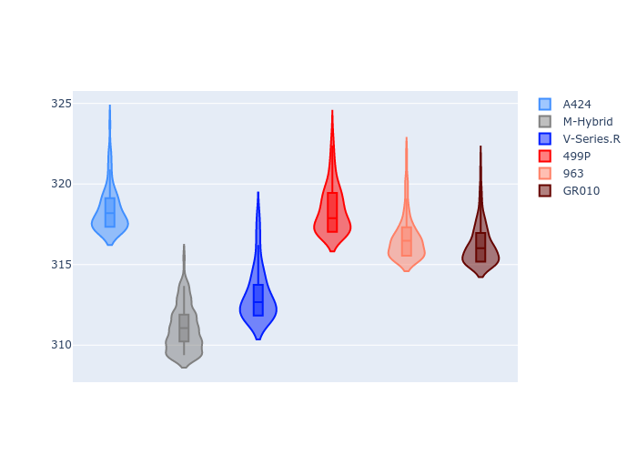

# Combined Plots

## Metadata

- BoP Accuracy: 40.73%
- Overall BoP Grade: Ω1
- Track: REFERENCETRACK
- Threshhold: 0.0kph

## BoP Table
| Manufacturer   | Car        | Weight   | Power   | PINC   | E/Stint   | FDS   | RDP    | QDP     | TDP    |
|:---------------|:-----------|:---------|:--------|:-------|:----------|:------|:-------|:--------|:-------|
| Alpine         | A424       | 1030kg   | 520.0kw | -      | 914MJ     | -     | 60.15% | 75.00%  | 8.48%  |
| BMW            | M-Hybrid   | 1030kg   | 520.0kw | -      | 913MJ     | -     | 59.18% | 100.00% | 45.81% |
| Cadillac       | V-Series.R | 1030kg   | 520.0kw | -      | 908MJ     | -     | 58.08% | 80.00%  | 6.60%  |
| Ferrari        | 499P       | 1030kg   | 520.0kw | -      | 912MJ     | -     | 58.66% | 40.00%  | 7.62%  |
| Porsche        | 963        | 1030kg   | 520.0kw | -      | 911MJ     | -     | 53.25% | 100.00% | 7.76%  |
| Toyota         | GR010      | 1030kg   | 520.0kw | -      | 917MJ     | -     | 59.22% | 66.67%  | 14.83% |

## Performance Table
| Manufacturer   | Car        | RP      | QP      | Vavg      |   RDLC | BOP-Grade   | Match   |
|:---------------|:-----------|:--------|:--------|:----------|-------:|:------------|:--------|
| Alpine         | A424       | 2:10.26 | 2:07.92 | 307.66kph |   1.02 | +Ω1         | 29.75%  |
| BMW            | M-Hybrid   | 2:10.37 | 2:07.88 | 300.56kph |   1.02 | +Ω1         | 23.33%  |
| Cadillac       | V-Series.R | 2:10.10 | 2:08.19 | 302.63kph |   1.01 | +Ω1         | 35.57%  |
| Ferrari        | 499P       | 2:06.32 | 2:03.53 | 307.72kph |   1.02 | -Ω1         | 45.39%  |
| Porsche        | 963        | 2:09.78 | 2:06.29 | 305.94kph |   1.03 | -Ω1         | 48.80%  |
| Toyota         | GR010      | 2:06.63 | 2:03.21 | 305.58kph |   1.03 | -D2         | 61.52%  |

## Race Laptimes

## Quali Laptimes

## Topspeeds

## Laptimes Lineplot

