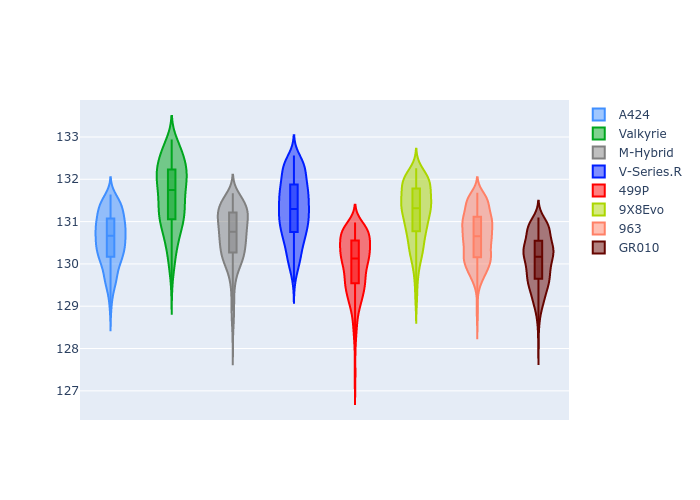
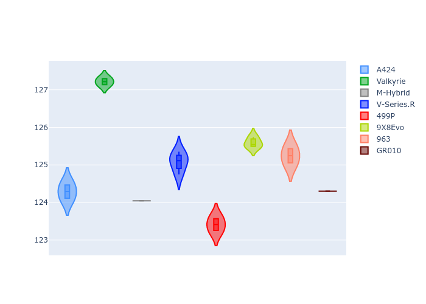
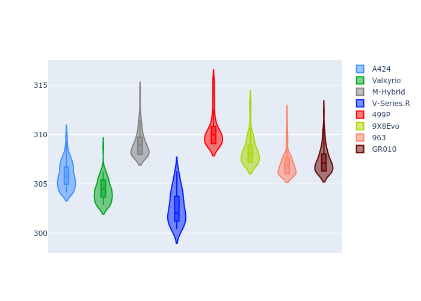
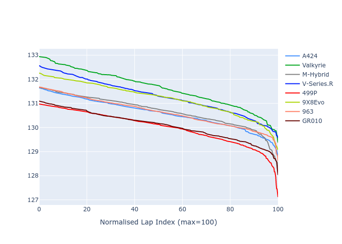

# Combined Plots

## Metadata

- BoP Accuracy: 43.29%
- Overall BoP Grade: Ω1
- Track: REFERENCETRACK
- Threshhold: 0.0kph
- Average Laptime: 2:09.45
- Average Quali Laptime: 2:03.94
- Average Topspeed: 306.84kph

## BoP Table
| Manufacturer   | Car        | Weight   | Power   | PINC   | E/Stint   | FDS   | RDP    | QDP    | TDP    |
|:---------------|:-----------|:---------|:--------|:-------|:----------|:------|:-------|:-------|:-------|
| Alpine         | A424       | 1030kg   | 520.0kw | -      | 919MJ     | -     | 55.21% | 66.67% | 45.96% |
| Aston Martin   | Valkyrie   | 1030kg   | 520.0kw | -      | 911MJ     | -     | 52.31% | 50.00% | 24.40% |
| BMW            | M-Hybrid   | 1030kg   | 520.0kw | -      | 913MJ     | -     | 55.82% | 25.00% | 11.44% |
| Cadillac       | V-Series.R | 1030kg   | 520.0kw | -      | 906MJ     | -     | 52.96% | 66.67% | 14.05% |
| Ferrari        | 499P       | 1030kg   | 520.0kw | -      | 913MJ     | -     | 55.24% | 28.57% | 4.97%  |
| Peugeot        | 9X8Evo     | 1030kg   | 520.0kw | -      | 922MJ     | -     | 51.18% | 60.00% | 11.73% |
| Porsche        | 963        | 1030kg   | 520.0kw | -      | 914MJ     | -     | 55.91% | 40.00% | 13.78% |
| Toyota         | GR010      | 1030kg   | 520.0kw | -      | 912MJ     | -     | 55.35% | 50.00% | 12.01% |

## Performance Table
| Manufacturer   | Car        | RP      | QP      | Vavg      |   RDLC | BOP-Grade   | Match   |
|:---------------|:-----------|:--------|:--------|:----------|-------:|:------------|:--------|
| Alpine         | A424       | 2:10.27 | 2:04.33 | 305.90kph |   1.05 | +D2         | 62.86%  |
| Aston Martin   | Valkyrie   | 2:11.38 | 2:07.26 | 304.22kph |   1.03 | +Ω1         | 14.86%  |
| BMW            | M-Hybrid   | 2:10.50 | 2:04.08 | 308.97kph |   1.05 | +Ω1         | 47.04%  |
| Cadillac       | V-Series.R | 2:11.26 | 2:05.12 | 302.70kph |   1.05 | +Ω1         | 17.52%  |
| Ferrari        | 499P       | 2:06.83 | 2:00.83 | 310.30kph |   1.05 | -Ω1         | 29.22%  |
| Peugeot        | 9X8Evo     | 2:08.08 | 2:02.92 | 308.37kph |   1.04 | -B1         | 85.54%  |
| Porsche        | 963        | 2:10.35 | 2:05.28 | 306.90kph |   1.04 | +E1         | 58.30%  |
| Toyota         | GR010      | 2:06.95 | 2:01.69 | 307.35kph |   1.04 | -Ω1         | 30.97%  |

## Race Laptimes

## Quali Laptimes

## Topspeeds

## Laptimes Lineplot

