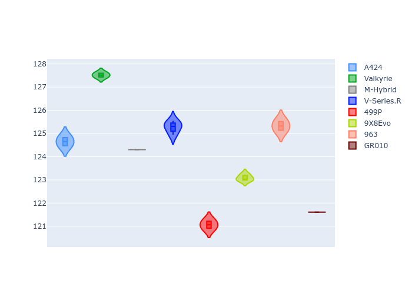
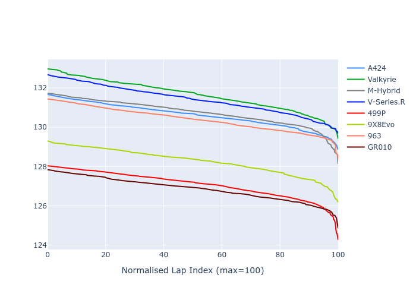

# Combined Plots

## Metadata

- BoP Accuracy: 42.28%
- Overall BoP Grade: Ω1
- Track: REFERENCETRACK
- Threshhold: 0.0kph

## BoP Table
| Manufacturer   | Car        | Weight   | Power   | PINC   | E/Stint   | FDS   | RDP    | QDP    | TDP    |
|:---------------|:-----------|:---------|:--------|:-------|:----------|:------|:-------|:-------|:-------|
| Alpine         | A424       | 1030kg   | 520.0kw | -      | 919MJ     | -     | 55.36% | 66.67% | 45.96% |
| Aston Martin   | Valkyrie   | 1030kg   | 520.0kw | -      | 911MJ     | -     | 52.31% | 50.00% | 24.40% |
| BMW            | M-Hybrid   | 1030kg   | 520.0kw | -      | 913MJ     | -     | 55.82% | 25.00% | 11.44% |
| Cadillac       | V-Series.R | 1030kg   | 520.0kw | -      | 906MJ     | -     | 52.64% | 66.67% | 14.05% |
| Ferrari        | 499P       | 1030kg   | 520.0kw | -      | 913MJ     | -     | 55.14% | 28.57% | 4.97%  |
| Peugeot        | 9X8Evo     | 1030kg   | 520.0kw | -      | 921MJ     | -     | 51.34% | 60.00% | 11.73% |
| Porsche        | 963        | 1030kg   | 520.0kw | -      | 914MJ     | -     | 55.80% | 40.00% | 13.78% |
| Toyota         | GR010      | 1030kg   | 520.0kw | -      | 913MJ     | -     | 55.35% | 50.00% | 12.01% |

## Performance Table
| Manufacturer   | Car        | RP      | QP      | Vavg      |   RDLC | BOP-Grade   | Match   |
|:---------------|:-----------|:--------|:--------|:----------|-------:|:------------|:--------|
| Alpine         | A424       | 2:09.25 | 2:03.13 | 307.72kph |   1.05 | +E1         | 59.83%  |
| Aston Martin   | Valkyrie   | 2:10.32 | 2:06.00 | 306.06kph |   1.03 | +Ω1         | 14.86%  |
| BMW            | M-Hybrid   | 2:09.43 | 2:02.84 | 310.83kph |   1.05 | +Ω1         | 46.76%  |
| Cadillac       | V-Series.R | 2:10.14 | 2:03.84 | 304.55kph |   1.05 | +Ω1         | 19.15%  |
| Ferrari        | 499P       | 2:05.75 | 1:59.60 | 312.16kph |   1.05 | -Ω1         | 27.95%  |
| Peugeot        | 9X8Evo     | 2:07.05 | 2:01.70 | 310.17kph |   1.04 | -B1         | 85.58%  |
| Porsche        | 963        | 2:09.29 | 2:04.04 | 308.75kph |   1.04 | +E1         | 57.09%  |
| Toyota         | GR010      | 2:05.85 | 2:00.43 | 309.23kph |   1.05 | -Ω1         | 26.99%  |

## Race Laptimes

## Quali Laptimes

## Topspeeds

## Laptimes Lineplot

