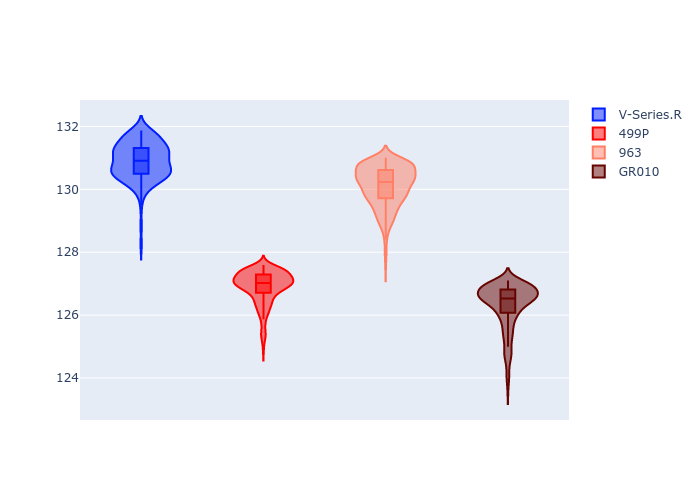
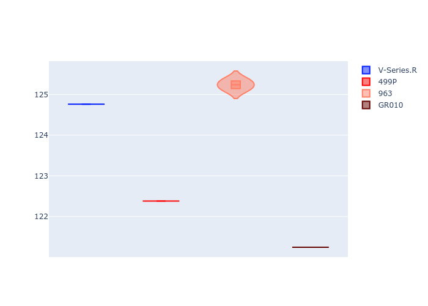
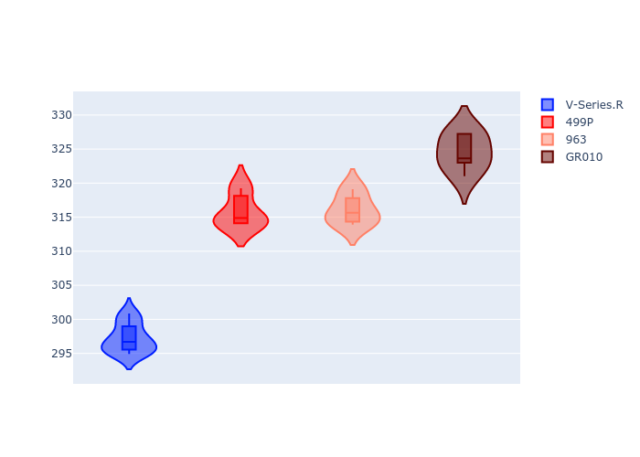
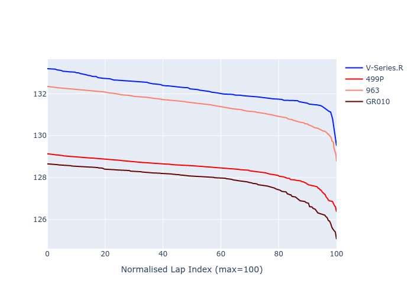

# Combined Plots

## Metadata

- BoP Accuracy: 46.55%
- Overall BoP Grade: Ω1
- Track: REFERENCETRACK
- Threshhold: 0.0kph

## BoP Table
| Manufacturer   | Car        | Weight   | Power   | PINC   | E/Stint   | FDS   | RDP    | QDP    | TDP    |
|:---------------|:-----------|:---------|:--------|:-------|:----------|:------|:-------|:-------|:-------|
| Cadillac       | V-Series.R | 1030kg   | 520.0kw | -      | 910MJ     | -     | 60.57% | 33.33% | 10.98% |
| Ferrari        | 499P       | 1030kg   | 520.0kw | -      | 909MJ     | -     | 57.14% | 33.33% | 1.36%  |
| Porsche        | 963        | 1030kg   | 520.0kw | -      | 913MJ     | -     | 55.60% | 40.00% | 0.77%  |
| Toyota         | GR010      | 1030kg   | 520.0kw | -      | 912MJ     | -     | 49.40% | 25.00% | 0.99%  |

## Performance Table
| Manufacturer   | Car        | RP      | QP      | Vavg      |   RDLC | BOP-Grade   | Match   |
|:---------------|:-----------|:--------|:--------|:----------|-------:|:------------|:--------|
| Cadillac       | V-Series.R | 2:10.90 | 2:03.52 | 287.36kph |   1.06 | +Ω1         | 1.34%   |
| Ferrari        | 499P       | 2:06.90 | 2:00.93 | 305.36kph |   1.05 | -A2         | 93.31%  |
| Porsche        | 963        | 2:10.11 | 2:03.97 | 305.62kph |   1.05 | +Ω1         | 14.70%  |
| Toyota         | GR010      | 2:06.31 | 1:59.80 | 313.83kph |   1.05 | -C1         | 76.83%  |

## Race Laptimes

## Quali Laptimes

## Topspeeds

## Laptimes Lineplot

