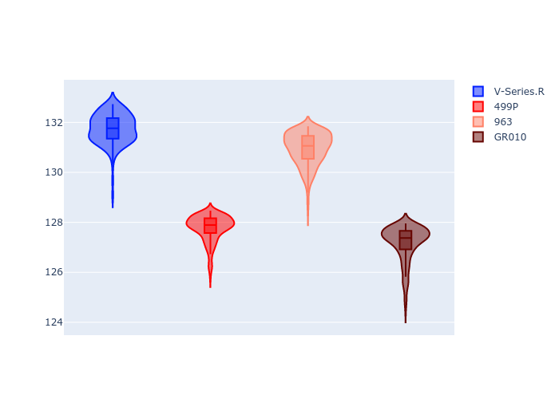
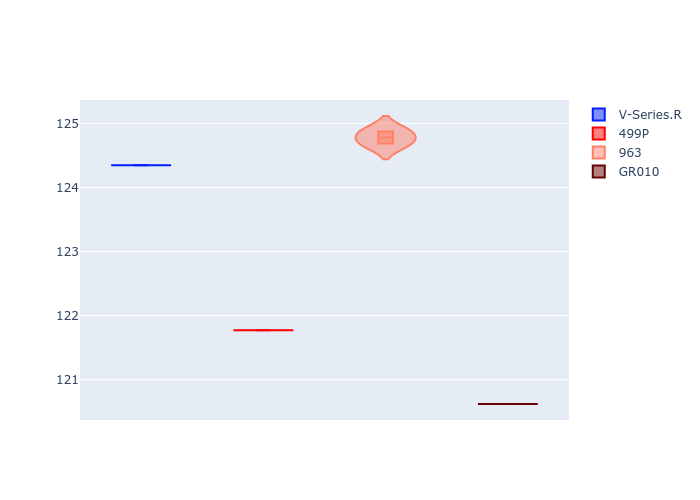
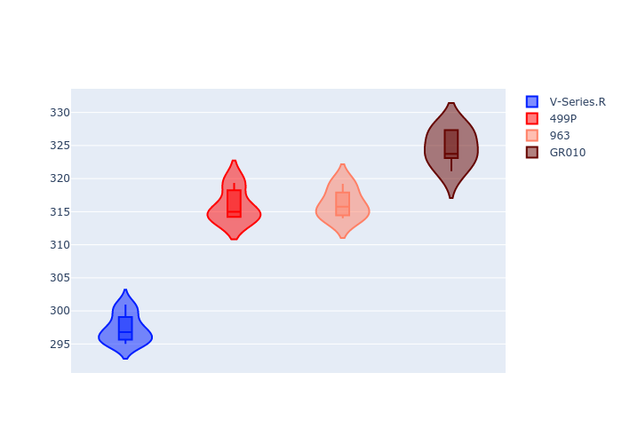
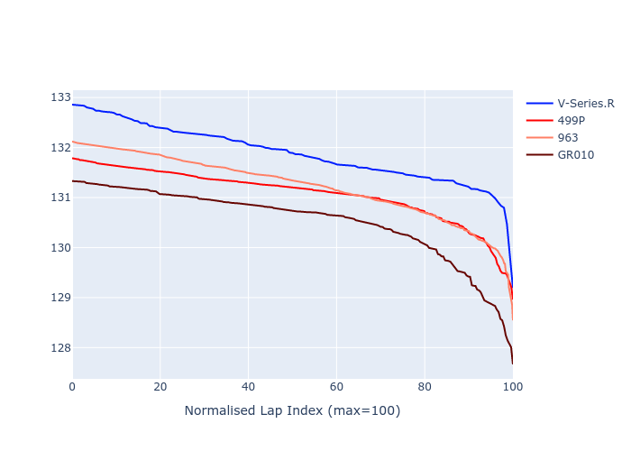

# Combined Plots

## Metadata

- BoP Accuracy: 82.37%
- Overall BoP Grade: B2
- Track: REFERENCETRACK
- Threshhold: 0.0kph
- Average Laptime: 2:10.79
- Average Quali Laptime: 2:04.13
- Laptime Std Dev: 0.63 seconds
- Filtered Average Topspeed: 313.41kph

## BoP Table
| Manufacturer   | Car        | Weight   | Power   | PINC   | E/Stint   | FDS   | RDP    | QDP    | TDP    |
|:---------------|:-----------|:---------|:--------|:-------|:----------|:------|:-------|:-------|:-------|
| Cadillac       | V-Series.R | 1030kg   | 520.0kw | -      | 910MJ     | -     | 60.57% | 33.33% | 10.98% |
| Ferrari        | 499P       | 1030kg   | 520.0kw | -      | 909MJ     | -     | 57.14% | 33.33% | 1.36%  |
| Porsche        | 963        | 1030kg   | 520.0kw | -      | 913MJ     | -     | 55.80% | 40.00% | 0.77%  |
| Toyota         | GR010      | 1030kg   | 520.0kw | -      | 912MJ     | -     | 49.80% | 25.00% | 0.99%  |

## Performance Table
| Manufacturer   | Car        | RP      | QP      | Vavg      |   RDLC | BOP-Grade   | Match   |
|:---------------|:-----------|:--------|:--------|:----------|-------:|:------------|:--------|
| Cadillac       | V-Series.R | 2:11.71 | 2:04.31 | 297.20kph |   1.06 | +Ω1         | 45.64%  |
| Ferrari        | 499P       | 2:10.59 | 2:04.33 | 315.81kph |   1.05 | ~A1         | 100.00% |
| Porsche        | 963        | 2:10.91 | 2:04.74 | 316.08kph |   1.05 | +B1         | 87.88%  |
| Toyota         | GR010      | 2:09.96 | 2:03.13 | 324.57kph |   1.06 | ~A1         | 95.97%  |

## Race Laptimes

## Quali Laptimes

## Topspeeds

## Laptimes Lineplot

