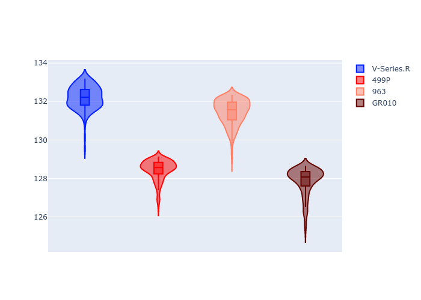

# Combined Plots

## Metadata

- BoP Accuracy: 48.16%
- Overall BoP Grade: Ω1
- Track: REFERENCETRACK
- Threshhold: 0.0kph
- Average Laptime: 2:09.99
- Average Quali Laptime: 2:03.41
- Average Topspeed: 313.40kph

## BoP Table
| Manufacturer   | Car        | Weight   | Power   | PINC   | E/Stint   | FDS   | RDP    | QDP    | TDP    |
|:---------------|:-----------|:---------|:--------|:-------|:----------|:------|:-------|:-------|:-------|
| Cadillac       | V-Series.R | 1030kg   | 520.0kw | -      | 910MJ     | -     | 60.57% | 33.33% | 10.98% |
| Ferrari        | 499P       | 1030kg   | 520.0kw | -      | 909MJ     | -     | 57.14% | 33.33% | 1.36%  |
| Porsche        | 963        | 1030kg   | 520.0kw | -      | 913MJ     | -     | 55.80% | 40.00% | 0.77%  |
| Toyota         | GR010      | 1030kg   | 520.0kw | -      | 912MJ     | -     | 49.80% | 25.00% | 0.99%  |

## Performance Table
| Manufacturer   | Car        | RP      | QP      | Vavg      |   RDLC | BOP-Grade   | Match   |
|:---------------|:-----------|:--------|:--------|:----------|-------:|:------------|:--------|
| Cadillac       | V-Series.R | 2:12.21 | 2:04.76 | 297.19kph |   1.06 | +Ω1         | 2.01%   |
| Ferrari        | 499P       | 2:08.44 | 2:02.38 | 315.80kph |   1.05 | -A2         | 94.01%  |
| Porsche        | 963        | 2:11.45 | 2:05.24 | 316.07kph |   1.05 | +Ω1         | 17.18%  |
| Toyota         | GR010      | 2:07.86 | 2:01.24 | 324.56kph |   1.05 | -C1         | 79.44%  |

## Race Laptimes

## Quali Laptimes

## Topspeeds

## Laptimes Lineplot

