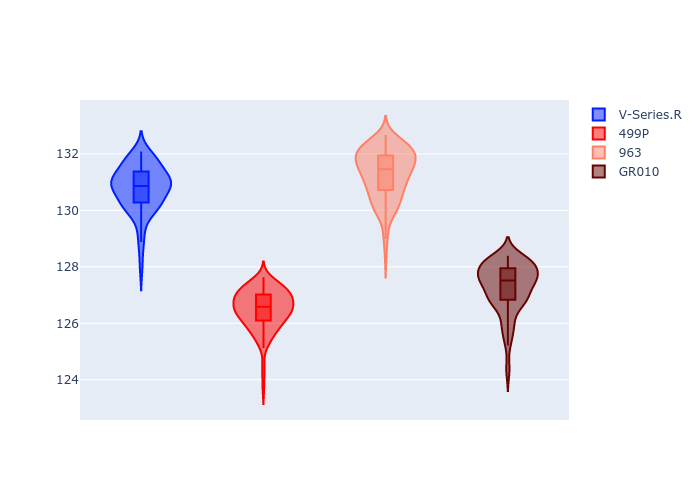
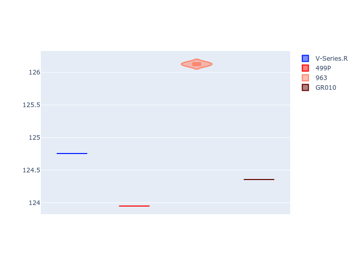
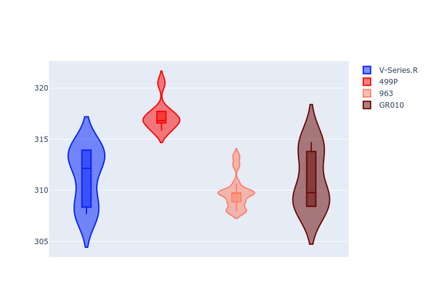
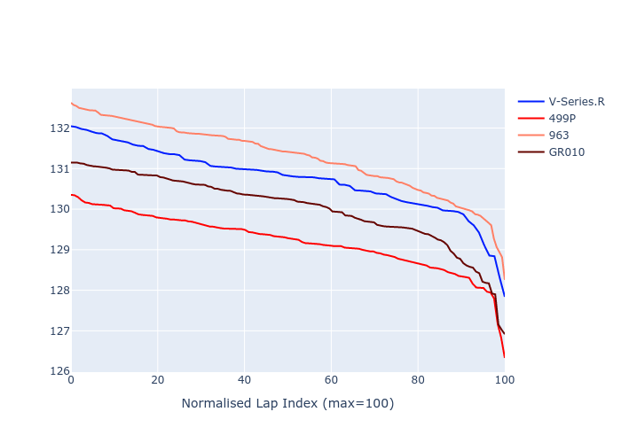

# Combined Plots

## Metadata

- BoP Accuracy: 84.75%
- Overall BoP Grade: B2
- Track: REFERENCETRACK
- Threshhold: 0.0kph
- Average Laptime: 2:10.44
- Average Quali Laptime: 2:04.92
- Laptime Std Dev: 0.71 seconds
- Filtered Average Topspeed: 312.61kph

## BoP Table
| Manufacturer   | Car        | Weight   | Power   | PINC   | E/Stint   | FDS   | RDP    | QDP    | TDP   |
|:---------------|:-----------|:---------|:--------|:-------|:----------|:------|:-------|:-------|:------|
| Cadillac       | V-Series.R | 1030kg   | 520.0kw | -      | 910MJ     | -     | 45.45% | 25.00% | 7.98% |
| Ferrari        | 499P       | 1030kg   | 520.0kw | -      | 907MJ     | -     | 48.43% | 25.00% | 3.21% |
| Porsche        | 963        | 1030kg   | 520.0kw | -      | 912MJ     | -     | 46.26% | 50.00% | 7.18% |
| Toyota         | GR010      | 1030kg   | 520.0kw | -      | 910MJ     | -     | 46.44% | 50.00% | 3.26% |

## Performance Table
| Manufacturer   | Car        | RP      | QP      | Vavg      |   RDLC | BOP-Grade   | Match   |
|:---------------|:-----------|:--------|:--------|:----------|-------:|:------------|:--------|
| Cadillac       | V-Series.R | 2:10.82 | 2:04.83 | 311.58kph |   1.05 | +B1         | 85.88%  |
| Ferrari        | 499P       | 2:09.44 | 2:04.16 | 317.49kph |   1.04 | ~A1         | 97.56%  |
| Porsche        | 963        | 2:11.33 | 2:06.18 | 310.00kph |   1.04 | +E1         | 57.76%  |
| Toyota         | GR010      | 2:10.18 | 2:04.50 | 311.38kph |   1.05 | ~A1         | 97.81%  |

## Race Laptimes

## Quali Laptimes

## Topspeeds

## Laptimes Lineplot

