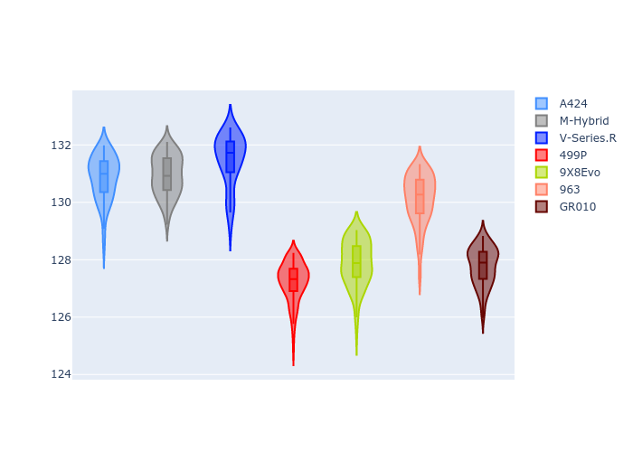
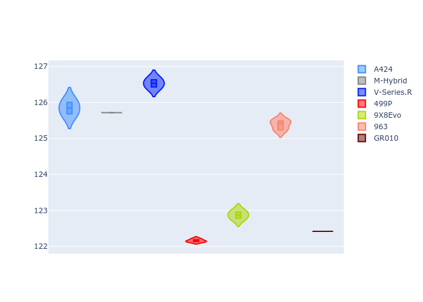
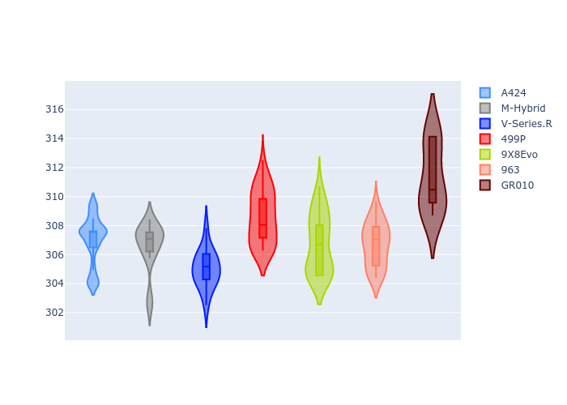
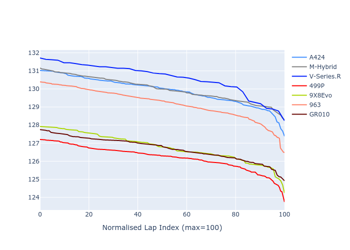

# Combined Plots

## Metadata

- BoP Accuracy: 53.92%
- Overall BoP Grade: E2
- Track: REFERENCETRACK
- Threshhold: 0.0kph
- Average Laptime: 2:09.47
- Average Quali Laptime: 2:05.76
- Average Topspeed: 314.99kph

## BoP Table
| Manufacturer   | Car        | Weight   | Power   | PINC   | E/Stint   | FDS   | RDP    | QDP    | TDP    |
|:---------------|:-----------|:---------|:--------|:-------|:----------|:------|:-------|:-------|:-------|
| Alpine         | A424       | 1030kg   | 520.0kw | -      | 918MJ     | -     | 46.62% | 33.33% | 11.90% |
| BMW            | M-Hybrid   | 1030kg   | 520.0kw | -      | 915MJ     | -     | 46.79% | 16.67% | 5.10%  |
| Cadillac       | V-Series.R | 1030kg   | 520.0kw | -      | 913MJ     | -     | 44.21% | 33.33% | 13.45% |
| Ferrari        | 499P       | 1030kg   | 520.0kw | -      | 910MJ     | -     | 45.63% | 33.33% | 11.42% |
| Peugeot        | 9X8Evo     | 1030kg   | 520.0kw | -      | 917MJ     | -     | 47.67% | 50.00% | 13.86% |
| Porsche        | 963        | 1030kg   | 520.0kw | -      | 915MJ     | -     | 46.37% | 75.00% | 11.50% |
| Toyota         | GR010      | 1030kg   | 520.0kw | -      | 918MJ     | -     | 47.52% | 16.67% | 3.83%  |

## Performance Table
| Manufacturer   | Car        | RP      | QP      | Vavg      |   RDLC | BOP-Grade   | Match   |
|:---------------|:-----------|:--------|:--------|:----------|-------:|:------------|:--------|
| Alpine         | A424       | 2:10.86 | 2:07.17 | 314.56kph |   1.03 | +Ω1         | 34.35%  |
| BMW            | M-Hybrid   | 2:10.93 | 2:07.01 | 314.17kph |   1.03 | +Ω1         | 34.35%  |
| Cadillac       | V-Series.R | 2:11.48 | 2:07.79 | 312.53kph |   1.03 | +Ω1         | 16.67%  |
| Ferrari        | 499P       | 2:07.23 | 2:03.52 | 316.20kph |   1.03 | -D2         | 62.18%  |
| Peugeot        | 9X8Evo     | 2:07.87 | 2:04.31 | 314.30kph |   1.03 | -B2         | 81.95%  |
| Porsche        | 963        | 2:10.12 | 2:06.68 | 314.25kph |   1.03 | +D1         | 65.84%  |
| Toyota         | GR010      | 2:07.77 | 2:03.82 | 318.93kph |   1.03 | -B2         | 82.09%  |

## Race Laptimes

## Quali Laptimes

## Topspeeds

## Laptimes Lineplot

