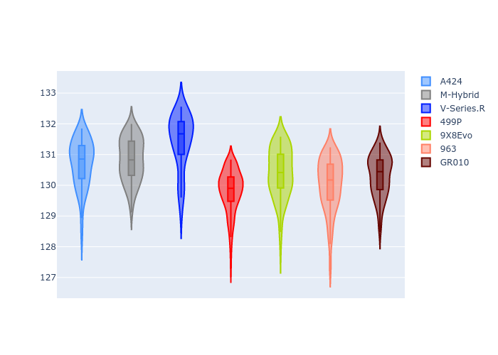
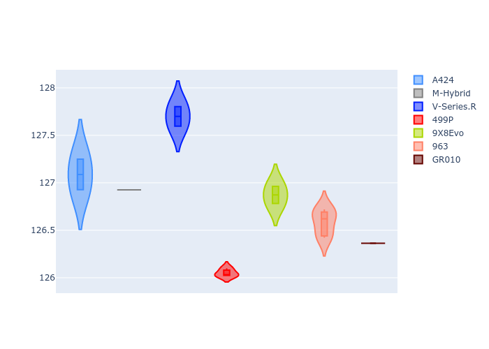
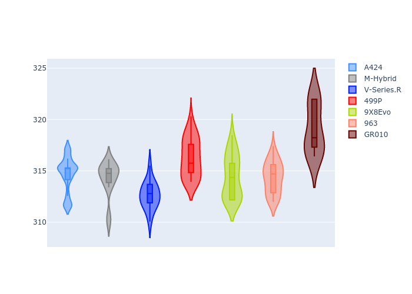
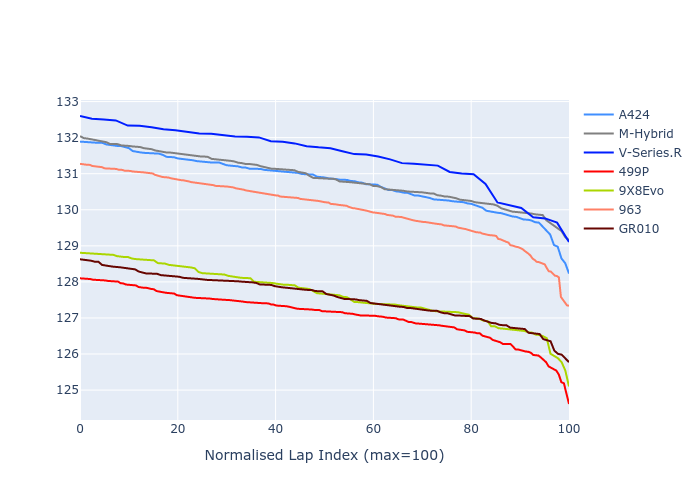

# Combined Plots

## Metadata

- BoP Accuracy: 88.97%
- Overall BoP Grade: B1
- Track: REFERENCETRACK
- Threshhold: 0.0kph
- Average Laptime: 2:10.73
- Average Quali Laptime: 2:06.94
- Laptime Std Dev: 0.40 seconds
- Filtered Average Topspeed: 315.36kph

## BoP Table
| Manufacturer   | Car        | Weight   | Power   | PINC   | E/Stint   | FDS   | RDP    | QDP    | TDP    |
|:---------------|:-----------|:---------|:--------|:-------|:----------|:------|:-------|:-------|:-------|
| Alpine         | A424       | 1030kg   | 520.0kw | -      | 918MJ     | -     | 46.62% | 33.33% | 11.90% |
| BMW            | M-Hybrid   | 1030kg   | 520.0kw | -      | 915MJ     | -     | 46.79% | 16.67% | 5.10%  |
| Cadillac       | V-Series.R | 1030kg   | 520.0kw | -      | 913MJ     | -     | 44.21% | 33.33% | 13.45% |
| Ferrari        | 499P       | 1030kg   | 520.0kw | -      | 910MJ     | -     | 45.63% | 33.33% | 11.42% |
| Peugeot        | 9X8Evo     | 1030kg   | 520.0kw | -      | 917MJ     | -     | 47.67% | 50.00% | 13.86% |
| Porsche        | 963        | 1030kg   | 520.0kw | -      | 915MJ     | -     | 46.37% | 75.00% | 11.50% |
| Toyota         | GR010      | 1030kg   | 520.0kw | -      | 918MJ     | -     | 47.52% | 16.67% | 3.83%  |

## Performance Table
| Manufacturer   | Car        | RP      | QP      | Vavg      |   RDLC | BOP-Grade   | Match   |
|:---------------|:-----------|:--------|:--------|:----------|-------:|:------------|:--------|
| Alpine         | A424       | 2:10.87 | 2:07.17 | 314.93kph |   1.03 | -A2         | 90.08%  |
| BMW            | M-Hybrid   | 2:11.02 | 2:07.09 | 314.54kph |   1.03 | +B1         | 87.02%  |
| Cadillac       | V-Series.R | 2:11.40 | 2:07.71 | 312.89kph |   1.03 | +D2         | 61.90%  |
| Ferrari        | 499P       | 2:10.16 | 2:06.27 | 316.57kph |   1.03 | ~A1         | 97.93%  |
| Peugeot        | 9X8Evo     | 2:10.83 | 2:07.09 | 314.67kph |   1.03 | -B1         | 88.72%  |
| Porsche        | 963        | 2:10.29 | 2:06.83 | 314.62kph |   1.03 | ~A1         | 97.12%  |
| Toyota         | GR010      | 2:10.52 | 2:06.40 | 319.30kph |   1.03 | ~A1         | 100.00% |

## Race Laptimes

## Quali Laptimes

## Topspeeds

## Laptimes Lineplot

