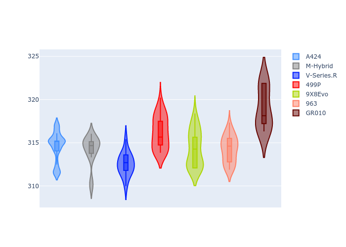

# Combined Plots

## Metadata

- BoP Accuracy: 51.04%
- Overall BoP Grade: E2
- Track: REFERENCETRACK
- Threshhold: 0.0kph

## BoP Table
| Manufacturer   | Car        | Weight   | Power   | PINC   | E/Stint   | FDS   | RDP    | QDP    | TDP    |
|:---------------|:-----------|:---------|:--------|:-------|:----------|:------|:-------|:-------|:-------|
| Alpine         | A424       | 1030kg   | 520.0kw | -      | 918MJ     | -     | 46.98% | 33.33% | 11.90% |
| BMW            | M-Hybrid   | 1030kg   | 520.0kw | -      | 915MJ     | -     | 46.79% | 16.67% | 5.10%  |
| Cadillac       | V-Series.R | 1030kg   | 520.0kw | -      | 913MJ     | -     | 44.21% | 33.33% | 13.45% |
| Ferrari        | 499P       | 1030kg   | 520.0kw | -      | 910MJ     | -     | 45.63% | 33.33% | 11.42% |
| Peugeot        | 9X8Evo     | 1030kg   | 520.0kw | -      | 917MJ     | -     | 47.67% | 50.00% | 13.86% |
| Porsche        | 963        | 1030kg   | 520.0kw | -      | 915MJ     | -     | 46.37% | 75.00% | 11.50% |
| Toyota         | GR010      | 1030kg   | 520.0kw | -      | 918MJ     | -     | 47.52% | 16.67% | 3.83%  |

## Performance Table
| Manufacturer   | Car        | RP      | QP      | Vavg      |   RDLC | BOP-Grade   | Match   |
|:---------------|:-----------|:--------|:--------|:----------|-------:|:------------|:--------|
| Alpine         | A424       | 2:09.91 | 2:05.84 | 306.98kph |   1.03 | +Ω1         | 32.58%  |
| BMW            | M-Hybrid   | 2:10.00 | 2:05.71 | 306.60kph |   1.03 | +Ω1         | 29.77%  |
| Cadillac       | V-Series.R | 2:10.59 | 2:06.53 | 305.00kph |   1.03 | +Ω1         | 16.67%  |
| Ferrari        | 499P       | 2:06.20 | 2:02.16 | 308.59kph |   1.03 | -E1         | 56.48%  |
| Peugeot        | 9X8Evo     | 2:06.78 | 2:02.87 | 306.73kph |   1.03 | -C1         | 79.70%  |
| Porsche        | 963        | 2:09.19 | 2:05.38 | 306.69kph |   1.03 | +D2         | 62.96%  |
| Toyota         | GR010      | 2:06.70 | 2:02.42 | 311.25kph |   1.03 | -C1         | 79.10%  |

## Race Laptimes

## Quali Laptimes

## Topspeeds

## Laptimes Lineplot

