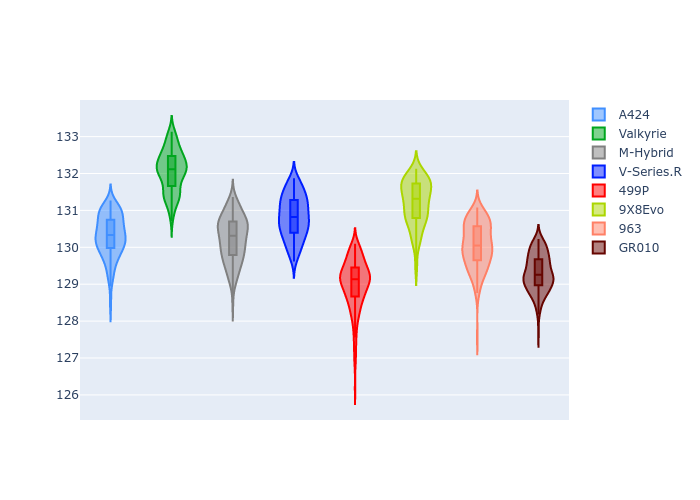
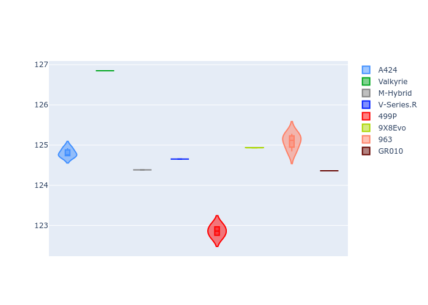
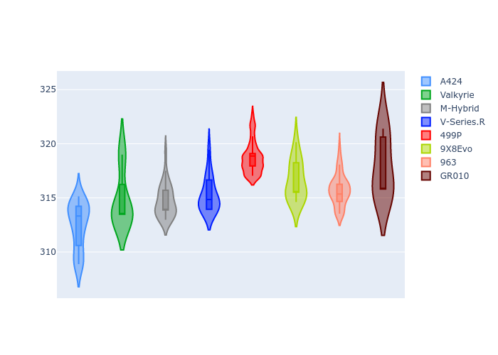
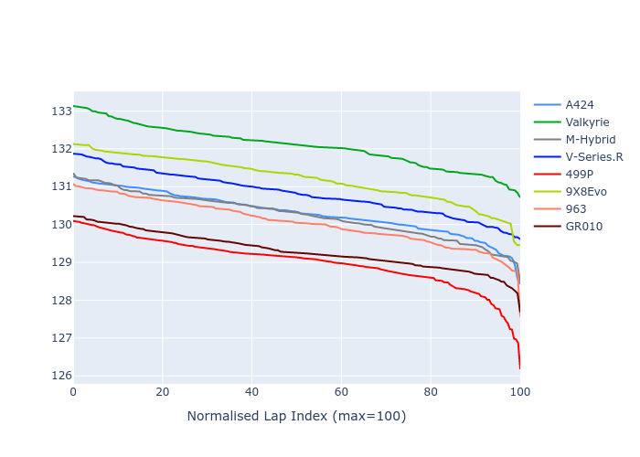

# Combined Plots

## Metadata

- BoP Accuracy: 78.64%
- Overall BoP Grade: C1
- Track: REFERENCETRACK
- Threshhold: 0.0kph
- Average Laptime: 2:10.38
- Average Quali Laptime: 2:04.74
- Laptime Std Dev: 0.93 seconds
- Filtered Average Topspeed: 315.77kph

## BoP Table
| Manufacturer   | Car        | Weight   | Power   | PINC   | E/Stint   | FDS   | RDP    | QDP    | TDP    |
|:---------------|:-----------|:---------|:--------|:-------|:----------|:------|:-------|:-------|:-------|
| Alpine         | A424       | 1030kg   | 520.0kw | -      | 911MJ     | -     | 56.00% | 37.50% | 12.72% |
| Aston Martin   | Valkyrie   | 1030kg   | 520.0kw | -      | 914MJ     | -     | 54.85% | 33.33% | 1.23%  |
| BMW            | M-Hybrid   | 1030kg   | 520.0kw | -      | 917MJ     | -     | 50.35% | 33.33% | 11.01% |
| Cadillac       | V-Series.R | 1030kg   | 520.0kw | -      | 912MJ     | -     | 54.00% | 16.67% | 4.94%  |
| Ferrari        | 499P       | 1030kg   | 520.0kw | -      | 913MJ     | -     | 53.04% | 50.00% | 8.49%  |
| Peugeot        | 9X8Evo     | 1030kg   | 520.0kw | -      | 911MJ     | -     | 57.03% | 66.67% | 4.15%  |
| Porsche        | 963        | 1030kg   | 520.0kw | -      | 917MJ     | -     | 50.93% | 50.00% | 18.51% |
| Toyota         | GR010      | 1030kg   | 520.0kw | -      | 918MJ     | -     | 55.67% | 33.33% | 1.54%  |

## Performance Table
| Manufacturer   | Car        | RP      | QP      | Vavg      |   RDLC | BOP-Grade   | Match   |
|:---------------|:-----------|:--------|:--------|:----------|-------:|:------------|:--------|
| Alpine         | A424       | 2:10.31 | 2:04.80 | 312.44kph |   1.04 | ~A1         | 99.40%  |
| Aston Martin   | Valkyrie   | 2:12.07 | 2:06.85 | 314.86kph |   1.04 | +Ω1         | 15.85%  |
| BMW            | M-Hybrid   | 2:10.24 | 2:04.38 | 314.68kph |   1.05 | ~A1         | 99.30%  |
| Cadillac       | V-Series.R | 2:10.83 | 2:04.65 | 315.27kph |   1.05 | +B2         | 81.48%  |
| Ferrari        | 499P       | 2:09.02 | 2:02.86 | 318.69kph |   1.05 | -B2         | 82.11%  |
| Peugeot        | 9X8Evo     | 2:11.21 | 2:04.94 | 316.59kph |   1.05 | +E1         | 56.34%  |
| Porsche        | 963        | 2:10.05 | 2:05.09 | 315.76kph |   1.04 | ~A1         | 99.39%  |
| Toyota         | GR010      | 2:09.31 | 2:04.36 | 317.85kph |   1.04 | ~A1         | 95.21%  |

## Race Laptimes

## Quali Laptimes

## Topspeeds

## Laptimes Lineplot

