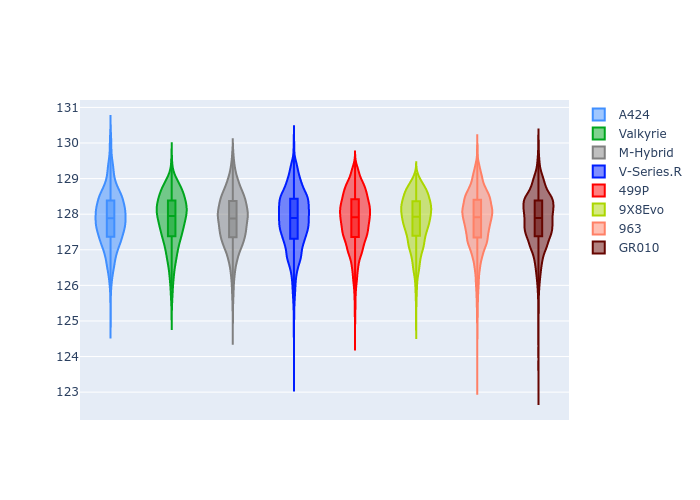
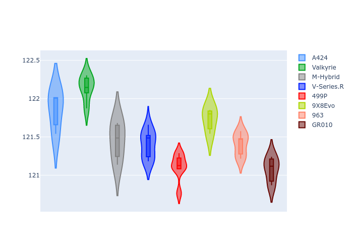
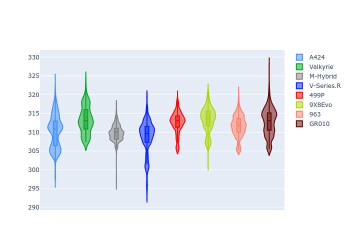
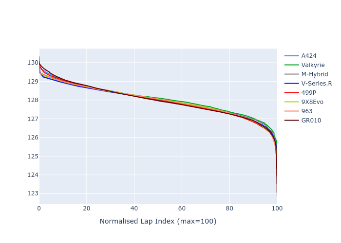

# Combined Plots

## Metadata

- BoP Accuracy: 99.80%
- Overall BoP Grade: A1
- Track: SPA
- Threshhold: 250.0kph
- Average Laptime: 2:07.88
- Average Quali Laptime: 2:01.30
- Average Topspeed: 311.19kph

## BoP Table
| Manufacturer   | Car        | Weight   | Power   | PINC   | E/Stint   | FDS    | RDP    | QDP    | TDP    |
|:---------------|:-----------|:---------|:--------|:-------|:----------|:-------|:-------|:-------|:-------|
| Alpine         | A424       | 1068kg   | 515.0kw | +0.70% | 912MJ     | -      | 51.64% | 59.31% | 26.80% |
| Aston Martin   | Valkyrie   | 1040kg   | 520.0kw | -      | 915MJ     | -      | 53.50% | 53.33% | 21.51% |
| BMW            | M-Hybrid   | 1060kg   | 517.0kw | -      | 918MJ     | -      | 52.89% | 56.22% | 33.41% |
| Cadillac       | V-Series.R | 1050kg   | 520.0kw | -      | 915MJ     | -      | 48.63% | 60.80% | 19.01% |
| Ferrari        | 499P       | 1071kg   | 504.0kw | -0.60% | 902MJ     | 190kph | 51.38% | 44.98% | 9.83%  |
| Peugeot        | 9X8Evo     | 1062kg   | 516.0kw | -0.10% | 910MJ     | 190kph | 48.87% | 52.78% | 15.41% |
| Porsche        | 963        | 1063kg   | 514.0kw | -0.10% | 916MJ     | -      | 50.70% | 44.30% | 29.51% |
| Toyota         | GR010      | 1069kg   | 501.0kw | +0.10% | 906MJ     | 190kph | 51.09% | 52.71% | 11.46% |

## Performance Table
| Manufacturer   | Car        | RP      | QP      | Vavg      |   RDLC | BOP-Grade   | Match   |
|:---------------|:-----------|:--------|:--------|:----------|-------:|:------------|:--------|
| Alpine         | A424       | 2:07.78 | 2:01.61 | 310.04kph |   1.05 | ~A1         | 99.30%  |
| Aston Martin   | Valkyrie   | 2:08.01 | 2:01.24 | 312.98kph |   1.06 | ~A1         | 100.00% |
| BMW            | M-Hybrid   | 2:07.73 | 2:01.12 | 310.13kph |   1.05 | ~A1         | 100.00% |
| Cadillac       | V-Series.R | 2:07.62 | 2:01.06 | 309.28kph |   1.05 | ~A1         | 99.93%  |
| Ferrari        | 499P       | 2:08.00 | 2:01.12 | 311.24kph |   1.06 | ~A1         | 99.55%  |
| Peugeot        | 9X8Evo     | 2:08.01 | 2:01.69 | 311.97kph |   1.05 | ~A1         | 100.00% |
| Porsche        | 963        | 2:07.85 | 2:01.46 | 311.79kph |   1.05 | ~A1         | 99.93%  |
| Toyota         | GR010      | 2:08.00 | 2:01.11 | 312.13kph |   1.06 | ~A1         | 99.70%  |

## Race Laptimes

## Quali Laptimes

## Topspeeds

## Laptimes Lineplot

