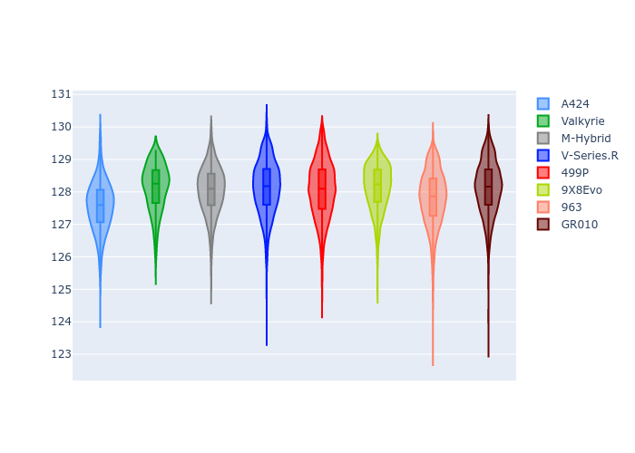
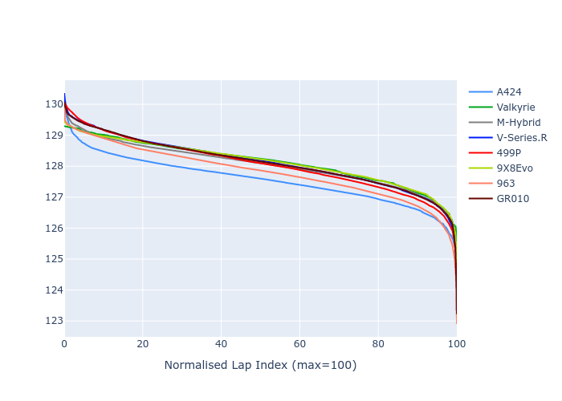

# Combined Plots

## Metadata

- BoP Accuracy: 99.71%
- Overall BoP Grade: A1
- Track: SPA
- Threshhold: 250.0kph
- Average Laptime: 2:07.99
- Average Quali Laptime: 2:01.45
- Average Topspeed: 310.93kph

## BoP Table
| Manufacturer   | Car        | Weight   | Power   | PINC   | E/Stint   | FDS    | RDP    | QDP    | TDP    |
|:---------------|:-----------|:---------|:--------|:-------|:----------|:-------|:-------|:-------|:-------|
| Alpine         | A424       | 1067kg   | 520.0kw | -0.10% | 915MJ     | -      | 51.64% | 59.31% | 26.80% |
| Aston Martin   | Valkyrie   | 1037kg   | 519.0kw | -      | 914MJ     | -      | 53.50% | 53.33% | 21.51% |
| BMW            | M-Hybrid   | 1061kg   | 512.0kw | +0.10% | 914MJ     | -      | 52.89% | 56.22% | 33.41% |
| Cadillac       | V-Series.R | 1042kg   | 510.0kw | +0.10% | 905MJ     | -      | 48.63% | 60.80% | 19.01% |
| Ferrari        | 499P       | 1083kg   | 508.0kw | -0.10% | 908MJ     | 190kph | 51.38% | 44.98% | 9.83%  |
| Peugeot        | 9X8Evo     | 1048kg   | 511.0kw | -      | 905MJ     | 190kph | 48.87% | 52.78% | 15.41% |
| Porsche        | 963        | 1067kg   | 516.0kw | -0.10% | 918MJ     | -      | 50.70% | 44.30% | 29.51% |
| Toyota         | GR010      | 1100kg   | 512.0kw | -0.10% | 918MJ     | 190kph | 51.09% | 52.71% | 11.46% |

## Performance Table
| Manufacturer   | Car        | RP      | QP      | Vavg      |   RDLC | BOP-Grade   | Match   |
|:---------------|:-----------|:--------|:--------|:----------|-------:|:------------|:--------|
| Alpine         | A424       | 2:07.54 | 2:01.36 | 310.56kph |   1.05 | ~A1         | 99.91%  |
| Aston Martin   | Valkyrie   | 2:08.14 | 2:01.34 | 313.09kph |   1.06 | ~A1         | 100.00% |
| BMW            | M-Hybrid   | 2:08.04 | 2:01.39 | 309.02kph |   1.05 | ~A1         | 99.69%  |
| Cadillac       | V-Series.R | 2:08.12 | 2:01.52 | 308.05kph |   1.05 | ~A1         | 99.44%  |
| Ferrari        | 499P       | 2:08.05 | 2:01.35 | 311.30kph |   1.06 | ~A1         | 99.26%  |
| Peugeot        | 9X8Evo     | 2:08.13 | 2:01.76 | 312.46kph |   1.05 | ~A1         | 100.00% |
| Porsche        | 963        | 2:07.80 | 2:01.61 | 311.80kph |   1.05 | ~A1         | 99.87%  |
| Toyota         | GR010      | 2:08.12 | 2:01.26 | 311.19kph |   1.06 | ~A1         | 99.56%  |

## Race Laptimes

## Quali Laptimes

## Topspeeds

## Laptimes Lineplot

