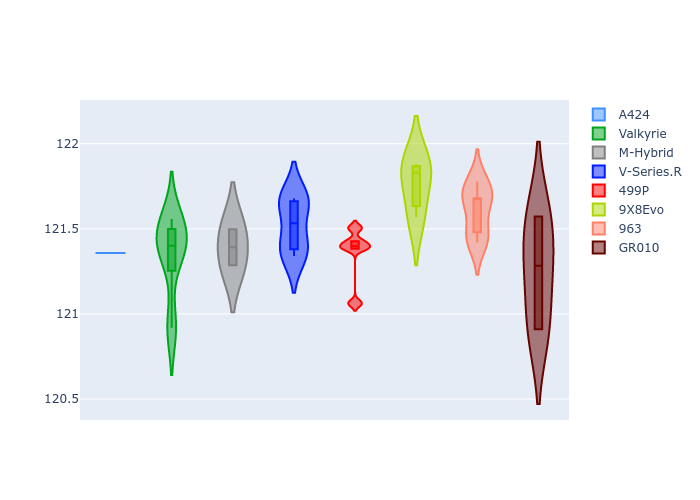

# Combined Plots

## Metadata

- BoP Accuracy: 99.53%
- Overall BoP Grade: A1
- Track: SPA
- Threshhold: 250.0kph

## BoP Table
| Manufacturer   | Car        | Weight   | Power   | PINC   | E/Stint   | FDS    | RDP    | QDP    | TDP    |
|:---------------|:-----------|:---------|:--------|:-------|:----------|:-------|:-------|:-------|:-------|
| Alpine         | A424       | 1067kg   | 520.0kw | -0.10% | 914MJ     | -      | 52.35% | 61.85% | 27.84% |
| Aston Martin   | Valkyrie   | 1040kg   | 506.0kw | +0.40% | 903MJ     | -      | 53.59% | 53.33% | 21.51% |
| BMW            | M-Hybrid   | 1061kg   | 512.0kw | +0.10% | 914MJ     | -      | 53.26% | 57.23% | 34.54% |
| Cadillac       | V-Series.R | 1054kg   | 510.0kw | +0.10% | 907MJ     | -      | 47.80% | 56.73% | 19.63% |
| Ferrari        | 499P       | 1083kg   | 508.0kw | -0.10% | 909MJ     | 190kph | 53.02% | 42.32% | 9.88%  |
| Peugeot        | 9X8Evo     | 1070kg   | 510.0kw | -0.10% | 906MJ     | 190kph | 48.47% | 51.26% | 16.02% |
| Porsche        | 963        | 1067kg   | 516.0kw | -0.10% | 918MJ     | -      | 50.87% | 45.25% | 30.77% |
| Toyota         | GR010      | 1100kg   | 512.0kw | -0.10% | 919MJ     | 190kph | 52.43% | 57.12% | 12.82% |

## Performance Table
| Manufacturer   | Car        | RP      | QP      | Vavg      |   RDLC | BOP-Grade   | Match   |
|:---------------|:-----------|:--------|:--------|:----------|-------:|:------------|:--------|
| Alpine         | A424       | 2:06.20 | 2:00.24 | 308.63kph |   1.05 | ~A1         | 99.79%  |
| Aston Martin   | Valkyrie   | 2:07.28 | 2:00.53 | 308.04kph |   1.06 | ~A1         | 100.00% |
| BMW            | M-Hybrid   | 2:06.65 | 2:00.23 | 306.75kph |   1.05 | ~A1         | 100.00% |
| Cadillac       | V-Series.R | 2:06.94 | 2:00.53 | 303.45kph |   1.05 | ~A1         | 99.83%  |
| Ferrari        | 499P       | 2:06.34 | 1:59.38 | 307.16kph |   1.06 | ~A1         | 99.70%  |
| Peugeot        | 9X8Evo     | 2:07.28 | 2:01.00 | 308.29kph |   1.05 | ~A1         | 97.32%  |
| Porsche        | 963        | 2:06.53 | 2:00.19 | 307.42kph |   1.05 | ~A1         | 99.81%  |
| Toyota         | GR010      | 2:06.39 | 1:59.31 | 307.34kph |   1.06 | ~A1         | 99.80%  |

## Race Laptimes

## Quali Laptimes

## Topspeeds

## Laptimes Lineplot

