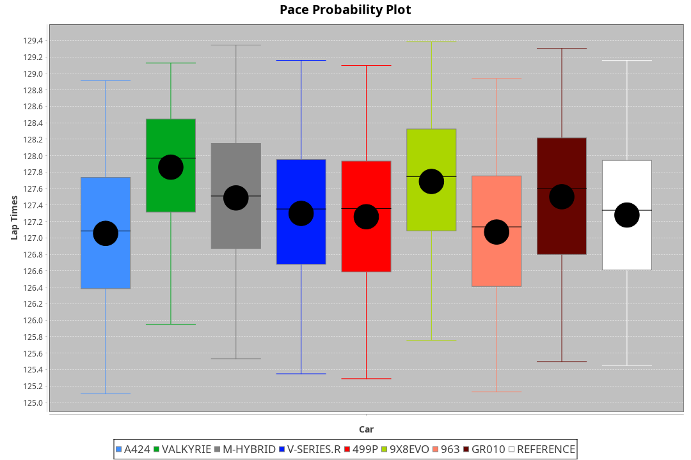
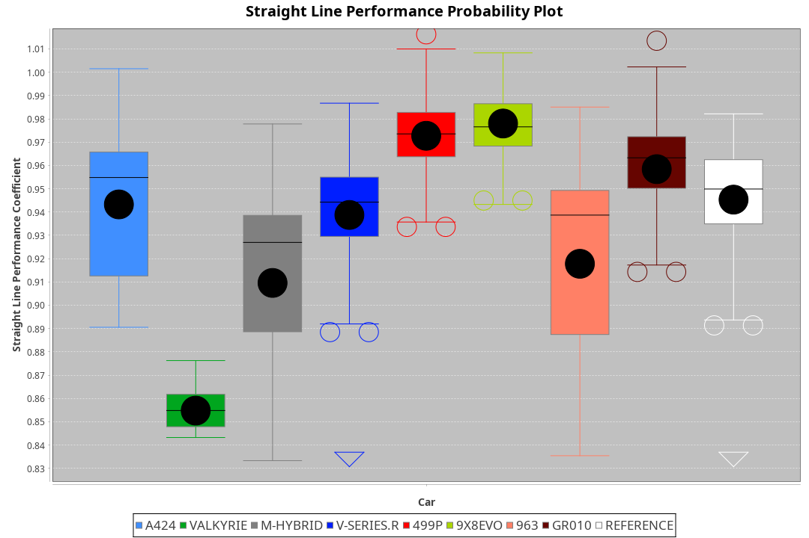
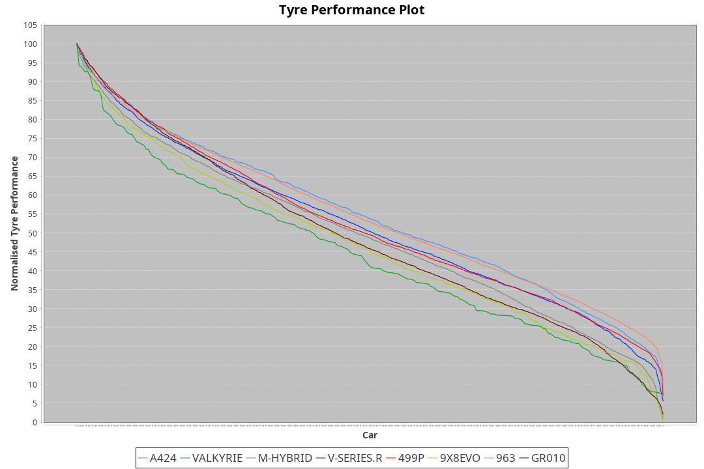

| Manufacturer | Car        | Weight | Power   | PINC    | E/Stint | FDS     |
|:-|:-|:-|:-|:-|:-|:-|
| Alpine       | A424       | 1049kg | 517.0kw |    -    | 917MJ   |    -    |
| Aston Martin | Valkyrie   | 1032kg | 520.0kw |    -    | 911MJ   |    -    |
| BMW          | M-Hybrid   | 1039kg | 512.0kw |    -    | 909MJ   |    -    |
| Cadillac     | V-Series.R | 1040kg | 507.0kw |    -    | 902MJ   |    -    |
| Ferrari      | 499P       | 1070kg | 505.0kw |    -    | 901MJ   | 190kph  |
| Peugeot      | 9X8Evo     | 1050kg | 508.0kw |    -    | 908MJ   | 190kph  |
| Porsche      | 963        | 1055kg | 513.0kw |    -    | 911MJ   |    -    |
| Toyota       | GR010      | 1084kg | 509.0kw |    -    | 914MJ   | 190kph  |

### BoP Accuracy: 76.55%; Overall BoP Grade: C1
| Manufacturer | Car        | Type  | RP      | QP      | Weight | Power¹  | Threshhold | PINC    | Power²   | E/Stint | AVG Vmax  | FDS     | RDLC | L/Stint | BOP-Grade | Model Accuracy | Model Points | Match% | SimDiff |
|:-|:-|:-|:-|:-|:-|:-|:-|:-|:-|:-|:-|:-|:-|:-|:-|:-|:-|:-|:-|
| Alpine       | A424       | LMDH  | 2:06.98 | 2:02.46 | 1049kg | 517.0kw | 210.0kph   |    -    | 517.00kw |  917MJ  | 311.70kph |    -    | 1.00 | 25      | -B1       | 99.49%         | 1360         | 87.63% | -0.08   |
| Aston Martin | Valkyrie   | LMHNH | 2:09.93 | 2:04.35 | 1032kg | 520.0kw | 210.0kph   |    -    | 520.00kw |  911MJ  | 304.13kph |    -    | 1.04 | 25      | +Ω1       | 100.00%        | 312          | 9.62%  | #       |
| BMW          | M-Hybrid   | LMDH  | 2:06.98 | 2:01.38 | 1039kg | 512.0kw | 210.0kph   |    -    | 512.00kw |  909MJ  | 310.38kph |    -    | 1.01 | 25      | -B1       | 98.62%         | 2363         | 87.79% | +0.05   |
| Cadillac     | V-Series.R | LMDH  | 2:06.99 | 2:01.82 | 1040kg | 507.0kw | 210.0kph   |    -    | 507.00kw |  902MJ  | 304.52kph |    -    | 1.02 | 25      | -B1       | 98.50%         | 4201         | 88.52% | +1.00   |
| Ferrari      | 499P       | LMHHU | 2:06.99 | 2:01.64 | 1070kg | 505.0kw | 210.0kph   |    -    | 505.00kw |  901MJ  | 307.60kph | 190kph  | 1.02 | 25      | -B2       | 100.00%        | 4441         | 84.78% | +0.52   |
| Peugeot      | 9X8Evo     | LMHHU | 2:06.99 | 2:02.09 | 1050kg | 508.0kw | 210.0kph   |    -    | 508.00kw |  908MJ  | 310.01kph | 190kph  | 1.00 | 25      | +B2       | 100.00%        | 808          | 81.63% | +0.26   |
| Porsche      | 963        | LMDH  | 2:06.97 | 2:01.34 | 1055kg | 513.0kw | 210.0kph   |    -    | 513.00kw |  911MJ  | 307.77kph |    -    | 1.00 | 25      | -B1       | 99.87%         | 12613        | 85.20% | -0.26   |
| Toyota       | GR010      | LMHHU | 2:06.99 | 2:01.41 | 1084kg | 509.0kw | 210.0kph   |    -    | 509.00kw |  914MJ  | 304.50kph | 190kph  | 1.01 | 25      | -B1       | 99.73%         | 2956         | 87.25% | +1.15   |

## Power below Threshhold
| N/Nmax    | A424    | VALKYRIE | M-HYBRID | V-SERIES.R | 499P    | 9X8EVO  | 963     | GR010   |
|:-|:-|:-|:-|:-|:-|:-|:-|:-|
|  0.550    |  255    |  256     |  252     |  250       |  249    |  250    |  253    |  251    |
|  0.575    |  278    |  279     |  275     |  273       |  272    |  273    |  276    |  274    |
|  0.600    |  298    |  300     |  296     |  293       |  292    |  293    |  296    |  294    |
|  0.625    |  320    |  322     |  317     |  314       |  312    |  314    |  317    |  315    |
|  0.650    |  341    |  343     |  338     |  335       |  333    |  335    |  338    |  336    |
|  0.675    |  363    |  365     |  359     |  356       |  355    |  357    |  360    |  357    |
|  0.700    |  385    |  387     |  381     |  377       |  376    |  378    |  382    |  379    |
|  0.725    |  407    |  409     |  403     |  399       |  397    |  399    |  403    |  400    |
|  0.750    |  427    |  430     |  423     |  419       |  417    |  420    |  424    |  421    |
|  0.775    |  446    |  449     |  442     |  438       |  436    |  439    |  443    |  440    |
|  0.800    |  464    |  467     |  460     |  455       |  454    |  456    |  461    |  457    |
|  0.825    |  479    |  482     |  475     |  470       |  469    |  471    |  476    |  472    |
|  0.850    |  491    |  494     |  486     |  482       |  480    |  483    |  487    |  484    |
|  0.875    |  502    |  505     |  497     |  492       |  490    |  493    |  498    |  494    |
|  0.900    |  509    |  512     |  504     |  499       |  497    |  500    |  505    |  501    |
|  0.925    |  514    |  517     |  509     |  504       |  502    |  505    |  510    |  506    |
| **0.950** | **517** | **520**  | **512**  | **507**    | **505** | **508** | **513** | **509** |
|  0.975    |  515    |  518     |  510     |  505       |  503    |  506    |  511    |  507    |
|  1.000    |  511    |  514     |  506     |  502       |  500    |  503    |  507    |  504    |
|  1.025    |  441    |  444     |  437     |  433       |  431    |  434    |  438    |  435    |

## Power above Threshhold
| N/Nmax    | A424    | VALKYRIE | M-HYBRID | V-SERIES.R | 499P    | 9X8EVO  | 963     | GR010   |
|:-|:-|:-|:-|:-|:-|:-|:-|:-|
|  0.550    |  255    |  256     |  252     |  250       |  249    |  250    |  253    |  251    |
|  0.575    |  278    |  279     |  275     |  273       |  272    |  273    |  276    |  274    |
|  0.600    |  298    |  300     |  296     |  293       |  292    |  293    |  296    |  294    |
|  0.625    |  320    |  322     |  317     |  314       |  312    |  314    |  317    |  315    |
|  0.650    |  341    |  343     |  338     |  335       |  333    |  335    |  338    |  336    |
|  0.675    |  363    |  365     |  359     |  356       |  355    |  357    |  360    |  357    |
|  0.700    |  385    |  387     |  381     |  377       |  376    |  378    |  382    |  379    |
|  0.725    |  407    |  409     |  403     |  399       |  397    |  399    |  403    |  400    |
|  0.750    |  427    |  430     |  423     |  419       |  417    |  420    |  424    |  421    |
|  0.775    |  446    |  449     |  442     |  438       |  436    |  439    |  443    |  440    |
|  0.800    |  464    |  467     |  460     |  455       |  454    |  456    |  461    |  457    |
|  0.825    |  479    |  482     |  475     |  470       |  469    |  471    |  476    |  472    |
|  0.850    |  491    |  494     |  486     |  482       |  480    |  483    |  487    |  484    |
|  0.875    |  502    |  505     |  497     |  492       |  490    |  493    |  498    |  494    |
|  0.900    |  509    |  512     |  504     |  499       |  497    |  500    |  505    |  501    |
|  0.925    |  514    |  517     |  509     |  504       |  502    |  505    |  510    |  506    |
| **0.950** | **517** | **520**  | **512**  | **507**    | **505** | **508** | **513** | **509** |
|  0.975    |  515    |  518     |  510     |  505       |  503    |  506    |  511    |  507    |
|  1.000    |  511    |  514     |  506     |  502       |  500    |  503    |  507    |  504    |
|  1.025    |  441    |  444     |  437     |  433       |  431    |  434    |  438    |  435    |
