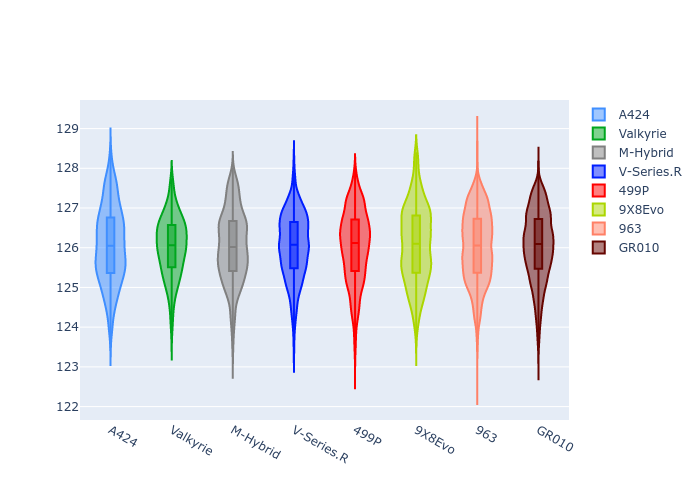
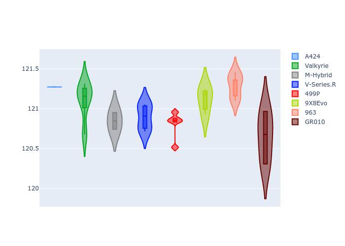
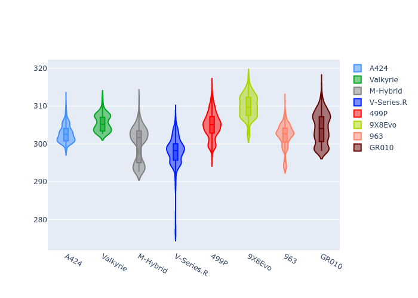
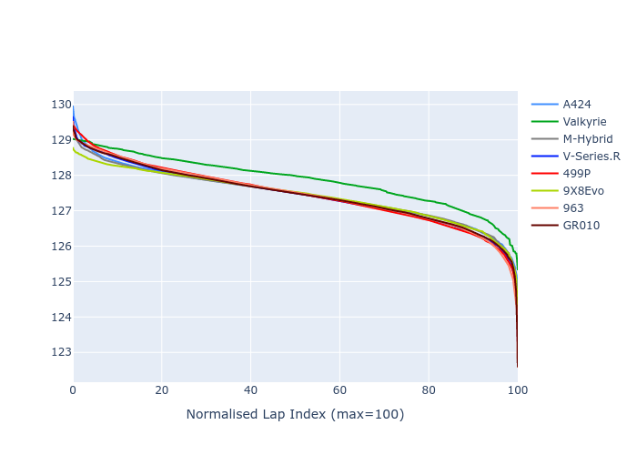

# Combined Plots

## Metadata

- BoP Accuracy: 99.78%
- Overall BoP Grade: A1
- Track: SPA
- Threshhold: 0.0kph
- Average Laptime: 2:07.50
- Average Quali Laptime: 2:01.00
- Average Topspeed: 313.01kph

## BoP Table
| Manufacturer   | Car        | Weight   | Power   | PINC   | E/Stint   | FDS    | RDP    | QDP    | TDP    |
|:---------------|:-----------|:---------|:--------|:-------|:----------|:-------|:-------|:-------|:-------|
| Alpine         | A424       | 1036kg   | 509.0kw | -      | 902MJ     | -      | 51.64% | 59.31% | 26.80% |
| Aston Martin   | Valkyrie   | 1030kg   | 520.0kw | -      | 914MJ     | -      | 53.50% | 53.33% | 21.51% |
| BMW            | M-Hybrid   | 1038kg   | 512.0kw | -      | 911MJ     | -      | 52.89% | 56.22% | 33.41% |
| Cadillac       | V-Series.R | 1042kg   | 520.0kw | -      | 914MJ     | -      | 48.63% | 60.80% | 19.01% |
| Ferrari        | 499P       | 1060kg   | 508.0kw | -      | 906MJ     | 190kph | 51.38% | 44.98% | 9.83%  |
| Peugeot        | 9X8Evo     | 1030kg   | 514.0kw | -      | 905MJ     | 190kph | 48.87% | 52.78% | 15.41% |
| Porsche        | 963        | 1034kg   | 508.0kw | -      | 907MJ     | -      | 50.70% | 44.30% | 29.51% |
| Toyota         | GR010      | 1058kg   | 506.0kw | -      | 909MJ     | 190kph | 51.09% | 52.71% | 11.46% |

## Performance Table
| Manufacturer   | Car        | RP      | QP      | Vavg      |   RDLC | BOP-Grade   | Match   |
|:---------------|:-----------|:--------|:--------|:----------|-------:|:------------|:--------|
| Alpine         | A424       | 2:07.45 | 2:01.27 | 311.55kph |   1.05 | ~A1         | 99.08%  |
| Aston Martin   | Valkyrie   | 2:07.87 | 2:01.10 | 314.08kph |   1.06 | ~A1         | 100.00% |
| BMW            | M-Hybrid   | 2:07.45 | 2:00.85 | 311.40kph |   1.05 | ~A1         | 99.94%  |
| Cadillac       | V-Series.R | 2:07.44 | 2:00.90 | 310.14kph |   1.05 | ~A1         | 99.72%  |
| Ferrari        | 499P       | 2:07.46 | 2:00.81 | 313.82kph |   1.06 | ~A1         | 99.88%  |
| Peugeot        | 9X8Evo     | 2:07.44 | 2:01.12 | 315.09kph |   1.05 | ~A1         | 100.00% |
| Porsche        | 963        | 2:07.46 | 2:01.29 | 313.68kph |   1.05 | ~A1         | 99.86%  |
| Toyota         | GR010      | 2:07.46 | 2:00.65 | 314.35kph |   1.06 | ~A1         | 99.76%  |

## Race Laptimes

## Quali Laptimes

## Topspeeds

## Laptimes Lineplot

