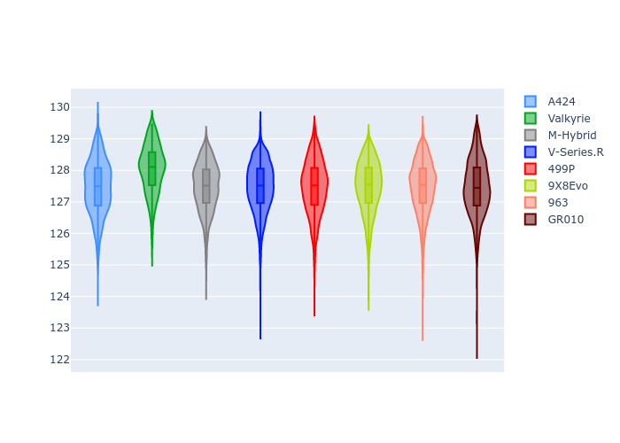
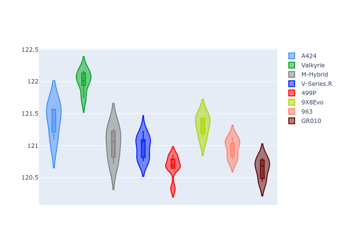
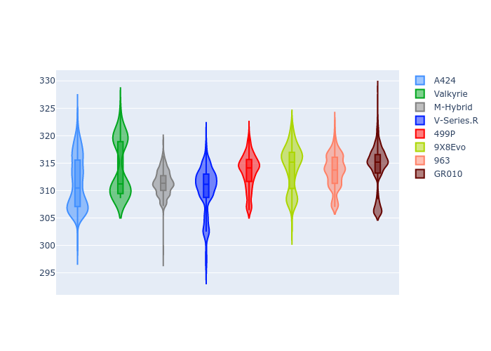
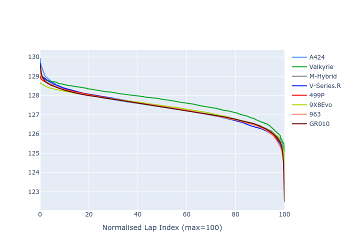

# Combined Plots

## Metadata

- BoP Accuracy: 99.74%
- Overall BoP Grade: A1
- Track: SPA
- Threshhold: 0.0kph
- Average Laptime: 2:07.41
- Average Quali Laptime: 2:01.12
- Laptime Std Dev: 0.11 seconds
- Filtered Average Topspeed: 312.92kph

## BoP Table
| Manufacturer   | Car        | Weight   | Power   | PINC   | E/Stint   | FDS    | RDP    | QDP    | TDP    |
|:---------------|:-----------|:---------|:--------|:-------|:----------|:-------|:-------|:-------|:-------|
| Alpine         | A424       | 1036kg   | 508.0kw | -      | 901MJ     | -      | 51.38% | 57.54% | 26.10% |
| Aston Martin   | Valkyrie   | 1030kg   | 520.0kw | -      | 914MJ     | -      | 52.56% | 51.11% | 27.23% |
| BMW            | M-Hybrid   | 1038kg   | 512.0kw | -      | 911MJ     | -      | 52.62% | 53.36% | 32.99% |
| Cadillac       | V-Series.R | 1042kg   | 520.0kw | -      | 914MJ     | -      | 48.29% | 59.47% | 18.65% |
| Ferrari        | 499P       | 1060kg   | 508.0kw | -      | 906MJ     | 190kph | 51.25% | 43.28% | 10.17% |
| Peugeot        | 9X8Evo     | 1031kg   | 512.0kw | -      | 904MJ     | 190kph | 48.70% | 50.83% | 18.68% |
| Porsche        | 963        | 1033kg   | 507.0kw | -      | 906MJ     | -      | 50.57% | 42.80% | 29.05% |
| Toyota         | GR010      | 1058kg   | 507.0kw | -      | 910MJ     | 200kph | 51.03% | 51.78% | 14.64% |

## Performance Table
| Manufacturer   | Car        | RP      | QP      | Vavg      |   RDLC | BOP-Grade   | Match   |
|:---------------|:-----------|:--------|:--------|:----------|-------:|:------------|:--------|
| Alpine         | A424       | 2:07.37 | 2:01.41 | 311.40kph |   1.05 | ~A1         | 99.02%  |
| Aston Martin   | Valkyrie   | 2:07.70 | 2:02.01 | 313.52kph |   1.05 | ~A1         | 99.85%  |
| BMW            | M-Hybrid   | 2:07.37 | 2:01.02 | 311.55kph |   1.05 | ~A1         | 100.00% |
| Cadillac       | V-Series.R | 2:07.37 | 2:00.97 | 310.50kph |   1.05 | ~A1         | 99.70%  |
| Ferrari        | 499P       | 2:07.37 | 2:00.67 | 313.83kph |   1.06 | ~A1         | 100.00% |
| Peugeot        | 9X8Evo     | 2:07.38 | 2:01.32 | 314.55kph |   1.05 | ~A1         | 100.00% |
| Porsche        | 963        | 2:07.36 | 2:00.96 | 313.64kph |   1.05 | ~A1         | 99.92%  |
| Toyota         | GR010      | 2:07.37 | 2:00.64 | 314.36kph |   1.06 | ~A1         | 99.45%  |

## Race Laptimes

## Quali Laptimes

## Topspeeds

## Laptimes Lineplot

