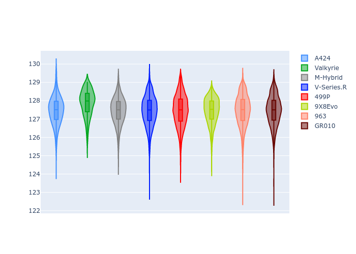
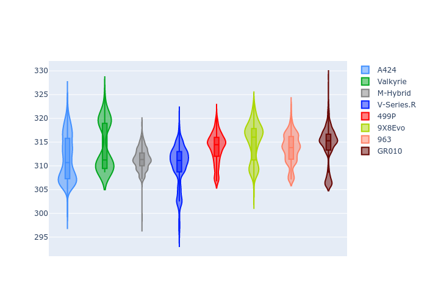

# Combined Plots

## Metadata

- BoP Accuracy: 99.81%
- Overall BoP Grade: A1
- Track: SPA
- Threshhold: 0.0kph

## BoP Table
| Manufacturer   | Car        | Weight   | Power   | PINC   | E/Stint   | FDS    |
|:---------------|:-----------|:---------|:--------|:-------|:----------|:-------|
| Alpine         | A424       | 1039kg   | 501.0kw | -      | 895MJ     | -      |
| Aston Martin   | Valkyrie   | 1031kg   | 520.0kw | -      | 914MJ     | -      |
| BMW            | M-Hybrid   | 1042kg   | 505.0kw | -      | 905MJ     | -      |
| Cadillac       | V-Series.R | 1047kg   | 515.0kw | -      | 911MJ     | -      |
| Ferrari        | 499P       | 1066kg   | 496.0kw | -      | 896MJ     | 190kph |
| Peugeot        | 9X8Evo     | 1031kg   | 505.0kw | -      | 897MJ     | 190kph |
| Porsche        | 963        | 1040kg   | 503.0kw | -      | 904MJ     | -      |
| Toyota         | GR010      | 1066kg   | 497.0kw | -      | 902MJ     | 190kph |

## Performance Table
| Manufacturer   | Car        | RP      | QP      | Vavg      |   RDLC | BOP-Grade   | Match   |
|:---------------|:-----------|:--------|:--------|:----------|-------:|:------------|:--------|
| Alpine         | A424       | 2:06.03 | 2:00.25 | 307.73kph |   1.05 | ~A1         | 99.62%  |
| Aston Martin   | Valkyrie   | 2:06.03 | 1:59.41 | 311.74kph |   1.06 | ~A1         | 100.00% |
| BMW            | M-Hybrid   | 2:06.03 | 1:59.85 | 307.19kph |   1.05 | ~A1         | 99.96%  |
| Cadillac       | V-Series.R | 2:06.03 | 1:59.96 | 305.42kph |   1.05 | ~A1         | 99.96%  |
| Ferrari        | 499P       | 2:06.03 | 1:59.77 | 306.42kph |   1.05 | ~A1         | 99.98%  |
| Peugeot        | 9X8Evo     | 2:06.02 | 1:59.87 | 311.43kph |   1.05 | ~A1         | 99.12%  |
| Porsche        | 963        | 2:06.02 | 1:59.93 | 307.14kph |   1.05 | ~A1         | 99.89%  |
| Toyota         | GR010      | 2:06.04 | 1:59.66 | 307.18kph |   1.05 | ~A1         | 99.97%  |

## Race Laptimes

## Quali Laptimes

## Topspeeds

## Laptimes Lineplot

