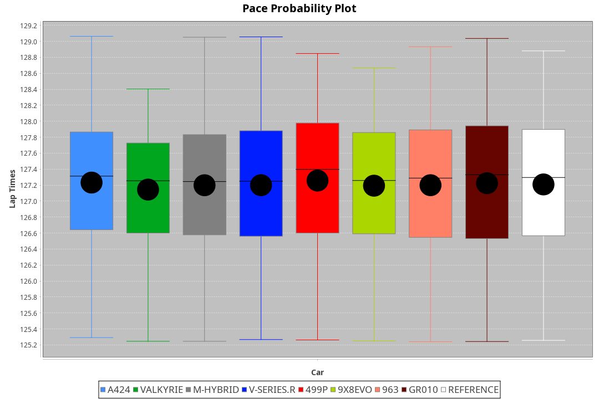
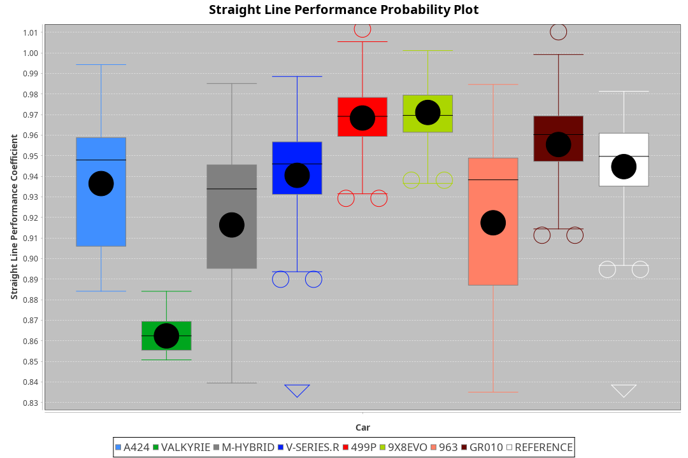

| Manufacturer | Car        | Weight | Power   | PINC    | E/Stint | FDS     |
|:-|:-|:-|:-|:-|:-|:-|
| Alpine       | A424       | 1045kg | 500.0kw |    -    | 901MJ   |    -    |
| Aston Martin | Valkyrie   | 1030kg | 512.0kw |    -    | 904MJ   |    -    |
| BMW          | M-Hybrid   | 1053kg | 520.0kw |    -    | 917MJ   |    -    |
| Cadillac     | V-Series.R | 1046kg | 508.0kw |    -    | 904MJ   |    -    |
| Ferrari      | 499P       | 1065kg | 493.0kw |    -    | 890MJ   | 190kph  |
| Peugeot      | 9X8Evo     | 1030kg | 482.0kw |    -    | 883MJ   | 190kph  |
| Porsche      | 963        | 1051kg | 509.0kw |    -    | 907MJ   |    -    |
| Toyota       | GR010      | 1067kg | 493.0kw |    -    | 898MJ   | 190kph  |

### BoP Accuracy: 94.98%; Overall BoP Grade: A2
| Manufacturer | Car        | Type  | RP      | QP      | Weight | Power¹  | Threshhold | PINC    | Power²   | E/Stint | AVG Vmax  | FDS     | RDLC | L/Stint | BOP-Grade | Model Accuracy | Model Points | Match%  | SimDiff |
|:-|:-|:-|:-|:-|:-|:-|:-|:-|:-|:-|:-|:-|:-|:-|:-|:-|:-|:-|:-|
| Alpine       | A424       | LMDH  | 2:07.17 | 2:01.73 | 1045kg | 500.0kw | 0.0kph     |    -    | 500.00kw |  901MJ  | 297.98kph |    -    | 1.02 | 25      | ~A1       | 99.58%         | 1429         | 97.79%  | +0.30   |
| Aston Martin | Valkyrie   | LMHNH | 2:07.14 | 2:01.60 | 1030kg | 512.0kw | 0.0kph     |    -    | 512.00kw |  904MJ  | 287.94kph |    -    | 1.06 | 25      | +C2       | 100.00%        | 247          | 72.67%  | #       |
| BMW          | M-Hybrid   | LMDH  | 2:07.15 | 2:01.57 | 1053kg | 520.0kw | 0.0kph     |    -    | 520.00kw |  917MJ  | 296.22kph |    -    | 1.02 | 25      | ~A1       | 99.97%         | 2912         | 100.00% | +0.25   |
| Cadillac     | V-Series.R | LMDH  | 2:07.16 | 2:01.78 | 1046kg | 508.0kw | 0.0kph     |    -    | 508.00kw |  904MJ  | 298.22kph |    -    | 1.02 | 25      | +A2       | 99.49%         | 5225         | 94.26%  | +0.81   |
| Ferrari      | 499P       | LMHHU | 2:07.17 | 2:01.41 | 1065kg | 493.0kw | 0.0kph     |    -    | 493.00kw |  890MJ  | 300.11kph | 190kph  | 1.03 | 25      | ~A1       | 100.00%        | 5378         | 99.64%  | +0.60   |
| Peugeot      | 9X8Evo     | LMHHU | 2:07.15 | 2:01.78 | 1030kg | 482.0kw | 0.0kph     |    -    | 482.00kw |  883MJ  | 302.45kph | 190kph  | 1.03 | 25      | ~A1       | 100.00%        | 1459         | 95.51%  | -0.01   |
| Porsche      | 963        | LMDH  | 2:07.14 | 2:01.44 | 1051kg | 509.0kw | 0.0kph     |    -    | 509.00kw |  907MJ  | 295.49kph |    -    | 1.02 | 25      | ~A1       | 99.92%         | 14207        | 100.00% | -0.12   |
| Toyota       | GR010      | LMHHU | 2:07.15 | 2:01.24 | 1067kg | 493.0kw | 0.0kph     |    -    | 493.00kw |  898MJ  | 298.32kph | 190kph  | 1.03 | 25      | ~A1       | 99.86%         | 4280         | 100.00% | +0.84   |

## Power below Threshhold
| N/Nmax    | A424    | VALKYRIE | M-HYBRID | V-SERIES.R | 499P    | 9X8EVO  | 963     | GR010   |
|:-|:-|:-|:-|:-|:-|:-|:-|:-|
|  0.550    |  246    |  252     |  256     |  250       |  243    |  237    |  251    |  243    |
|  0.575    |  269    |  275     |  279     |  273       |  265    |  259    |  274    |  265    |
|  0.600    |  289    |  296     |  300     |  293       |  285    |  278    |  294    |  285    |
|  0.625    |  309    |  317     |  322     |  314       |  305    |  298    |  315    |  305    |
|  0.650    |  330    |  338     |  343     |  335       |  325    |  318    |  336    |  325    |
|  0.675    |  351    |  359     |  365     |  357       |  346    |  338    |  357    |  346    |
|  0.700    |  372    |  381     |  387     |  378       |  367    |  359    |  379    |  367    |
|  0.725    |  393    |  403     |  409     |  399       |  388    |  380    |  400    |  388    |
|  0.750    |  413    |  423     |  430     |  420       |  407    |  399    |  421    |  407    |
|  0.775    |  432    |  442     |  449     |  439       |  426    |  417    |  440    |  426    |
|  0.800    |  449    |  460     |  467     |  456       |  443    |  433    |  457    |  443    |
|  0.825    |  464    |  475     |  482     |  471       |  457    |  447    |  472    |  457    |
|  0.850    |  475    |  486     |  494     |  483       |  468    |  458    |  484    |  468    |
|  0.875    |  485    |  497     |  505     |  493       |  478    |  468    |  494    |  478    |
|  0.900    |  492    |  504     |  512     |  500       |  485    |  474    |  501    |  485    |
|  0.925    |  497    |  509     |  517     |  505       |  490    |  479    |  506    |  490    |
| **0.950** | **500** | **512**  | **520**  | **508**    | **493** | **482** | **509** | **493** |
|  0.975    |  498    |  510     |  518     |  506       |  491    |  480    |  507    |  491    |
|  1.000    |  495    |  506     |  514     |  503       |  488    |  477    |  504    |  488    |
|  1.025    |  427    |  437     |  444     |  434       |  421    |  412    |  435    |  421    |

## Power above Threshhold
| N/Nmax    | A424    | VALKYRIE | M-HYBRID | V-SERIES.R | 499P    | 9X8EVO  | 963     | GR010   |
|:-|:-|:-|:-|:-|:-|:-|:-|:-|
|  0.550    |  246    |  252     |  256     |  250       |  243    |  237    |  251    |  243    |
|  0.575    |  269    |  275     |  279     |  273       |  265    |  259    |  274    |  265    |
|  0.600    |  289    |  296     |  300     |  293       |  285    |  278    |  294    |  285    |
|  0.625    |  309    |  317     |  322     |  314       |  305    |  298    |  315    |  305    |
|  0.650    |  330    |  338     |  343     |  335       |  325    |  318    |  336    |  325    |
|  0.675    |  351    |  359     |  365     |  357       |  346    |  338    |  357    |  346    |
|  0.700    |  372    |  381     |  387     |  378       |  367    |  359    |  379    |  367    |
|  0.725    |  393    |  403     |  409     |  399       |  388    |  380    |  400    |  388    |
|  0.750    |  413    |  423     |  430     |  420       |  407    |  399    |  421    |  407    |
|  0.775    |  432    |  442     |  449     |  439       |  426    |  417    |  440    |  426    |
|  0.800    |  449    |  460     |  467     |  456       |  443    |  433    |  457    |  443    |
|  0.825    |  464    |  475     |  482     |  471       |  457    |  447    |  472    |  457    |
|  0.850    |  475    |  486     |  494     |  483       |  468    |  458    |  484    |  468    |
|  0.875    |  485    |  497     |  505     |  493       |  478    |  468    |  494    |  478    |
|  0.900    |  492    |  504     |  512     |  500       |  485    |  474    |  501    |  485    |
|  0.925    |  497    |  509     |  517     |  505       |  490    |  479    |  506    |  490    |
| **0.950** | **500** | **512**  | **520**  | **508**    | **493** | **482** | **509** | **493** |
|  0.975    |  498    |  510     |  518     |  506       |  491    |  480    |  507    |  491    |
|  1.000    |  495    |  506     |  514     |  503       |  488    |  477    |  504    |  488    |
|  1.025    |  427    |  437     |  444     |  434       |  421    |  412    |  435    |  421    |
