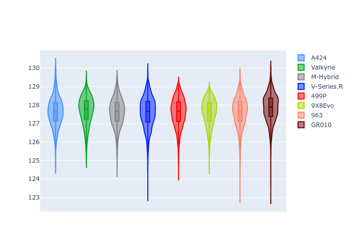
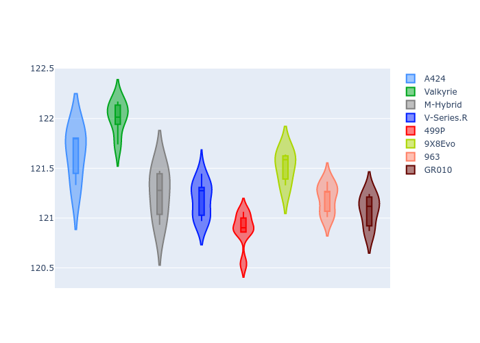
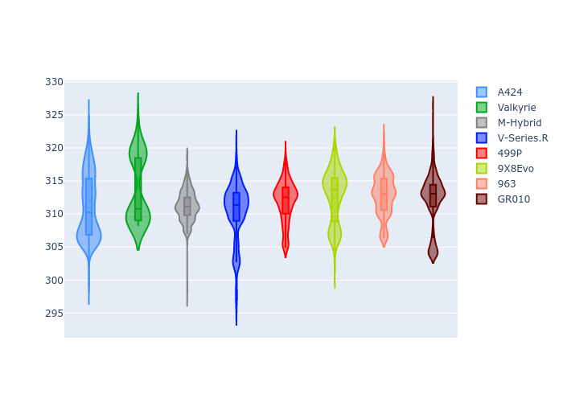
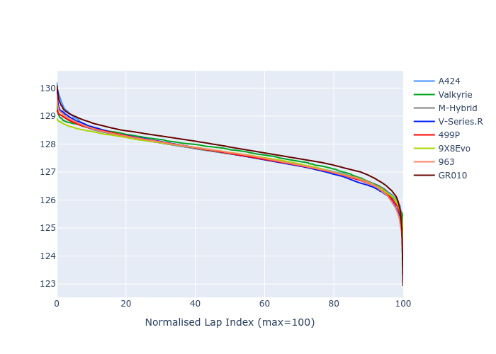

# Combined Plots

## Metadata

- BoP Accuracy: 99.75%
- Overall BoP Grade: A1
- Track: SPA
- Threshhold: 250.0kph
- Average Laptime: 2:07.65
- Average Quali Laptime: 2:01.34
- Laptime Std Dev: 0.08 seconds
- Filtered Average Topspeed: 312.11kph

## BoP Table
| Manufacturer   | Car        | Weight   | Power   | PINC   | E/Stint   | FDS    | RDP    | QDP    | TDP    |
|:---------------|:-----------|:---------|:--------|:-------|:----------|:-------|:-------|:-------|:-------|
| Alpine         | A424       | 1051kg   | 511.0kw | +0.10% | 906MJ     | -      | 51.38% | 57.54% | 26.10% |
| Aston Martin   | Valkyrie   | 1030kg   | 520.0kw | -      | 914MJ     | -      | 52.56% | 51.11% | 27.23% |
| BMW            | M-Hybrid   | 1048kg   | 513.0kw | +0.10% | 913MJ     | -      | 52.62% | 53.36% | 32.99% |
| Cadillac       | V-Series.R | 1047kg   | 519.0kw | -      | 914MJ     | -      | 48.29% | 59.47% | 18.65% |
| Ferrari        | 499P       | 1052kg   | 503.0kw | -0.60% | 899MJ     | 190kph | 51.25% | 43.28% | 10.17% |
| Peugeot        | 9X8Evo     | 1050kg   | 518.0kw | -0.10% | 911MJ     | 190kph | 48.70% | 50.83% | 18.68% |
| Porsche        | 963        | 1049kg   | 511.0kw | -0.10% | 912MJ     | -      | 50.57% | 42.80% | 29.05% |
| Toyota         | GR010      | 1061kg   | 502.0kw | -0.10% | 905MJ     | 190kph | 51.03% | 51.78% | 14.64% |

## Performance Table
| Manufacturer   | Car        | RP      | QP      | Vavg      |   RDLC | BOP-Grade   | Match   |
|:---------------|:-----------|:--------|:--------|:----------|-------:|:------------|:--------|
| Alpine         | A424       | 2:07.62 | 2:01.65 | 310.53kph |   1.05 | ~A1         | 98.99%  |
| Aston Martin   | Valkyrie   | 2:07.70 | 2:02.01 | 313.52kph |   1.05 | ~A1         | 100.00% |
| BMW            | M-Hybrid   | 2:07.61 | 2:01.24 | 310.77kph |   1.05 | ~A1         | 100.00% |
| Cadillac       | V-Series.R | 2:07.60 | 2:01.18 | 309.75kph |   1.05 | ~A1         | 99.73%  |
| Ferrari        | 499P       | 2:07.61 | 2:00.88 | 313.05kph |   1.06 | ~A1         | 100.00% |
| Peugeot        | 9X8Evo     | 2:07.60 | 2:01.52 | 313.71kph |   1.05 | ~A1         | 100.00% |
| Porsche        | 963        | 2:07.61 | 2:01.20 | 312.70kph |   1.05 | ~A1         | 99.91%  |
| Toyota         | GR010      | 2:07.84 | 2:01.08 | 312.83kph |   1.06 | ~A1         | 99.39%  |

## Race Laptimes

## Quali Laptimes

## Topspeeds

## Laptimes Lineplot

