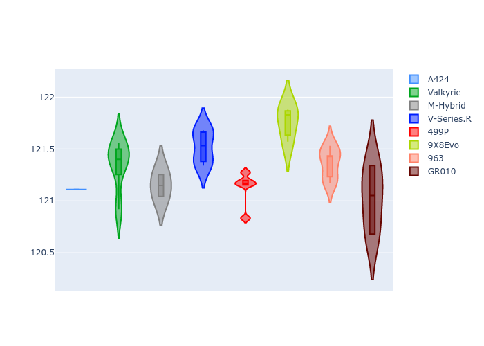

# Combined Plots

## Metadata

- BoP Accuracy: 99.02%
- Overall BoP Grade: A1
- Track: SPA
- Threshhold: 210.0kph

## BoP Table
| Manufacturer   | Car        | Weight   | Power   | PINC   | E/Stint   | FDS    |
|:---------------|:-----------|:---------|:--------|:-------|:----------|:-------|
| Alpine         | A424       | 1057kg   | 520.0kw | -1.00% | 912MJ     | -      |
| Aston Martin   | Valkyrie   | 1040kg   | 505.0kw | +0.40% | 902MJ     | -      |
| BMW            | M-Hybrid   | 1051kg   | 512.0kw | +1.00% | 914MJ     | -      |
| Cadillac       | V-Series.R | 1044kg   | 510.0kw | +1.00% | 908MJ     | -      |
| Ferrari        | 499P       | 1073kg   | 508.0kw | -1.00% | 906MJ     | 190kph |
| Peugeot        | 9X8Evo     | 1060kg   | 510.0kw | -1.00% | 903MJ     | 190kph |
| Porsche        | 963        | 1057kg   | 516.0kw | -1.00% | 916MJ     | -      |
| Toyota         | GR010      | 1090kg   | 512.0kw | +1.00% | 920MJ     | 190kph |

## Performance Table
| Manufacturer   | Car        | RP      | QP      | Vavg      |   RDLC | BOP-Grade   | Match   |
|:---------------|:-----------|:--------|:--------|:----------|-------:|:------------|:--------|
| Alpine         | A424       | 2:05.51 | 1:59.77 | 309.19kph |   1.05 | ~A1         | 99.81%  |
| Aston Martin   | Valkyrie   | 2:06.95 | 2:00.25 | 307.80kph |   1.06 | ~A1         | 96.55%  |
| BMW            | M-Hybrid   | 2:05.74 | 1:59.59 | 308.54kph |   1.05 | ~A1         | 99.96%  |
| Cadillac       | V-Series.R | 2:06.13 | 2:00.05 | 305.42kph |   1.05 | ~A1         | 99.79%  |
| Ferrari        | 499P       | 2:05.63 | 1:59.40 | 307.58kph |   1.05 | ~A1         | 99.68%  |
| Peugeot        | 9X8Evo     | 2:06.43 | 2:00.25 | 308.64kph |   1.05 | ~A1         | 96.74%  |
| Porsche        | 963        | 2:05.79 | 1:59.71 | 307.40kph |   1.05 | ~A1         | 99.87%  |
| Toyota         | GR010      | 2:05.60 | 1:59.25 | 308.78kph |   1.05 | ~A1         | 99.80%  |

## Race Laptimes

## Quali Laptimes

## Topspeeds

## Laptimes Lineplot

