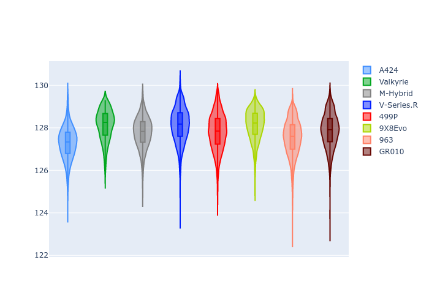
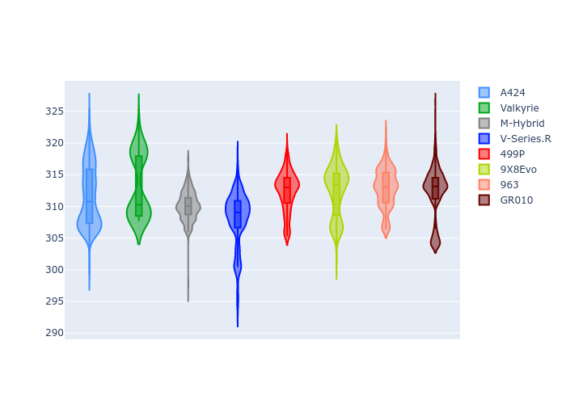

# Combined Plots

## Metadata

- BoP Accuracy: 99.49%
- Overall BoP Grade: A1
- Track: SPA
- Threshhold: 250.0kph

## BoP Table
| Manufacturer   | Car        | Weight   | Power   | PINC   | E/Stint   | FDS    | RDP    | QDP    | TDP    |
|:---------------|:-----------|:---------|:--------|:-------|:----------|:-------|:-------|:-------|:-------|
| Alpine         | A424       | 1057kg   | 520.0kw | -0.10% | 913MJ     | -      | 52.35% | 61.85% | 27.84% |
| Aston Martin   | Valkyrie   | 1040kg   | 505.0kw | +0.40% | 902MJ     | -      | 53.59% | 53.33% | 21.51% |
| BMW            | M-Hybrid   | 1051kg   | 512.0kw | +0.10% | 913MJ     | -      | 53.26% | 57.23% | 34.54% |
| Cadillac       | V-Series.R | 1044kg   | 510.0kw | +0.10% | 906MJ     | -      | 47.80% | 56.73% | 19.63% |
| Ferrari        | 499P       | 1073kg   | 508.0kw | -0.10% | 908MJ     | 190kph | 53.02% | 42.32% | 9.88%  |
| Peugeot        | 9X8Evo     | 1060kg   | 510.0kw | -0.10% | 904MJ     | 190kph | 48.47% | 51.26% | 16.02% |
| Porsche        | 963        | 1057kg   | 516.0kw | -0.10% | 917MJ     | -      | 50.87% | 45.25% | 30.77% |
| Toyota         | GR010      | 1090kg   | 512.0kw | -0.10% | 918MJ     | 190kph | 52.43% | 57.12% | 12.82% |

## Performance Table
| Manufacturer   | Car        | RP      | QP      | Vavg      |   RDLC | BOP-Grade   | Match   |
|:---------------|:-----------|:--------|:--------|:----------|-------:|:------------|:--------|
| Alpine         | A424       | 2:05.88 | 1:59.95 | 309.68kph |   1.05 | ~A1         | 99.79%  |
| Aston Martin   | Valkyrie   | 2:07.35 | 2:00.59 | 307.82kph |   1.06 | ~A1         | 99.06%  |
| BMW            | M-Hybrid   | 2:06.33 | 1:59.94 | 307.80kph |   1.05 | ~A1         | 100.00% |
| Cadillac       | V-Series.R | 2:06.63 | 2:00.25 | 304.50kph |   1.05 | ~A1         | 99.91%  |
| Ferrari        | 499P       | 2:06.04 | 1:59.11 | 308.20kph |   1.06 | ~A1         | 99.60%  |
| Peugeot        | 9X8Evo     | 2:06.96 | 2:00.71 | 309.34kph |   1.05 | ~A1         | 97.95%  |
| Porsche        | 963        | 2:06.21 | 1:59.90 | 308.47kph |   1.05 | ~A1         | 99.81%  |
| Toyota         | GR010      | 2:06.10 | 1:59.04 | 308.36kph |   1.06 | ~A1         | 99.80%  |

## Race Laptimes

## Quali Laptimes

## Topspeeds

## Laptimes Lineplot

