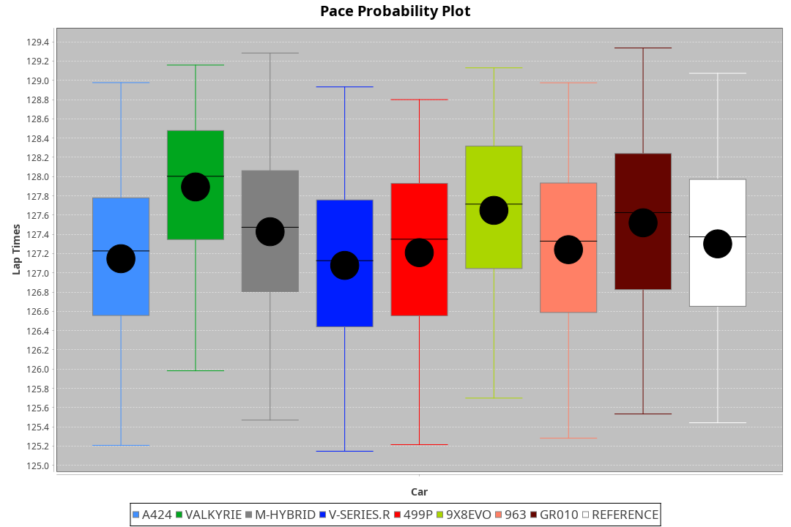
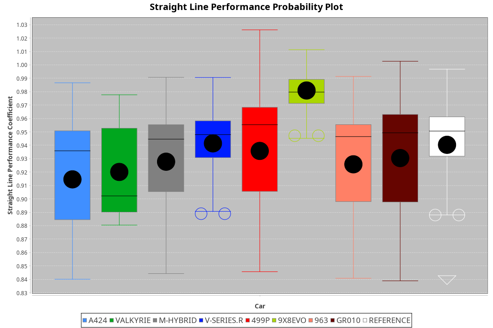
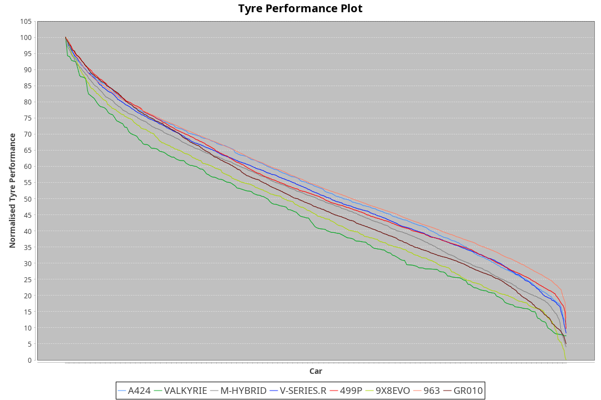

| Manufacturer | Car        | Weight | Power   | PINC    | E/Stint | FDS     |
|:-|:-|:-|:-|:-|:-|:-|
| Alpine       | A424       | 1057kg | 517.0kw |    -    | 918MJ   |    -    |
| Aston Martin | Valkyrie   | 1042kg | 505.0kw | 0.40%   | 900MJ   |    -    |
| BMW          | M-Hybrid   | 1051kg | 509.0kw | 1.00%   | 909MJ   |    -    |
| Cadillac     | V-Series.R | 1044kg | 507.0kw | 1.00%   | 904MJ   |    -    |
| Ferrari      | 499P       | 1073kg | 505.0kw | -1.00%  | 900MJ   | 190kph  |
| Peugeot      | 9X8Evo     | 1060kg | 507.0kw | -1.00%  | 907MJ   | 190kph  |
| Porsche      | 963        | 1057kg | 513.0kw | 1.00%   | 913MJ   |    -    |
| Toyota       | GR010      | 1090kg | 509.0kw | 1.00%   | 916MJ   | 190kph  |

### BoP Accuracy: 88.99%; Overall BoP Grade: B1
| Manufacturer | Car        | Type  | RP      | QP      | Weight | Power¹  | Threshhold | PINC    | Power²   | E/Stint | AVG Vmax  | FDS     | RDLC | L/Stint | BOP-Grade | Model Accuracy | Model Points | Match%  | SimDiff |
|:-|:-|:-|:-|:-|:-|:-|:-|:-|:-|:-|:-|:-|:-|:-|:-|:-|:-|:-|:-|
| Alpine       | A424       | LMDH  | 2:07.09 | 2:01.65 | 1057kg | 517.0kw | 210.0kph   |    -    | 517.00kw |  918MJ  | 300.36kph |    -    | 1.01 | 25      | -A2       | 99.58%         | 1429         | 92.72%  | +0.30   |
| Aston Martin | Valkyrie   | LMHNH | 2:07.88 | 2:02.29 | 1042kg | 505.0kw | 210.0kph   | 0.40%   | 507.00kw |  900MJ  | 285.59kph |    -    | 1.05 | 25      | +E1       | 100.00%        | 247          | 59.71%  | #       |
| BMW          | M-Hybrid   | LMDH  | 2:07.38 | 2:01.78 | 1051kg | 509.0kw | 210.0kph   | 1.00%   | 514.10kw |  909MJ  | 295.16kph |    -    | 1.03 | 25      | ~A1       | 99.97%         | 2912         | 100.00% | +0.25   |
| Cadillac     | V-Series.R | LMDH  | 2:07.03 | 2:01.66 | 1044kg | 507.0kw | 210.0kph   | 1.00%   | 512.10kw |  904MJ  | 298.71kph |    -    | 1.03 | 25      | -A2       | 99.49%         | 5225         | 90.73%  | +0.81   |
| Ferrari      | 499P       | LMHHU | 2:07.12 | 2:01.37 | 1073kg | 505.0kw | 210.0kph   | -1.00%  | 500.00kw |  900MJ  | 301.05kph | 190kph  | 1.03 | 25      | -B1       | 100.00%        | 5378         | 89.58%  | +0.61   |
| Peugeot      | 9X8Evo     | LMHHU | 2:07.61 | 2:02.20 | 1060kg | 507.0kw | 210.0kph   | -1.00%  | 501.90kw |  907MJ  | 303.18kph | 190kph  | 1.00 | 25      | +B1       | 100.00%        | 1459         | 88.92%  | -0.01   |
| Porsche      | 963        | LMDH  | 2:07.18 | 2:01.47 | 1057kg | 513.0kw | 210.0kph   | 1.00%   | 518.10kw |  913MJ  | 296.60kph |    -    | 1.02 | 25      | -A2       | 99.92%         | 14207        | 94.57%  | -0.12   |
| Toyota       | GR010      | LMHHU | 2:07.44 | 2:01.51 | 1090kg | 509.0kw | 210.0kph   | 1.00%   | 514.10kw |  916MJ  | 300.10kph | 190kph  | 1.01 | 25      | ~A1       | 99.86%         | 4280         | 95.73%  | +0.84   |

## Power below Threshhold
| N/Nmax    | A424    | VALKYRIE | M-HYBRID | V-SERIES.R | 499P    | 9X8EVO  | 963     | GR010   |
|:-|:-|:-|:-|:-|:-|:-|:-|:-|
|  0.550    |  255    |  249     |  251     |  250       |  249    |  250    |  253    |  251    |
|  0.575    |  278    |  272     |  274     |  273       |  272    |  273    |  276    |  274    |
|  0.600    |  298    |  292     |  294     |  293       |  292    |  293    |  296    |  294    |
|  0.625    |  320    |  312     |  315     |  314       |  312    |  314    |  317    |  315    |
|  0.650    |  341    |  333     |  336     |  335       |  333    |  335    |  338    |  336    |
|  0.675    |  363    |  355     |  357     |  356       |  355    |  356    |  360    |  357    |
|  0.700    |  385    |  376     |  379     |  377       |  376    |  377    |  382    |  379    |
|  0.725    |  407    |  397     |  400     |  399       |  397    |  399    |  403    |  400    |
|  0.750    |  427    |  417     |  421     |  419       |  417    |  419    |  424    |  421    |
|  0.775    |  446    |  436     |  440     |  438       |  436    |  438    |  443    |  440    |
|  0.800    |  464    |  454     |  457     |  455       |  454    |  455    |  461    |  457    |
|  0.825    |  479    |  469     |  472     |  470       |  469    |  470    |  476    |  472    |
|  0.850    |  491    |  480     |  484     |  482       |  480    |  482    |  487    |  484    |
|  0.875    |  502    |  490     |  494     |  492       |  490    |  492    |  498    |  494    |
|  0.900    |  509    |  497     |  501     |  499       |  497    |  499    |  505    |  501    |
|  0.925    |  514    |  502     |  506     |  504       |  502    |  504    |  510    |  506    |
| **0.950** | **517** | **505**  | **509**  | **507**    | **505** | **507** | **513** | **509** |
|  0.975    |  515    |  503     |  507     |  505       |  503    |  505    |  511    |  507    |
|  1.000    |  511    |  500     |  504     |  502       |  500    |  502    |  507    |  504    |
|  1.025    |  441    |  431     |  435     |  433       |  431    |  433    |  438    |  435    |

## Power above Threshhold
| N/Nmax    | A424    | VALKYRIE   | M-HYBRID   | V-SERIES.R | 499P       | 9X8EVO     | 963        | GR010      |
|:-|:-|:-|:-|:-|:-|:-|:-|:-|
|  0.550    |  255    |  250.01    |  253.04    |  252.03    |  246.47    |  247.46    |  255.06    |  253.04    |
|  0.575    |  278    |  273.01    |  276.05    |  275.04    |  268.51    |  270.50    |  278.07    |  276.05    |
|  0.600    |  298    |  293.01    |  297.05    |  296.04    |  288.55    |  290.54    |  299.08    |  297.05    |
|  0.625    |  320    |  314.01    |  318.06    |  317.04    |  308.59    |  310.58    |  321.08    |  318.06    |
|  0.650    |  341    |  335.01    |  339.06    |  338.05    |  329.63    |  331.61    |  342.09    |  339.06    |
|  0.675    |  363    |  356.01    |  361.06    |  359.05    |  350.67    |  352.65    |  364.09    |  361.06    |
|  0.700    |  385    |  377.01    |  383.07    |  381.05    |  371.71    |  373.69    |  386.10    |  383.07    |
|  0.725    |  407    |  399.02    |  404.07    |  403.06    |  392.75    |  394.73    |  407.10    |  404.07    |
|  0.750    |  427    |  419.02    |  425.07    |  423.06    |  412.78    |  414.77    |  428.11    |  425.07    |
|  0.775    |  446    |  438.02    |  444.08    |  442.06    |  431.82    |  433.80    |  447.11    |  444.08    |
|  0.800    |  464    |  455.02    |  462.08    |  460.06    |  448.85    |  450.84    |  465.12    |  462.08    |
|  0.825    |  479    |  470.02    |  477.08    |  475.06    |  463.88    |  465.86    |  480.12    |  477.08    |
|  0.850    |  491    |  482.02    |  488.09    |  486.07    |  474.90    |  476.88    |  492.12    |  488.09    |
|  0.875    |  502    |  492.02    |  499.09    |  497.07    |  484.92    |  486.90    |  503.13    |  499.09    |
|  0.900    |  509    |  499.02    |  506.09    |  504.07    |  491.93    |  493.92    |  510.13    |  506.09    |
|  0.925    |  514    |  504.02    |  511.09    |  509.07    |  496.94    |  498.92    |  515.13    |  511.09    |
| **0.950** | **517** | **507.02** | **514.09** | **512.07** | **499.95** | **501.93** | **518.13** | **514.09** |
|  0.975    |  515    |  505.02    |  512.09    |  510.07    |  497.95    |  499.93    |  516.13    |  512.09    |
|  1.000    |  511    |  502.02    |  508.09    |  506.07    |  494.94    |  496.92    |  512.13    |  508.09    |
|  1.025    |  441    |  433.02    |  439.08    |  437.06    |  426.81    |  428.79    |  442.11    |  439.08    |
