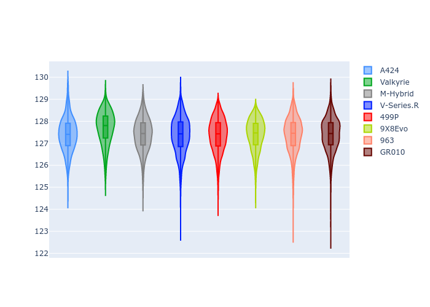
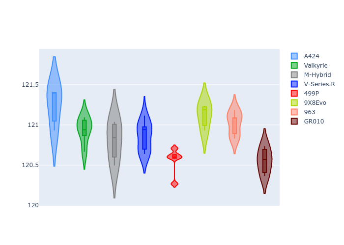
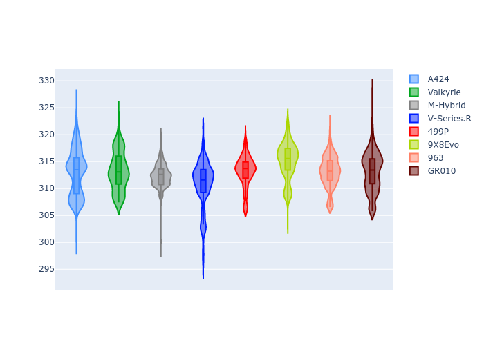
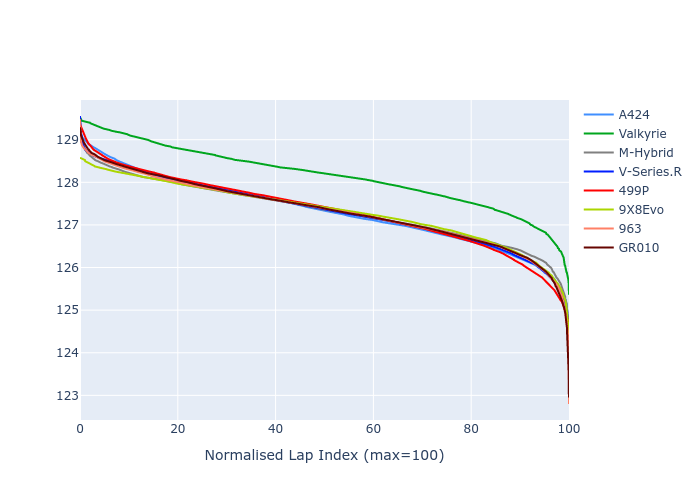

# Combined Plots

## Metadata

- BoP Accuracy: 99.78%
- Overall BoP Grade: A1
- Track: SPA
- Threshhold: 250.0kph
- Average Laptime: 2:07.54
- Average Quali Laptime: 2:01.22
- Laptime Std Dev: 0.19 seconds
- Filtered Average Topspeed: 312.97kph

## BoP Table
| Manufacturer   | Car        | Weight   | Power   | PINC   | E/Stint   | FDS    | RDP    | QDP    | TDP    |
|:---------------|:-----------|:---------|:--------|:-------|:----------|:-------|:-------|:-------|:-------|
| Alpine         | A424       | 1039kg   | 506.0kw | +2.70% | 906MJ     | -      | 51.45% | 55.09% | 24.89% |
| Aston Martin   | Valkyrie   | 1030kg   | 520.0kw | -      | 914MJ     | -      | 53.07% | 48.70% | 24.00% |
| BMW            | M-Hybrid   | 1040kg   | 508.0kw | +2.30% | 913MJ     | -      | 52.63% | 52.34% | 34.06% |
| Cadillac       | V-Series.R | 1041kg   | 520.0kw | -      | 914MJ     | -      | 48.80% | 57.26% | 18.10% |
| Ferrari        | 499P       | 1060kg   | 519.0kw | -3.60% | 907MJ     | 200kph | 51.39% | 44.34% | 9.89%  |
| Peugeot        | 9X8Evo     | 1030kg   | 520.0kw | -1.80% | 907MJ     | 190kph | 49.16% | 50.25% | 18.00% |
| Porsche        | 963        | 1035kg   | 517.0kw | -2.80% | 909MJ     | -      | 50.61% | 41.90% | 27.68% |
| Toyota         | GR010      | 1060kg   | 520.0kw | -4.20% | 911MJ     | 190kph | 51.33% | 51.71% | 14.89% |

## Performance Table
| Manufacturer   | Car        | RP      | QP      | Vavg      |   RDLC | BOP-Grade   | Match   |
|:---------------|:-----------|:--------|:--------|:----------|-------:|:------------|:--------|
| Alpine         | A424       | 2:07.47 | 2:01.34 | 312.96kph |   1.05 | ~A1         | 99.88%  |
| Aston Martin   | Valkyrie   | 2:08.04 | 2:02.08 | 313.23kph |   1.05 | ~A1         | 99.00%  |
| BMW            | M-Hybrid   | 2:07.47 | 2:01.06 | 312.40kph |   1.05 | ~A1         | 100.00% |
| Cadillac       | V-Series.R | 2:07.46 | 2:01.01 | 310.78kph |   1.05 | ~A1         | 99.95%  |
| Ferrari        | 499P       | 2:07.46 | 2:00.89 | 313.17kph |   1.05 | ~A1         | 99.94%  |
| Peugeot        | 9X8Evo     | 2:07.47 | 2:01.34 | 315.03kph |   1.05 | ~A1         | 100.00% |
| Porsche        | 963        | 2:07.46 | 2:01.34 | 313.12kph |   1.05 | ~A1         | 99.94%  |
| Toyota         | GR010      | 2:07.48 | 2:00.66 | 313.06kph |   1.06 | ~A1         | 99.53%  |

## Race Laptimes

## Quali Laptimes

## Topspeeds

## Laptimes Lineplot

