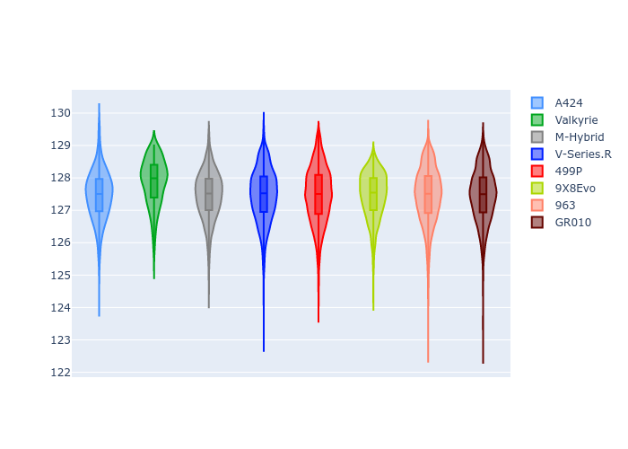

# Combined Plots

## Metadata

- BoP Accuracy: 99.80%
- Overall BoP Grade: A1
- Track: SPA
- Threshhold: 210.0kph

## BoP Table
| Manufacturer   | Car        | Weight   | Power   | PINC   | E/Stint   | FDS    |
|:---------------|:-----------|:---------|:--------|:-------|:----------|:-------|
| Alpine         | A424       | 1041kg   | 500.0kw | +0.80% | 895MJ     | -      |
| Aston Martin   | Valkyrie   | 1030kg   | 520.0kw | -0.20% | 913MJ     | -      |
| BMW            | M-Hybrid   | 1042kg   | 500.0kw | +2.50% | 905MJ     | -      |
| Cadillac       | V-Series.R | 1049kg   | 513.0kw | +1.30% | 911MJ     | -      |
| Ferrari        | 499P       | 1065kg   | 486.0kw | +5.10% | 896MJ     | 190kph |
| Peugeot        | 9X8Evo     | 1030kg   | 520.0kw | -7.60% | 897MJ     | 190kph |
| Porsche        | 963        | 1040kg   | 497.0kw | +3.00% | 904MJ     | -      |
| Toyota         | GR010      | 1064kg   | 492.0kw | +2.40% | 902MJ     | 190kph |

## Performance Table
| Manufacturer   | Car        | RP      | QP      | Vavg      |   RDLC | BOP-Grade   | Match   |
|:---------------|:-----------|:--------|:--------|:----------|-------:|:------------|:--------|
| Alpine         | A424       | 2:06.04 | 2:00.26 | 307.91kph |   1.05 | ~A1         | 99.54%  |
| Aston Martin   | Valkyrie   | 2:06.03 | 1:59.41 | 311.70kph |   1.06 | ~A1         | 100.00% |
| BMW            | M-Hybrid   | 2:06.03 | 1:59.86 | 308.00kph |   1.05 | ~A1         | 99.96%  |
| Cadillac       | V-Series.R | 2:06.04 | 1:59.97 | 305.77kph |   1.05 | ~A1         | 99.96%  |
| Ferrari        | 499P       | 2:06.03 | 1:59.76 | 308.14kph |   1.05 | ~A1         | 99.98%  |
| Peugeot        | 9X8Evo     | 2:06.02 | 1:59.88 | 308.73kph |   1.05 | ~A1         | 99.12%  |
| Porsche        | 963        | 2:06.03 | 1:59.94 | 308.11kph |   1.05 | ~A1         | 99.89%  |
| Toyota         | GR010      | 2:06.02 | 1:59.64 | 308.10kph |   1.05 | ~A1         | 99.97%  |

## Race Laptimes

## Quali Laptimes

## Topspeeds

## Laptimes Lineplot

