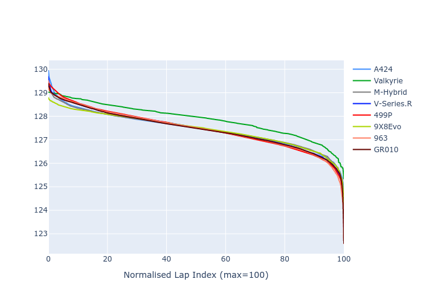

# Combined Plots

## Metadata

- BoP Accuracy: 99.90%
- Overall BoP Grade: A1
- Track: SPA
- Threshhold: 250.0kph

## BoP Table
| Manufacturer   | Car        | Weight   | Power   | PINC   | E/Stint   | FDS    | RDP    | QDP    | TDP    |
|:---------------|:-----------|:---------|:--------|:-------|:----------|:-------|:-------|:-------|:-------|
| Alpine         | A424       | 1040kg   | 508.0kw | +0.40% | 902MJ     | -      | 52.35% | 61.85% | 27.84% |
| Aston Martin   | Valkyrie   | 1030kg   | 520.0kw | -0.40% | 913MJ     | -      | 53.59% | 53.33% | 21.51% |
| BMW            | M-Hybrid   | 1044kg   | 508.0kw | +1.80% | 912MJ     | -      | 53.26% | 57.23% | 34.54% |
| Cadillac       | V-Series.R | 1049kg   | 520.0kw | -      | 915MJ     | -      | 47.80% | 56.73% | 19.63% |
| Ferrari        | 499P       | 1067kg   | 496.0kw | +3.60% | 904MJ     | 190kph | 53.02% | 42.32% | 9.88%  |
| Peugeot        | 9X8Evo     | 1030kg   | 520.0kw | -4.50% | 900MJ     | 190kph | 48.47% | 51.26% | 16.02% |
| Porsche        | 963        | 1040kg   | 507.0kw | +1.20% | 910MJ     | -      | 50.87% | 45.25% | 30.77% |
| Toyota         | GR010      | 1066kg   | 498.0kw | +1.50% | 907MJ     | 190kph | 52.43% | 57.12% | 12.82% |

## Performance Table
| Manufacturer   | Car        | RP      | QP      | Vavg      |   RDLC | BOP-Grade   | Match   |
|:---------------|:-----------|:--------|:--------|:----------|-------:|:------------|:--------|
| Alpine         | A424       | 2:06.10 | 2:00.15 | 309.30kph |   1.05 | ~A1         | 99.79%  |
| Aston Martin   | Valkyrie   | 2:06.09 | 1:59.45 | 311.52kph |   1.06 | ~A1         | 100.00% |
| BMW            | M-Hybrid   | 2:06.10 | 1:59.72 | 309.08kph |   1.05 | ~A1         | 100.00% |
| Cadillac       | V-Series.R | 2:06.10 | 1:59.76 | 306.04kph |   1.05 | ~A1         | 100.00% |
| Ferrari        | 499P       | 2:06.08 | 1:59.15 | 309.19kph |   1.06 | ~A1         | 99.81%  |
| Peugeot        | 9X8Evo     | 2:06.09 | 1:59.91 | 311.00kph |   1.05 | ~A1         | 100.00% |
| Porsche        | 963        | 2:06.08 | 1:59.78 | 309.39kph |   1.05 | ~A1         | 99.87%  |
| Toyota         | GR010      | 2:06.10 | 1:59.04 | 309.08kph |   1.06 | ~A1         | 99.76%  |

## Race Laptimes

## Quali Laptimes

## Topspeeds

## Laptimes Lineplot

