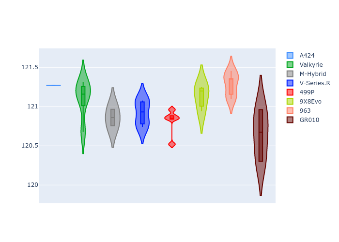

# Combined Plots

## Metadata

- BoP Accuracy: 99.78%
- Overall BoP Grade: A1
- Track: SPA
- Threshhold: 250.0kph
- Average Laptime: 2:07.51
- Average Quali Laptime: 2:01.00
- Average Topspeed: 312.70kph

## BoP Table
| Manufacturer   | Car        | Weight   | Power   | PINC   | E/Stint   | FDS    | RDP    | QDP    | TDP    |
|:---------------|:-----------|:---------|:--------|:-------|:----------|:-------|:-------|:-------|:-------|
| Alpine         | A424       | 1038kg   | 499.0kw | +4.20% | 903MJ     | -      | 51.64% | 59.31% | 26.80% |
| Aston Martin   | Valkyrie   | 1030kg   | 520.0kw | -      | 914MJ     | -      | 53.50% | 53.33% | 21.51% |
| BMW            | M-Hybrid   | 1040kg   | 505.0kw | +2.90% | 912MJ     | -      | 52.89% | 56.22% | 33.41% |
| Cadillac       | V-Series.R | 1043kg   | 520.0kw | -      | 914MJ     | -      | 48.63% | 60.80% | 19.01% |
| Ferrari        | 499P       | 1061kg   | 519.0kw | -4.00% | 906MJ     | 190kph | 51.38% | 44.98% | 9.83%  |
| Peugeot        | 9X8Evo     | 1030kg   | 520.0kw | -2.30% | 905MJ     | 190kph | 48.87% | 52.78% | 15.41% |
| Porsche        | 963        | 1035kg   | 517.0kw | -3.20% | 908MJ     | -      | 50.70% | 44.30% | 29.51% |
| Toyota         | GR010      | 1056kg   | 519.0kw | -5.10% | 908MJ     | 190kph | 51.09% | 52.71% | 11.46% |

## Performance Table
| Manufacturer   | Car        | RP      | QP      | Vavg      |   RDLC | BOP-Grade   | Match   |
|:---------------|:-----------|:--------|:--------|:----------|-------:|:------------|:--------|
| Alpine         | A424       | 2:07.44 | 2:01.27 | 312.64kph |   1.05 | ~A1         | 99.11%  |
| Aston Martin   | Valkyrie   | 2:07.87 | 2:01.10 | 314.08kph |   1.06 | ~A1         | 100.00% |
| BMW            | M-Hybrid   | 2:07.46 | 2:00.86 | 312.08kph |   1.05 | ~A1         | 99.94%  |
| Cadillac       | V-Series.R | 2:07.47 | 2:00.92 | 310.04kph |   1.05 | ~A1         | 99.68%  |
| Ferrari        | 499P       | 2:07.46 | 2:00.81 | 312.65kph |   1.06 | ~A1         | 99.88%  |
| Peugeot        | 9X8Evo     | 2:07.45 | 2:01.13 | 314.41kph |   1.05 | ~A1         | 100.00% |
| Porsche        | 963        | 2:07.45 | 2:01.28 | 312.77kph |   1.05 | ~A1         | 99.86%  |
| Toyota         | GR010      | 2:07.45 | 2:00.65 | 312.96kph |   1.06 | ~A1         | 99.79%  |

## Race Laptimes

## Quali Laptimes

## Topspeeds

## Laptimes Lineplot

