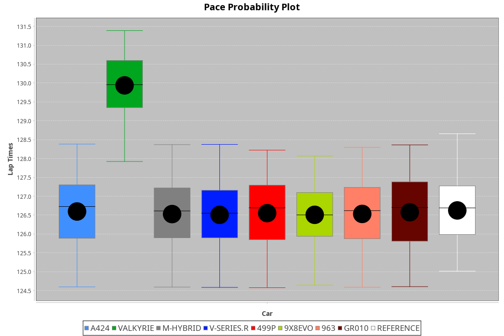
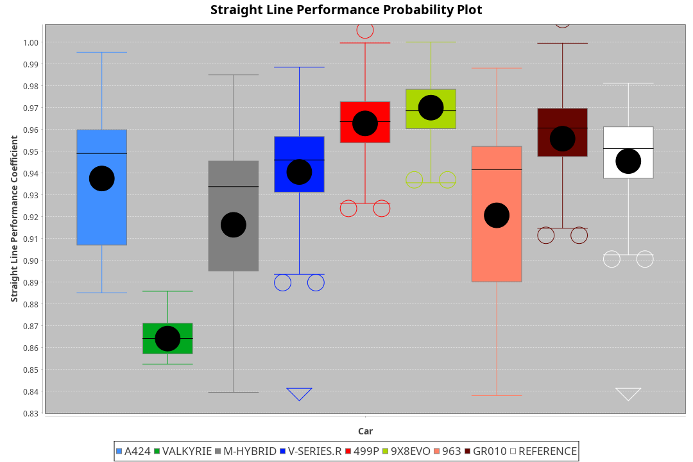
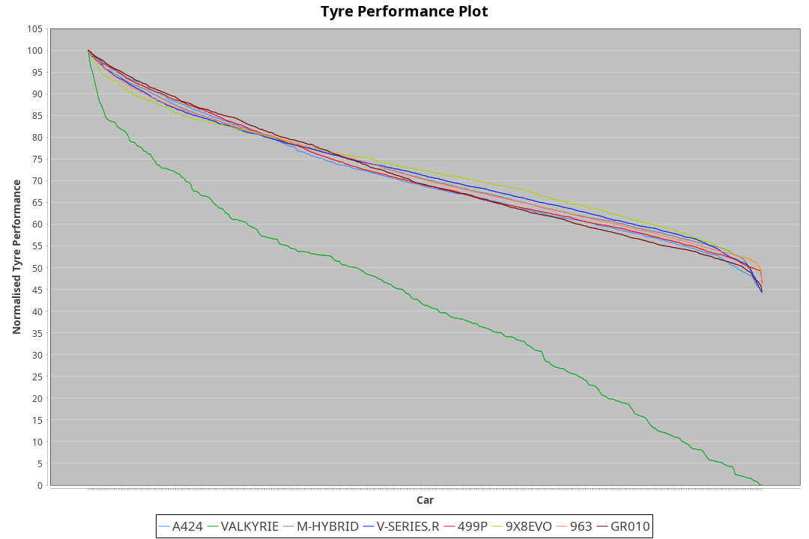

| Manufacturer | Car        | Weight | Power   | PINC    | E/Stint | FDS     |
|:-|:-|:-|:-|:-|:-|:-|
| Alpine       | A424       | 1036kg | 520.0kw | -0.90%  | 916MJ   |    -    |
| Aston Martin | Valkyrie   | 1030kg | 520.0kw |    -    | 911MJ   |    -    |
| BMW          | M-Hybrid   | 1039kg | 520.0kw | -0.30%  | 915MJ   |    -    |
| Cadillac     | V-Series.R | 1049kg | 518.0kw | 0.30%   | 914MJ   |    -    |
| Ferrari      | 499P       | 1068kg | 509.0kw | 1.00%   | 907MJ   | 190kph  |
| Peugeot      | 9X8Evo     | 1030kg | 520.0kw | -5.70%  | 904MJ   | 190kph  |
| Porsche      | 963        | 1040kg | 508.0kw | 1.90%   | 909MJ   |    -    |
| Toyota       | GR010      | 1074kg | 504.0kw | 3.10%   | 915MJ   | 190kph  |

### BoP Accuracy: 72.69%; Overall BoP Grade: C2
| Manufacturer | Car        | Type  | RP      | QP      | Weight | Power¹  | Threshhold | PINC    | Power²   | E/Stint | AVG Vmax  | FDS     | RDLC | L/Stint | BOP-Grade | Model Accuracy | Model Points | Match% | SimDiff |
|:-|:-|:-|:-|:-|:-|:-|:-|:-|:-|:-|:-|:-|:-|:-|:-|:-|:-|:-|:-|
| Alpine       | A424       | LMDH  | 2:06.49 | 2:01.99 | 1036kg | 520.0kw | 250.0kph   | -0.90%  | 515.30kw |  916MJ  | 313.00kph |    -    | 1.01 | 25      | -B1       | 99.49%         | 1360         | 85.63% | -0.08   |
| Aston Martin | Valkyrie   | LMHNH | 2:09.85 | 2:04.28 | 1030kg | 520.0kw | 0.0kph     |    -    | 520.00kw |  911MJ  | 304.35kph |    -    | 1.04 | 25      | +Ω2       | 100.00%        | 312          | -5.65% | #       |
| BMW          | M-Hybrid   | LMDH  | 2:06.48 | 2:00.93 | 1039kg | 520.0kw | 250.0kph   | -0.30%  | 518.40kw |  915MJ  | 311.87kph |    -    | 1.01 | 25      | -B1       | 98.62%         | 2363         | 85.69% | +0.05   |
| Cadillac     | V-Series.R | LMDH  | 2:06.48 | 2:01.35 | 1049kg | 518.0kw | 250.0kph   | 0.30%   | 519.60kw |  914MJ  | 306.18kph |    -    | 1.01 | 25      | -B1       | 98.50%         | 4201         | 85.77% | +1.00   |
| Ferrari      | 499P       | LMHHU | 2:06.47 | 2:01.16 | 1068kg | 509.0kw | 250.0kph   | 1.00%   | 514.10kw |  907MJ  | 309.52kph | 190kph  | 1.02 | 25      | -B2       | 100.00%        | 4441         | 81.97% | +0.52   |
| Peugeot      | 9X8Evo     | LMHHU | 2:06.48 | 2:01.62 | 1030kg | 520.0kw | 250.0kph   | -5.70%  | 490.40kw |  904MJ  | 309.95kph | 190kph  | 1.02 | 25      | -C1       | 100.00%        | 808          | 79.03% | +0.26   |
| Porsche      | 963        | LMDH  | 2:06.49 | 2:00.89 | 1040kg | 508.0kw | 250.0kph   | 1.90%   | 517.70kw |  909MJ  | 309.84kph |    -    | 1.01 | 25      | -B2       | 99.87%         | 12613        | 83.76% | -0.26   |
| Toyota       | GR010      | LMHHU | 2:06.50 | 2:00.96 | 1074kg | 504.0kw | 250.0kph   | 3.10%   | 519.60kw |  915MJ  | 306.95kph | 190kph  | 1.02 | 25      | -B1       | 99.73%         | 2956         | 85.34% | +1.15   |

## Power below Threshhold
| N/Nmax    | A424    | VALKYRIE | M-HYBRID | V-SERIES.R | 499P    | 9X8EVO  | 963     | GR010   |
|:-|:-|:-|:-|:-|:-|:-|:-|:-|
|  0.550    |  256    |  256     |  256     |  255       |  251    |  256    |  250    |  248    |
|  0.575    |  279    |  279     |  279     |  278       |  274    |  279    |  273    |  271    |
|  0.600    |  300    |  300     |  300     |  299       |  294    |  300    |  293    |  291    |
|  0.625    |  322    |  322     |  322     |  321       |  315    |  322    |  314    |  312    |
|  0.650    |  343    |  343     |  343     |  342       |  336    |  343    |  335    |  333    |
|  0.675    |  365    |  365     |  365     |  364       |  357    |  365    |  357    |  354    |
|  0.700    |  387    |  387     |  387     |  386       |  379    |  387    |  378    |  375    |
|  0.725    |  409    |  409     |  409     |  407       |  400    |  409    |  399    |  396    |
|  0.750    |  430    |  430     |  430     |  428       |  421    |  430    |  420    |  416    |
|  0.775    |  449    |  449     |  449     |  447       |  440    |  449    |  439    |  435    |
|  0.800    |  467    |  467     |  467     |  465       |  457    |  467    |  456    |  453    |
|  0.825    |  482    |  482     |  482     |  480       |  472    |  482    |  471    |  468    |
|  0.850    |  494    |  494     |  494     |  492       |  484    |  494    |  483    |  479    |
|  0.875    |  505    |  505     |  505     |  503       |  494    |  505    |  493    |  489    |
|  0.900    |  512    |  512     |  512     |  510       |  501    |  512    |  500    |  496    |
|  0.925    |  517    |  517     |  517     |  515       |  506    |  517    |  505    |  501    |
| **0.950** | **520** | **520**  | **520**  | **518**    | **509** | **520** | **508** | **504** |
|  0.975    |  518    |  518     |  518     |  516       |  507    |  518    |  506    |  502    |
|  1.000    |  514    |  514     |  514     |  512       |  504    |  514    |  503    |  499    |
|  1.025    |  444    |  444     |  444     |  442       |  435    |  444    |  434    |  430    |

## Power above Threshhold
| N/Nmax    | A424       | VALKYRIE | M-HYBRID   | V-SERIES.R | 499P       | 9X8EVO     | 963        | GR010      |
|:-|:-|:-|:-|:-|:-|:-|:-|:-|
|  0.550    |  254.16    |  256     |  255.22    |  256.27    |  253.04    |  241.18    |  255.32    |  256.31    |
|  0.575    |  277.17    |  279     |  278.24    |  279.30    |  276.05    |  264.19    |  278.35    |  279.34    |
|  0.600    |  297.18    |  300     |  299.25    |  299.32    |  297.05    |  283.21    |  298.38    |  299.36    |
|  0.625    |  319.20    |  322     |  321.27    |  321.34    |  318.06    |  303.22    |  320.40    |  321.39    |
|  0.650    |  340.21    |  343     |  342.29    |  342.37    |  339.06    |  324.24    |  341.43    |  342.41    |
|  0.675    |  362.22    |  365     |  364.31    |  364.39    |  361.06    |  344.25    |  363.46    |  364.44    |
|  0.700    |  383.24    |  387     |  386.33    |  386.41    |  383.07    |  365.27    |  385.49    |  386.46    |
|  0.725    |  405.25    |  409     |  407.35    |  408.44    |  404.07    |  386.28    |  407.51    |  408.49    |
|  0.750    |  426.26    |  430     |  428.36    |  429.46    |  425.07    |  405.30    |  427.54    |  429.52    |
|  0.775    |  445.28    |  449     |  447.38    |  448.48    |  444.08    |  424.31    |  446.56    |  448.54    |
|  0.800    |  463.29    |  467     |  465.39    |  466.50    |  462.08    |  440.32    |  464.59    |  466.56    |
|  0.825    |  478.30    |  482     |  480.41    |  481.51    |  477.08    |  455.33    |  479.60    |  481.58    |
|  0.850    |  489.30    |  494     |  492.42    |  493.53    |  488.09    |  466.34    |  491.62    |  493.59    |
|  0.875    |  500.31    |  505     |  503.43    |  504.54    |  499.09    |  476.35    |  502.63    |  504.61    |
|  0.900    |  507.32    |  512     |  510.43    |  511.55    |  506.09    |  482.35    |  509.64    |  511.61    |
|  0.925    |  512.32    |  517     |  515.44    |  516.55    |  511.09    |  487.36    |  514.65    |  516.62    |
| **0.950** | **515.32** | **520**  | **518.44** | **519.55** | **514.09** | **490.36** | **517.65** | **519.62** |
|  0.975    |  513.32    |  518     |  516.44    |  517.55    |  512.09    |  488.36    |  515.65    |  517.62    |
|  1.000    |  509.32    |  514     |  512.43    |  513.55    |  508.09    |  485.36    |  511.64    |  513.62    |
|  1.025    |  440.27    |  444     |  442.38    |  443.47    |  439.08    |  419.31    |  441.56    |  443.53    |
