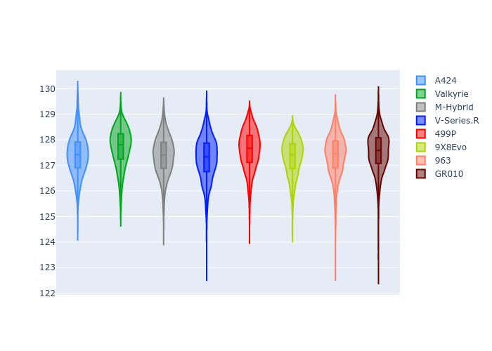
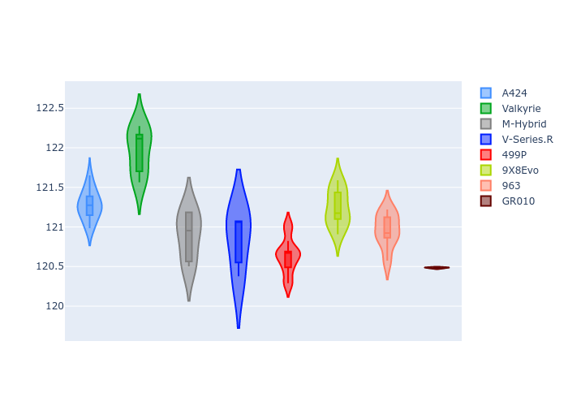
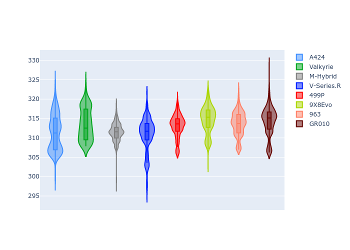
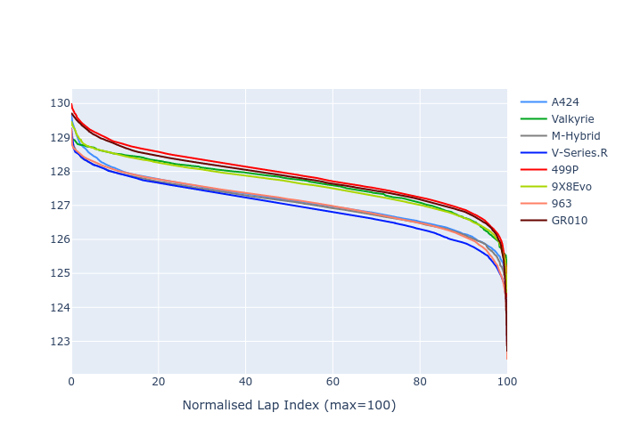

# Combined Plots

## Metadata

- BoP Accuracy: 99.37%
- Overall BoP Grade: A1
- Track: SPA
- Threshhold: 250.0kph
- Average Laptime: 2:07.39
- Average Quali Laptime: 2:01.03
- Laptime Std Dev: 0.31 seconds
- Filtered Average Topspeed: 312.65kph

## BoP Table
| Manufacturer   | Car        | Weight   | Power   | PINC   | E/Stint   | FDS    | RDP    | QDP    | TDP    |
|:---------------|:-----------|:---------|:--------|:-------|:----------|:-------|:-------|:-------|:-------|
| Alpine         | A424       | 1046kg   | 511.0kw | +0.50% | 906MJ     | -      | 52.20% | 54.51% | 24.58% |
| Aston Martin   | Valkyrie   | 1030kg   | 520.0kw | -      | 914MJ     | -      | 53.39% | 54.11% | 23.71% |
| BMW            | M-Hybrid   | 1040kg   | 513.0kw | -      | 912MJ     | -      | 53.47% | 52.95% | 33.73% |
| Cadillac       | V-Series.R | 1037kg   | 519.0kw | -      | 913MJ     | -      | 49.22% | 60.31% | 18.04% |
| Ferrari        | 499P       | 1052kg   | 503.0kw | -0.60% | 899MJ     | 190kph | 51.56% | 44.72% | 9.86%  |
| Peugeot        | 9X8Evo     | 1042kg   | 518.0kw | -      | 910MJ     | 190kph | 50.17% | 49.36% | 17.73% |
| Porsche        | 963        | 1046kg   | 511.0kw | +0.60% | 913MJ     | -      | 50.78% | 41.25% | 27.61% |
| Toyota         | GR010      | 1061kg   | 502.0kw | +1.50% | 909MJ     | 190kph | 51.68% | 51.25% | 14.48% |

## Performance Table
| Manufacturer   | Car        | RP      | QP      | Vavg      |   RDLC | BOP-Grade   | Match   |
|:---------------|:-----------|:--------|:--------|:----------|-------:|:------------|:--------|
| Alpine         | A424       | 2:07.42 | 2:01.27 | 311.08kph |   1.05 | ~A1         | 99.85%  |
| Aston Martin   | Valkyrie   | 2:08.14 | 2:01.96 | 311.57kph |   1.05 | ~A1         | 95.52%  |
| BMW            | M-Hybrid   | 2:07.33 | 2:00.89 | 311.48kph |   1.05 | ~A1         | 100.00% |
| Cadillac       | V-Series.R | 2:07.26 | 2:00.84 | 311.19kph |   1.05 | ~A1         | 99.86%  |
| Ferrari        | 499P       | 2:07.12 | 2:00.64 | 313.16kph |   1.05 | ~A1         | 99.99%  |
| Peugeot        | 9X8Evo     | 2:07.45 | 2:01.24 | 314.34kph |   1.05 | ~A1         | 100.00% |
| Porsche        | 963        | 2:07.28 | 2:00.96 | 313.81kph |   1.05 | ~A1         | 99.92%  |
| Toyota         | GR010      | 2:07.09 | 2:00.48 | 314.56kph |   1.05 | ~A1         | 99.82%  |

## Race Laptimes

## Quali Laptimes

## Topspeeds

## Laptimes Lineplot

