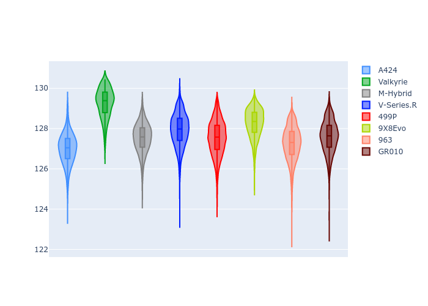
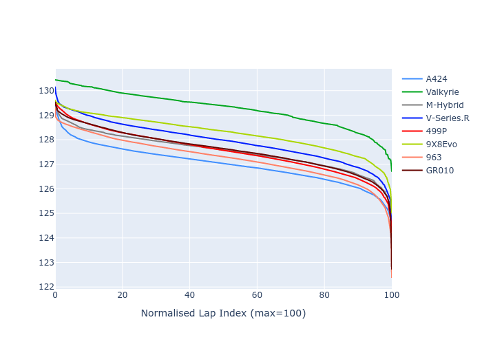

# Combined Plots

## Metadata

- BoP Accuracy: 96.08%
- Overall BoP Grade: A1
- Track: SPA
- Threshhold: 210.0kph
- Average Laptime: 2:07.79
- Average Quali Laptime: 2:01.26
- Average Topspeed: 311.89kph

## BoP Table
| Manufacturer   | Car        | Weight   | Power   | PINC   | E/Stint   | FDS    | RDP    | QDP    | TDP    |
|:---------------|:-----------|:---------|:--------|:-------|:----------|:-------|:-------|:-------|:-------|
| Alpine         | A424       | 1047kg   | 520.0kw | -      | 913MJ     | -      | 51.64% | 59.31% | 26.80% |
| Aston Martin   | Valkyrie   | 1042kg   | 504.0kw | +0.40% | 902MJ     | -      | 53.50% | 53.33% | 21.51% |
| BMW            | M-Hybrid   | 1041kg   | 512.0kw | -      | 911MJ     | -      | 52.89% | 56.22% | 33.41% |
| Cadillac       | V-Series.R | 1034kg   | 510.0kw | -      | 904MJ     | -      | 48.63% | 60.80% | 19.01% |
| Ferrari        | 499P       | 1063kg   | 508.0kw | -      | 906MJ     | 190kph | 51.38% | 44.98% | 9.83%  |
| Peugeot        | 9X8Evo     | 1050kg   | 510.0kw | -      | 904MJ     | 190kph | 48.87% | 52.78% | 15.41% |
| Porsche        | 963        | 1047kg   | 516.0kw | -      | 916MJ     | -      | 50.70% | 44.30% | 29.51% |
| Toyota         | GR010      | 1080kg   | 512.0kw | -      | 916MJ     | 190kph | 51.09% | 52.71% | 11.46% |

## Performance Table
| Manufacturer   | Car        | RP      | QP      | Vavg      |   RDLC | BOP-Grade   | Match   |
|:---------------|:-----------|:--------|:--------|:----------|-------:|:------------|:--------|
| Alpine         | A424       | 2:06.98 | 2:00.84 | 312.78kph |   1.05 | ~A1         | 99.97%  |
| Aston Martin   | Valkyrie   | 2:09.27 | 2:02.38 | 309.58kph |   1.06 | +D1         | 69.70%  |
| BMW            | M-Hybrid   | 2:07.53 | 2:00.92 | 311.07kph |   1.05 | ~A1         | 100.00% |
| Cadillac       | V-Series.R | 2:07.93 | 2:01.34 | 308.83kph |   1.05 | ~A1         | 99.40%  |
| Ferrari        | 499P       | 2:07.53 | 2:00.88 | 313.50kph |   1.06 | ~A1         | 99.98%  |
| Peugeot        | 9X8Evo     | 2:08.26 | 2:01.87 | 312.02kph |   1.05 | ~A1         | 100.00% |
| Porsche        | 963        | 2:07.25 | 2:01.10 | 314.03kph |   1.05 | ~A1         | 99.80%  |
| Toyota         | GR010      | 2:07.60 | 2:00.78 | 313.35kph |   1.06 | ~A1         | 99.79%  |

## Race Laptimes

## Quali Laptimes

## Topspeeds

## Laptimes Lineplot

