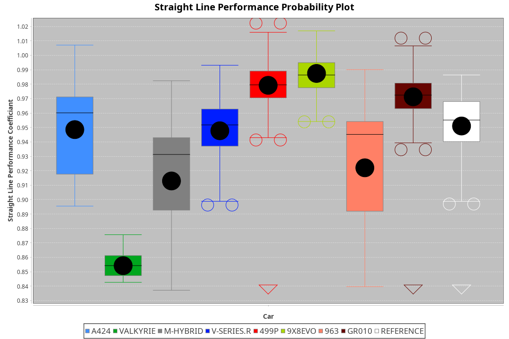
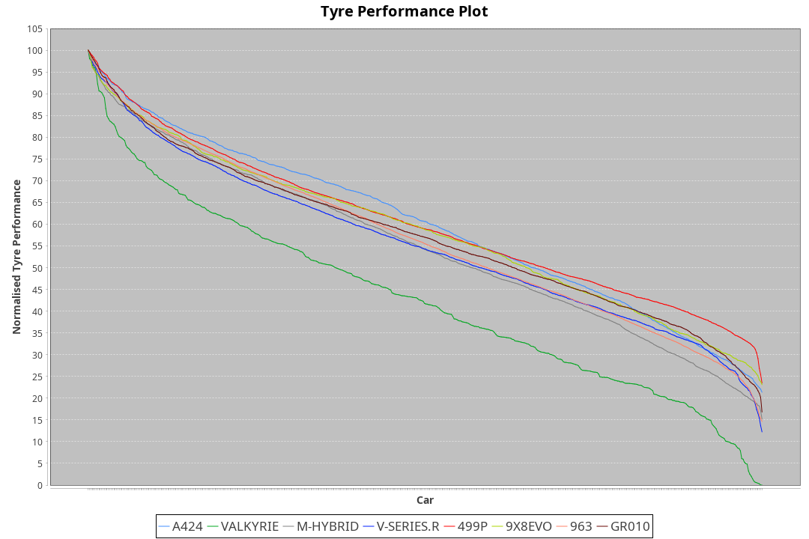

| Manufacturer | Car        | Weight | Power   | PINC    | E/Stint | FDS     |
|:-|:-|:-|:-|:-|:-|:-|
| Alpine       | A424       | 1047kg | 520.0kw |    -    | 919MJ   |    -    |
| Aston Martin | Valkyrie   | 1042kg | 504.0kw | 0.40%   | 899MJ   |    -    |
| BMW          | M-Hybrid   | 1041kg | 512.0kw |    -    | 909MJ   |    -    |
| Cadillac     | V-Series.R | 1034kg | 510.0kw |    -    | 904MJ   |    -    |
| Ferrari      | 499P       | 1063kg | 508.0kw |    -    | 903MJ   | 190kph  |
| Peugeot      | 9X8Evo     | 1050kg | 510.0kw |    -    | 910MJ   | 190kph  |
| Porsche      | 963        | 1047kg | 516.0kw |    -    | 913MJ   |    -    |
| Toyota       | GR010      | 1080kg | 512.0kw |    -    | 916MJ   | 190kph  |

### BoP Accuracy: 61.08%; Overall BoP Grade: D2
| Manufacturer | Car        | Type  | RP      | QP      | Weight | Power¹  | Threshhold | PINC    | Power²   | E/Stint | AVG Vmax  | FDS     | RDLC | L/Stint | BOP-Grade | Model Accuracy | Model Points | Match%  | SimDiff |
|:-|:-|:-|:-|:-|:-|:-|:-|:-|:-|:-|:-|:-|:-|:-|:-|:-|:-|:-|:-|
| Alpine       | A424       | LMDH  | 2:06.71 | 2:02.20 | 1047kg | 520.0kw | 210.0kph   |    -    | 520.00kw |  919MJ  | 312.57kph |    -    | 1.00 | 25      | -C1       | 99.49%         | 1360         | 79.24%  | -0.08   |
| Aston Martin | Valkyrie   | LMHNH | 2:11.40 | 2:05.71 | 1042kg | 504.0kw | 250.0kph   | 0.40%   | 506.00kw |  899MJ  | 299.98kph |    -    | 1.03 | 25      | +Ω2       | 100.00%        | 312          | -51.58% | #       |
| BMW          | M-Hybrid   | LMDH  | 2:07.05 | 2:01.45 | 1041kg | 512.0kw | 210.0kph   |    -    | 512.00kw |  909MJ  | 310.16kph |    -    | 1.01 | 25      | -A2       | 98.62%         | 2363         | 93.17%  | +0.05   |
| Cadillac     | V-Series.R | LMDH  | 2:06.58 | 2:01.44 | 1034kg | 510.0kw | 210.0kph   |    -    | 510.00kw |  904MJ  | 305.81kph |    -    | 1.03 | 25      | -C2       | 98.50%         | 4201         | 74.34%  | +1.00   |
| Ferrari      | 499P       | LMHHU | 2:06.55 | 2:01.23 | 1063kg | 508.0kw | 210.0kph   |    -    | 508.00kw |  903MJ  | 309.00kph | 190kph  | 1.03 | 25      | -D1       | 100.00%        | 4441         | 69.81%  | +0.52   |
| Peugeot      | 9X8Evo     | LMHHU | 2:06.85 | 2:01.97 | 1050kg | 510.0kw | 210.0kph   |    -    | 510.00kw |  910MJ  | 310.46kph | 190kph  | 1.00 | 25      | -C1       | 100.00%        | 808          | 78.59%  | +0.26   |
| Porsche      | 963        | LMDH  | 2:06.49 | 2:00.90 | 1047kg | 516.0kw | 210.0kph   |    -    | 516.00kw |  913MJ  | 309.27kph |    -    | 1.01 | 25      | -D1       | 99.87%         | 12613        | 68.58%  | -0.26   |
| Toyota       | GR010      | LMHHU | 2:06.66 | 2:01.11 | 1080kg | 512.0kw | 210.0kph   |    -    | 512.00kw |  916MJ  | 305.56kph | 190kph  | 1.01 | 25      | -C1       | 99.73%         | 2956         | 76.50%  | +1.15   |

## Power below Threshhold
| N/Nmax    | A424    | VALKYRIE | M-HYBRID | V-SERIES.R | 499P    | 9X8EVO  | 963     | GR010   |
|:-|:-|:-|:-|:-|:-|:-|:-|:-|
|  0.550    |  256    |  248     |  252     |  251       |  250    |  251    |  254    |  252    |
|  0.575    |  279    |  271     |  275     |  274       |  273    |  274    |  277    |  275    |
|  0.600    |  300    |  291     |  296     |  295       |  293    |  295    |  298    |  296    |
|  0.625    |  322    |  312     |  317     |  316       |  314    |  316    |  319    |  317    |
|  0.650    |  343    |  333     |  338     |  337       |  335    |  337    |  340    |  338    |
|  0.675    |  365    |  354     |  359     |  358       |  357    |  358    |  362    |  359    |
|  0.700    |  387    |  375     |  381     |  380       |  378    |  380    |  384    |  381    |
|  0.725    |  409    |  396     |  403     |  401       |  399    |  401    |  406    |  403    |
|  0.750    |  430    |  416     |  423     |  422       |  420    |  422    |  427    |  423    |
|  0.775    |  449    |  435     |  442     |  441       |  439    |  441    |  446    |  442    |
|  0.800    |  467    |  453     |  460     |  458       |  456    |  458    |  463    |  460    |
|  0.825    |  482    |  468     |  475     |  473       |  471    |  473    |  478    |  475    |
|  0.850    |  494    |  479     |  486     |  485       |  483    |  485    |  490    |  486    |
|  0.875    |  505    |  489     |  497     |  495       |  493    |  495    |  501    |  497    |
|  0.900    |  512    |  496     |  504     |  502       |  500    |  502    |  508    |  504    |
|  0.925    |  517    |  501     |  509     |  507       |  505    |  507    |  513    |  509    |
| **0.950** | **520** | **504**  | **512**  | **510**    | **508** | **510** | **516** | **512** |
|  0.975    |  518    |  502     |  510     |  508       |  506    |  508    |  514    |  510    |
|  1.000    |  514    |  499     |  506     |  505       |  503    |  505    |  510    |  506    |
|  1.025    |  444    |  430     |  437     |  436       |  434    |  436    |  441    |  437    |

## Power above Threshhold
| N/Nmax    | A424    | VALKYRIE   | M-HYBRID | V-SERIES.R | 499P    | 9X8EVO  | 963     | GR010   |
|:-|:-|:-|:-|:-|:-|:-|:-|:-|
|  0.550    |  256    |  249.01    |  252     |  251       |  250    |  251    |  254    |  252    |
|  0.575    |  279    |  272.01    |  275     |  274       |  273    |  274    |  277    |  275    |
|  0.600    |  300    |  292.01    |  296     |  295       |  293    |  295    |  298    |  296    |
|  0.625    |  322    |  313.01    |  317     |  316       |  314    |  316    |  319    |  317    |
|  0.650    |  343    |  334.01    |  338     |  337       |  335    |  337    |  340    |  338    |
|  0.675    |  365    |  355.01    |  359     |  358       |  357    |  358    |  362    |  359    |
|  0.700    |  387    |  377.01    |  381     |  380       |  378    |  380    |  384    |  381    |
|  0.725    |  409    |  398.01    |  403     |  401       |  399    |  401    |  406    |  403    |
|  0.750    |  430    |  418.01    |  423     |  422       |  420    |  422    |  427    |  423    |
|  0.775    |  449    |  437.01    |  442     |  441       |  439    |  441    |  446    |  442    |
|  0.800    |  467    |  454.01    |  460     |  458       |  456    |  458    |  463    |  460    |
|  0.825    |  482    |  469.01    |  475     |  473       |  471    |  473    |  478    |  475    |
|  0.850    |  494    |  481.02    |  486     |  485       |  483    |  485    |  490    |  486    |
|  0.875    |  505    |  491.02    |  497     |  495       |  493    |  495    |  501    |  497    |
|  0.900    |  512    |  498.02    |  504     |  502       |  500    |  502    |  508    |  504    |
|  0.925    |  517    |  503.02    |  509     |  507       |  505    |  507    |  513    |  509    |
| **0.950** | **520** | **506.02** | **512**  | **510**    | **508** | **510** | **516** | **512** |
|  0.975    |  518    |  504.02    |  510     |  508       |  506    |  508    |  514    |  510    |
|  1.000    |  514    |  501.02    |  506     |  505       |  503    |  505    |  510    |  506    |
|  1.025    |  444    |  432.01    |  437     |  436       |  434    |  436    |  441    |  437    |
