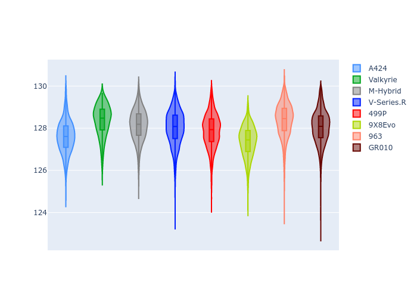
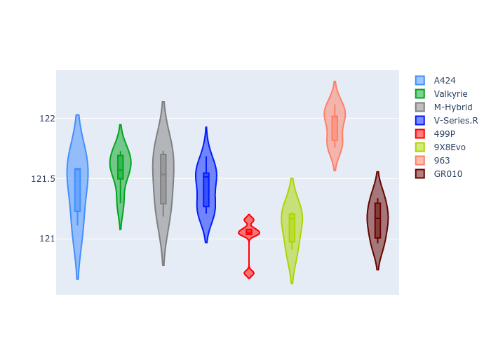
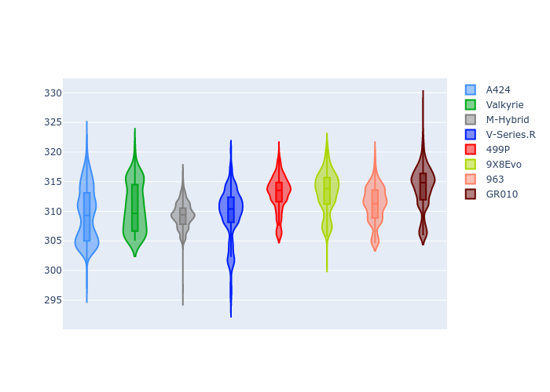
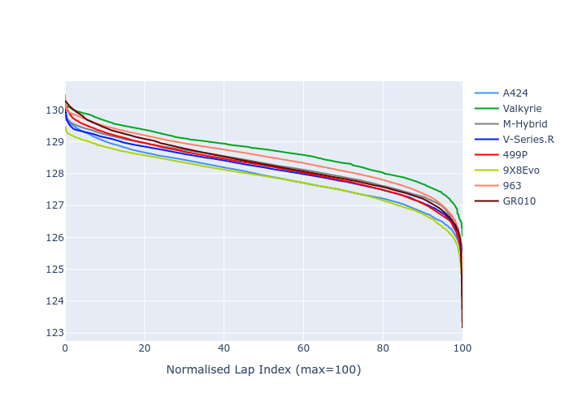

# Combined Plots

## Metadata

- BoP Accuracy: 99.76%
- Overall BoP Grade: A1
- Track: SPA
- Threshhold: 250.0kph
- Average Laptime: 2:08.02
- Average Quali Laptime: 2:01.69
- Laptime Std Dev: 0.31 seconds
- Filtered Average Topspeed: 311.28kph

## BoP Table
| Manufacturer   | Car        | Weight   | Power   | PINC   | E/Stint   | FDS    | RDP    | QDP    | TDP    |
|:---------------|:-----------|:---------|:--------|:-------|:----------|:-------|:-------|:-------|:-------|
| Alpine         | A424       | 1043kg   | 520.0kw | -4.40% | 902MJ     | -      | 51.38% | 57.54% | 26.10% |
| Aston Martin   | Valkyrie   | 1035kg   | 520.0kw | -2.70% | 908MJ     | -      | 52.56% | 51.11% | 27.23% |
| BMW            | M-Hybrid   | 1049kg   | 503.0kw | +1.20% | 907MJ     | -      | 52.62% | 53.36% | 32.99% |
| Cadillac       | V-Series.R | 1042kg   | 501.0kw | +3.80% | 906MJ     | -      | 48.29% | 59.47% | 18.65% |
| Ferrari        | 499P       | 1057kg   | 489.0kw | +3.70% | 897MJ     | 190kph | 51.25% | 43.28% | 10.17% |
| Peugeot        | 9X8Evo     | 1030kg   | 520.0kw | -3.70% | 902MJ     | 190kph | 48.70% | 50.83% | 18.68% |
| Porsche        | 963        | 1055kg   | 494.0kw | +3.40% | 905MJ     | -      | 50.57% | 42.80% | 29.05% |
| Toyota         | GR010      | 1069kg   | 480.0kw | +8.30% | 905MJ     | 190kph | 51.03% | 51.78% | 14.64% |

## Performance Table
| Manufacturer   | Car        | RP      | QP      | Vavg      |   RDLC | BOP-Grade   | Match   |
|:---------------|:-----------|:--------|:--------|:----------|-------:|:------------|:--------|
| Alpine         | A424       | 2:07.58 | 2:01.61 | 309.45kph |   1.05 | ~A1         | 99.94%  |
| Aston Martin   | Valkyrie   | 2:08.39 | 2:02.65 | 310.63kph |   1.05 | ~A1         | 99.71%  |
| BMW            | M-Hybrid   | 2:08.16 | 2:01.74 | 309.39kph |   1.05 | ~A1         | 99.79%  |
| Cadillac       | V-Series.R | 2:08.02 | 2:01.57 | 309.51kph |   1.05 | ~A1         | 99.70%  |
| Ferrari        | 499P       | 2:07.99 | 2:01.24 | 312.97kph |   1.06 | ~A1         | 100.00% |
| Peugeot        | 9X8Evo     | 2:07.49 | 2:01.41 | 313.18kph |   1.05 | ~A1         | 100.00% |
| Porsche        | 963        | 2:08.39 | 2:01.90 | 311.19kph |   1.05 | ~A1         | 99.49%  |
| Toyota         | GR010      | 2:08.17 | 2:01.38 | 313.91kph |   1.06 | ~A1         | 99.44%  |

## Race Laptimes

## Quali Laptimes

## Topspeeds

## Laptimes Lineplot

