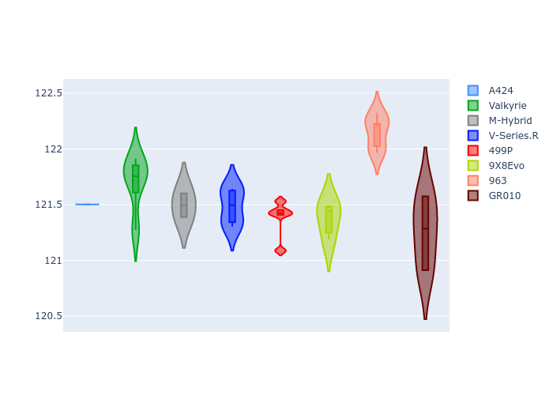
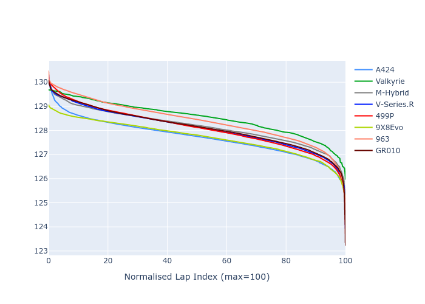

# Combined Plots

## Metadata

- BoP Accuracy: 99.75%
- Overall BoP Grade: A1
- Track: SPA
- Threshhold: 250.0kph
- Average Laptime: 2:08.09
- Average Quali Laptime: 2:01.54
- Average Topspeed: 311.29kph

## BoP Table
| Manufacturer   | Car        | Weight   | Power   | PINC   | E/Stint   | FDS    | RDP    | QDP    | TDP    |
|:---------------|:-----------|:---------|:--------|:-------|:----------|:-------|:-------|:-------|:-------|
| Alpine         | A424       | 1043kg   | 520.0kw | -4.40% | 902MJ     | -      | 51.64% | 59.31% | 26.80% |
| Aston Martin   | Valkyrie   | 1035kg   | 520.0kw | -2.70% | 908MJ     | -      | 53.50% | 53.33% | 21.51% |
| BMW            | M-Hybrid   | 1049kg   | 503.0kw | +1.20% | 907MJ     | -      | 52.89% | 56.22% | 33.41% |
| Cadillac       | V-Series.R | 1042kg   | 501.0kw | +3.80% | 906MJ     | -      | 48.63% | 60.80% | 19.01% |
| Ferrari        | 499P       | 1057kg   | 489.0kw | +3.70% | 897MJ     | 190kph | 51.38% | 44.98% | 9.83%  |
| Peugeot        | 9X8Evo     | 1030kg   | 520.0kw | -3.70% | 902MJ     | 190kph | 48.87% | 52.78% | 15.41% |
| Porsche        | 963        | 1055kg   | 494.0kw | +3.40% | 905MJ     | -      | 50.70% | 44.30% | 29.51% |
| Toyota         | GR010      | 1069kg   | 480.0kw | +8.30% | 905MJ     | 190kph | 51.09% | 52.71% | 11.46% |

## Performance Table
| Manufacturer   | Car        | RP      | QP      | Vavg      |   RDLC | BOP-Grade   | Match   |
|:---------------|:-----------|:--------|:--------|:----------|-------:|:------------|:--------|
| Alpine         | A424       | 2:07.70 | 2:01.50 | 309.38kph |   1.05 | ~A1         | 99.88%  |
| Aston Martin   | Valkyrie   | 2:08.52 | 2:01.70 | 311.18kph |   1.06 | ~A1         | 100.00% |
| BMW            | M-Hybrid   | 2:08.16 | 2:01.50 | 309.23kph |   1.05 | ~A1         | 99.69%  |
| Cadillac       | V-Series.R | 2:08.08 | 2:01.48 | 309.15kph |   1.05 | ~A1         | 99.68%  |
| Ferrari        | 499P       | 2:08.08 | 2:01.38 | 312.96kph |   1.06 | ~A1         | 99.65%  |
| Peugeot        | 9X8Evo     | 2:07.71 | 2:01.37 | 313.18kph |   1.05 | ~A1         | 100.00% |
| Porsche        | 963        | 2:08.39 | 2:02.15 | 311.12kph |   1.05 | ~A1         | 99.38%  |
| Toyota         | GR010      | 2:08.12 | 2:01.26 | 314.12kph |   1.06 | ~A1         | 99.74%  |

## Race Laptimes

## Quali Laptimes

## Topspeeds

## Laptimes Lineplot

