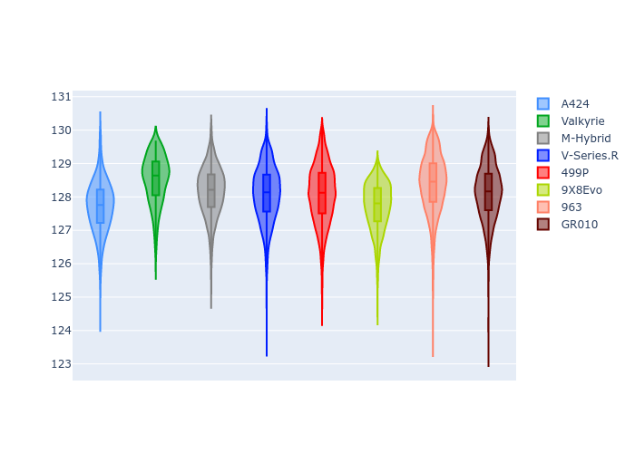

# Combined Plots

## Metadata

- BoP Accuracy: 99.93%
- Overall BoP Grade: A1
- Track: SPA
- Threshhold: 250.0kph

## BoP Table
| Manufacturer   | Car        | Weight   | Power   | PINC   | E/Stint   | FDS    |
|:---------------|:-----------|:---------|:--------|:-------|:----------|:-------|
| Alpine         | A424       | 1043kg   | 520.0kw | -4.40% | 902MJ     | -      |
| Aston Martin   | Valkyrie   | 1035kg   | 520.0kw | -2.70% | 908MJ     | -      |
| BMW            | M-Hybrid   | 1049kg   | 503.0kw | +1.20% | 907MJ     | -      |
| Cadillac       | V-Series.R | 1042kg   | 501.0kw | +3.80% | 906MJ     | -      |
| Ferrari        | 499P       | 1057kg   | 489.0kw | +3.70% | 897MJ     | 190kph |
| Peugeot        | 9X8Evo     | 1030kg   | 520.0kw | -3.70% | 902MJ     | 190kph |
| Porsche        | 963        | 1055kg   | 494.0kw | +3.40% | 905MJ     | -      |
| Toyota         | GR010      | 1069kg   | 480.0kw | +8.30% | 905MJ     | 190kph |

## Performance Table
| Manufacturer   | Car        | RP      | QP      | Vavg      |   RDLC | BOP-Grade   | Match   |
|:---------------|:-----------|:--------|:--------|:----------|-------:|:------------|:--------|
| Alpine         | A424       | 2:05.70 | 1:59.95 | 307.74kph |   1.05 | ~A1         | 100.00% |
| Aston Martin   | Valkyrie   | 2:06.46 | 1:59.80 | 309.03kph |   1.06 | ~A1         | 100.00% |
| BMW            | M-Hybrid   | 2:06.12 | 1:59.93 | 307.00kph |   1.05 | ~A1         | 100.00% |
| Cadillac       | V-Series.R | 2:06.17 | 2:00.09 | 305.99kph |   1.05 | ~A1         | 99.79%  |
| Ferrari        | 499P       | 2:05.77 | 1:59.53 | 308.81kph |   1.05 | ~A1         | 99.83%  |
| Peugeot        | 9X8Evo     | 2:05.71 | 1:59.59 | 311.70kph |   1.05 | ~A1         | 100.00% |
| Porsche        | 963        | 2:06.35 | 2:00.24 | 306.32kph |   1.05 | ~A1         | 99.85%  |
| Toyota         | GR010      | 2:05.97 | 1:59.59 | 309.67kph |   1.05 | ~A1         | 99.97%  |

## Race Laptimes

## Quali Laptimes

## Topspeeds

## Laptimes Lineplot

