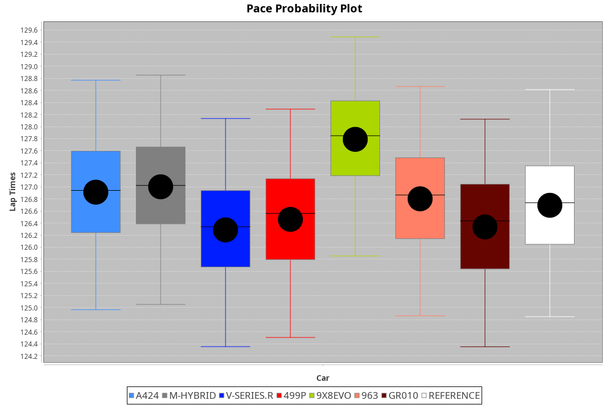
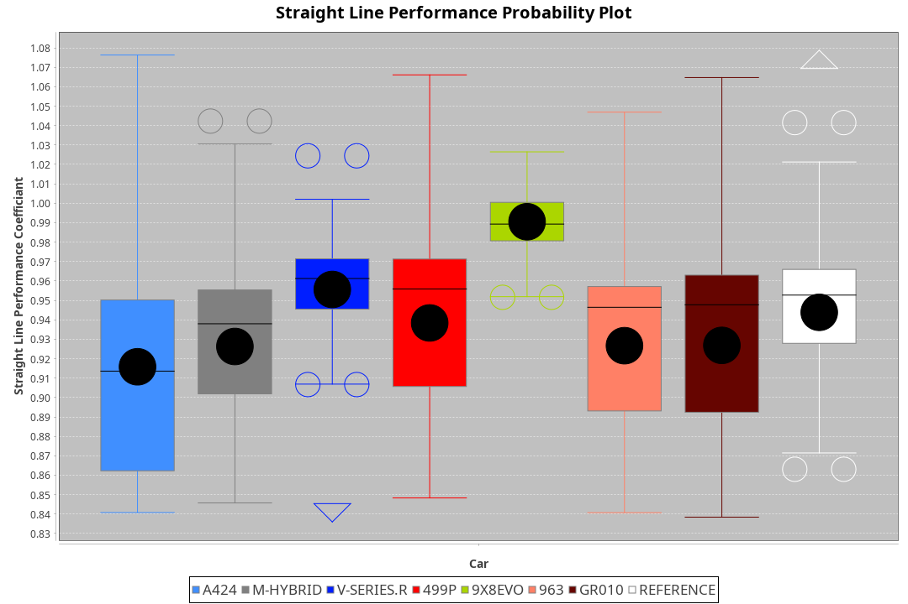
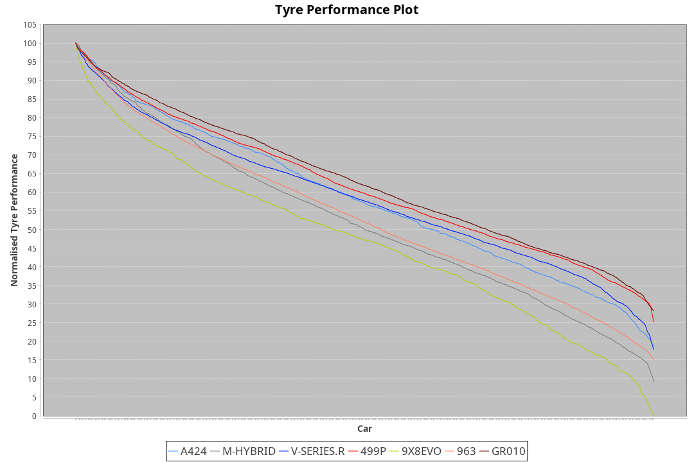

| Manufacturer | Car        | Weight | Power   | PINC    | E/Stint | FDS     |
|:-|:-|:-|:-|:-|:-|:-|
| Alpine       | A424       | 1045kg | 513.0kw |    -    | 913MJ   |    -    |
| BMW          | M-Hybrid   | 1038kg | 510.0kw |    -    | 907MJ   |    -    |
| Cadillac     | V-Series.R | 1030kg | 516.0kw |    -    | 909MJ   |    -    |
| Ferrari      | 499P       | 1053kg | 508.0kw |    -    | 902MJ   | 190kph  |
| Peugeot      | 9X8Evo     | 1065kg | 508.0kw |    -    | 910MJ   | 190kph  |
| Porsche      | 963        | 1037kg | 507.0kw |    -    | 904MJ   |    -    |
| Toyota       | GR010      | 1064kg | 515.0kw |    -    | 917MJ   | 190kph  |

### BoP Accuracy: 83.44%; Overall BoP Grade: B2
| Manufacturer | Car        | Type  | RP      | QP      | Weight | Power¹  | Threshhold | PINC    | Power²   | E/Stint | AVG Vmax  | FDS     | RDLC | L/Stint | BOP-Grade | Model Accuracy | Model Points | Match%  | SimDiff |
|:-|:-|:-|:-|:-|:-|:-|:-|:-|:-|:-|:-|:-|:-|:-|:-|:-|:-|:-|:-|
| Alpine       | A424       | LMDH  | 2:06.87 | 2:01.61 | 1045kg | 513.0kw | 210.0kph   |    -    | 513.00kw |  913MJ  | 296.08kph |    -    | 1.03 | 25      | +B1       | 99.37%         | 2056         | 89.32%  | -0.13   |
| BMW          | M-Hybrid   | LMDH  | 2:06.95 | 2:01.20 | 1038kg | 510.0kw | 210.0kph   |    -    | 510.00kw |  907MJ  | 298.72kph |    -    | 1.03 | 25      | +A2       | 99.20%         | 3081         | 90.66%  | -0.12   |
| Cadillac     | V-Series.R | LMDH  | 2:06.24 | 2:00.73 | 1030kg | 516.0kw | 210.0kph   |    -    | 516.00kw |  909MJ  | 302.46kph |    -    | 1.04 | 25      | -B2       | 99.22%         | 5358         | 81.08%  | +0.48   |
| Ferrari      | 499P       | LMHHU | 2:06.40 | 2:00.60 | 1053kg | 508.0kw | 210.0kph   |    -    | 508.00kw |  902MJ  | 299.16kph | 190kph  | 1.05 | 25      | -B1       | 99.93%         | 6954         | 86.84%  | +0.06   |
| Peugeot      | 9X8Evo     | LMHHU | 2:07.75 | 2:02.39 | 1065kg | 508.0kw | 210.0kph   |    -    | 508.00kw |  910MJ  | 307.39kph | 190kph  | 0.99 | 25      | +E1       | 100.00%        | 1458         | 55.60%  | -0.30   |
| Porsche      | 963        | LMDH  | 2:06.76 | 2:01.12 | 1037kg | 507.0kw | 210.0kph   |    -    | 507.00kw |  904MJ  | 297.69kph |    -    | 1.04 | 25      | ~A1       | 99.87%         | 14199        | 100.00% | -0.54   |
| Toyota       | GR010      | LMHHU | 2:06.24 | 2:00.21 | 1064kg | 515.0kw | 210.0kph   |    -    | 515.00kw |  917MJ  | 296.57kph | 190kph  | 1.05 | 25      | -B2       | 99.92%         | 5012         | 80.59%  | +0.55   |

## Power below Threshhold
| N/Nmax    | A424    | M-HYBRID | V-SERIES.R | 499P    | 9X8EVO  | 963     | GR010   |
|:-|:-|:-|:-|:-|:-|:-|:-|
|  0.550    |  253    |  251     |  254       |  250    |  250    |  250    |  254    |
|  0.575    |  276    |  274     |  277       |  273    |  273    |  273    |  277    |
|  0.600    |  296    |  295     |  298       |  293    |  293    |  293    |  297    |
|  0.625    |  317    |  316     |  319       |  314    |  314    |  314    |  319    |
|  0.650    |  338    |  337     |  340       |  335    |  335    |  335    |  340    |
|  0.675    |  360    |  358     |  362       |  357    |  357    |  356    |  362    |
|  0.700    |  382    |  380     |  384       |  378    |  378    |  377    |  383    |
|  0.725    |  403    |  401     |  406       |  399    |  399    |  399    |  405    |
|  0.750    |  424    |  422     |  427       |  420    |  420    |  419    |  426    |
|  0.775    |  443    |  441     |  446       |  439    |  439    |  438    |  445    |
|  0.800    |  461    |  458     |  463       |  456    |  456    |  455    |  463    |
|  0.825    |  476    |  473     |  478       |  471    |  471    |  470    |  478    |
|  0.850    |  487    |  485     |  490       |  483    |  483    |  482    |  489    |
|  0.875    |  498    |  495     |  501       |  493    |  493    |  492    |  500    |
|  0.900    |  505    |  502     |  508       |  500    |  500    |  499    |  507    |
|  0.925    |  510    |  507     |  513       |  505    |  505    |  504    |  512    |
| **0.950** | **513** | **510**  | **516**    | **508** | **508** | **507** | **515** |
|  0.975    |  511    |  508     |  514       |  506    |  506    |  505    |  513    |
|  1.000    |  507    |  505     |  510       |  503    |  503    |  502    |  509    |
|  1.025    |  438    |  436     |  441       |  434    |  434    |  433    |  440    |

## Power above Threshhold
| N/Nmax    | A424    | M-HYBRID | V-SERIES.R | 499P    | 9X8EVO  | 963     | GR010   |
|:-|:-|:-|:-|:-|:-|:-|:-|
|  0.550    |  253    |  251     |  254       |  250    |  250    |  250    |  254    |
|  0.575    |  276    |  274     |  277       |  273    |  273    |  273    |  277    |
|  0.600    |  296    |  295     |  298       |  293    |  293    |  293    |  297    |
|  0.625    |  317    |  316     |  319       |  314    |  314    |  314    |  319    |
|  0.650    |  338    |  337     |  340       |  335    |  335    |  335    |  340    |
|  0.675    |  360    |  358     |  362       |  357    |  357    |  356    |  362    |
|  0.700    |  382    |  380     |  384       |  378    |  378    |  377    |  383    |
|  0.725    |  403    |  401     |  406       |  399    |  399    |  399    |  405    |
|  0.750    |  424    |  422     |  427       |  420    |  420    |  419    |  426    |
|  0.775    |  443    |  441     |  446       |  439    |  439    |  438    |  445    |
|  0.800    |  461    |  458     |  463       |  456    |  456    |  455    |  463    |
|  0.825    |  476    |  473     |  478       |  471    |  471    |  470    |  478    |
|  0.850    |  487    |  485     |  490       |  483    |  483    |  482    |  489    |
|  0.875    |  498    |  495     |  501       |  493    |  493    |  492    |  500    |
|  0.900    |  505    |  502     |  508       |  500    |  500    |  499    |  507    |
|  0.925    |  510    |  507     |  513       |  505    |  505    |  504    |  512    |
| **0.950** | **513** | **510**  | **516**    | **508** | **508** | **507** | **515** |
|  0.975    |  511    |  508     |  514       |  506    |  506    |  505    |  513    |
|  1.000    |  507    |  505     |  510       |  503    |  503    |  502    |  509    |
|  1.025    |  438    |  436     |  441       |  434    |  434    |  433    |  440    |
