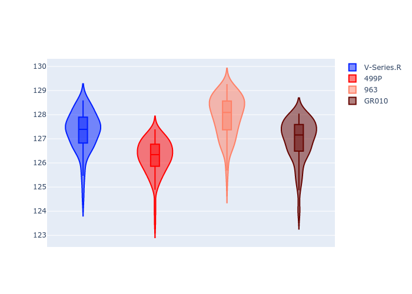
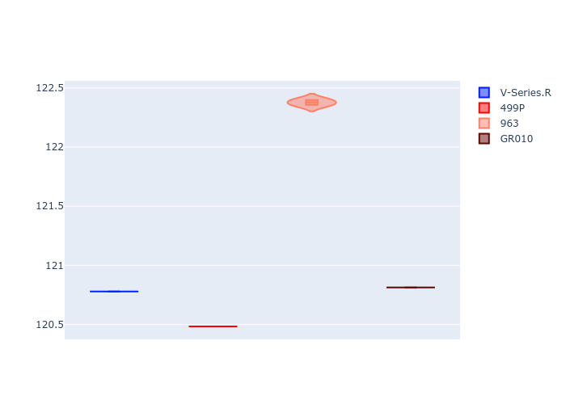
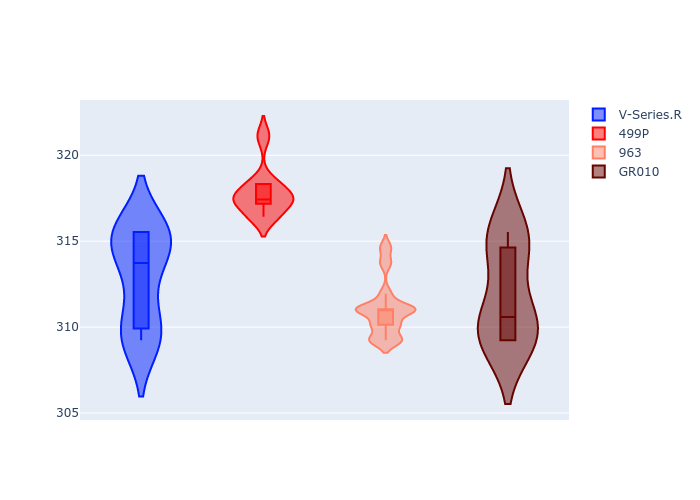
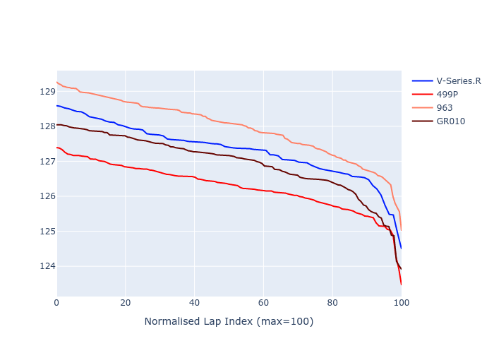

# Combined Plots

## Metadata

- BoP Accuracy: 86.40%
- Overall BoP Grade: B1
- Track: SPA
- Threshhold: 0.0kph

## BoP Table
| Manufacturer   | Car        | Weight   | Power   | PINC   | E/Stint   | FDS    |
|:---------------|:-----------|:---------|:--------|:-------|:----------|:-------|
| Cadillac       | V-Series.R | 1035kg   | 513.0kw | -      | 904MJ     | -      |
| Ferrari        | 499P       | 1040kg   | 509.0kw | -      | 899MJ     | 190kph |
| Porsche        | 963        | 1045kg   | 516.0kw | -      | 910MJ     | -      |
| Toyota         | GR010      | 1043kg   | 512.0kw | -      | 904MJ     | 190kph |

## Performance Table
| Manufacturer   | Car        | RP      | QP      | Vavg      |   RDLC | BOP-Grade   | Match   |
|:---------------|:-----------|:--------|:--------|:----------|-------:|:------------|:--------|
| Cadillac       | V-Series.R | 2:07.16 | 2:01.24 | 313.62kph |   1.05 | +A2         | 91.67%  |
| Ferrari        | 499P       | 2:06.12 | 2:00.87 | 318.56kph |   1.04 | ~A1         | 98.37%  |
| Porsche        | 963        | 2:07.80 | 2:02.68 | 311.73kph |   1.04 | +E1         | 57.76%  |
| Toyota         | GR010      | 2:06.79 | 2:01.15 | 312.67kph |   1.05 | ~A1         | 97.81%  |

## Race Laptimes

## Quali Laptimes

## Topspeeds

## Laptimes Lineplot

