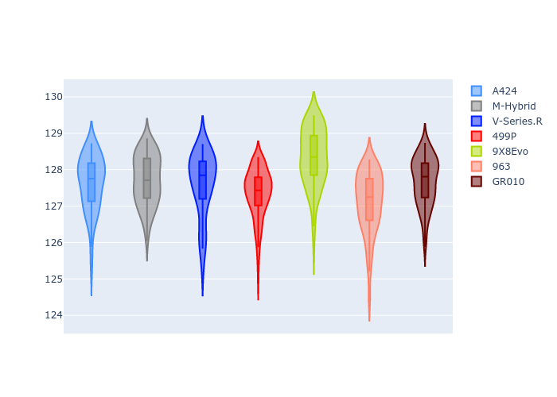
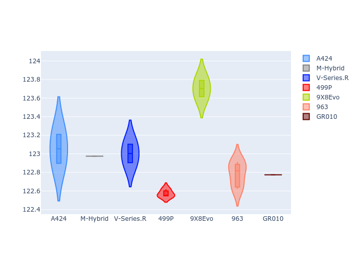
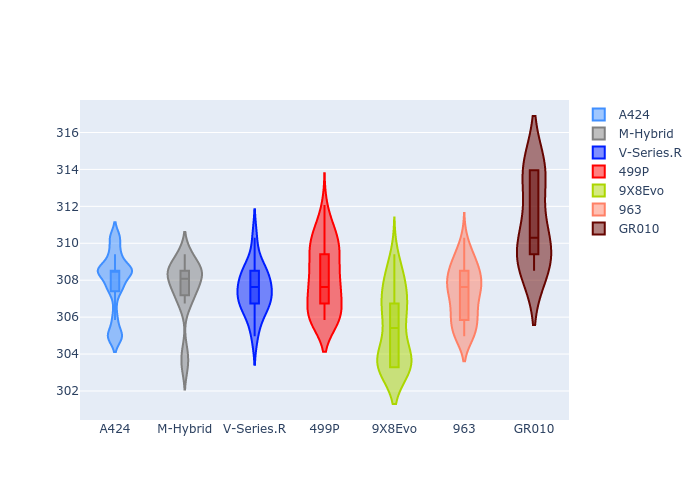
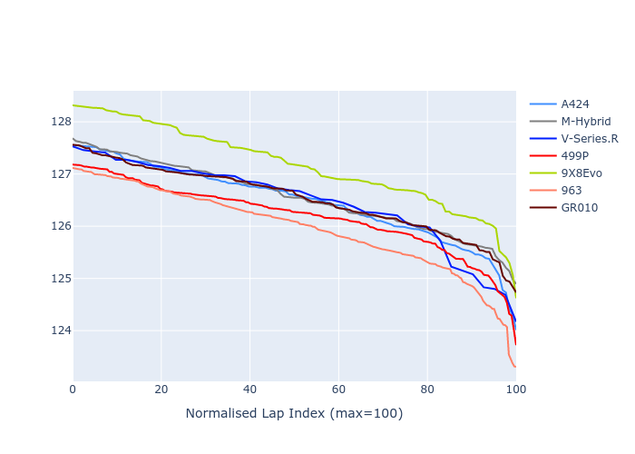

# Combined Plots

## Metadata

- BoP Accuracy: 93.17%
- Overall BoP Grade: A2
- Track: SPA
- Threshhold: 210.0kph
- Average Laptime: 2:07.63
- Average Quali Laptime: 2:03.91
- Average Topspeed: 315.43kph

## BoP Table
| Manufacturer   | Car        | Weight   | Power   | PINC   | E/Stint   | FDS    | RDP    | QDP    | TDP    |
|:---------------|:-----------|:---------|:--------|:-------|:----------|:-------|:-------|:-------|:-------|
| Alpine         | A424       | 1045kg   | 513.0kw | -      | 913MJ     | -      | 46.62% | 33.33% | 11.90% |
| BMW            | M-Hybrid   | 1038kg   | 510.0kw | -      | 907MJ     | -      | 46.79% | 16.67% | 5.10%  |
| Cadillac       | V-Series.R | 1030kg   | 516.0kw | -      | 909MJ     | -      | 44.21% | 33.33% | 13.45% |
| Ferrari        | 499P       | 1053kg   | 508.0kw | -      | 902MJ     | 190kph | 45.63% | 33.33% | 11.42% |
| Peugeot        | 9X8Evo     | 1065kg   | 508.0kw | -      | 910MJ     | 190kph | 47.67% | 50.00% | 13.86% |
| Porsche        | 963        | 1037kg   | 507.0kw | -      | 904MJ     | -      | 46.37% | 75.00% | 11.50% |
| Toyota         | GR010      | 1064kg   | 515.0kw | -      | 917MJ     | 190kph | 47.52% | 16.67% | 3.83%  |

## Performance Table
| Manufacturer   | Car        | RP      | QP      | Vavg      |   RDLC | BOP-Grade   | Match   |
|:---------------|:-----------|:--------|:--------|:----------|-------:|:------------|:--------|
| Alpine         | A424       | 2:07.62 | 2:04.00 | 315.49kph |   1.03 | ~A1         | 99.24%  |
| BMW            | M-Hybrid   | 2:07.72 | 2:03.87 | 315.17kph |   1.03 | ~A1         | 95.42%  |
| Cadillac       | V-Series.R | 2:07.61 | 2:04.02 | 315.05kph |   1.03 | ~A1         | 97.62%  |
| Ferrari        | 499P       | 2:07.34 | 2:03.51 | 315.76kph |   1.03 | ~A1         | 98.96%  |
| Peugeot        | 9X8Evo     | 2:08.34 | 2:04.63 | 312.97kph |   1.03 | +D2         | 64.66%  |
| Porsche        | 963        | 2:07.10 | 2:03.71 | 314.86kph |   1.03 | ~A1         | 96.30%  |
| Toyota         | GR010      | 2:07.68 | 2:03.61 | 318.74kph |   1.03 | ~A1         | 100.00% |

## Race Laptimes

## Quali Laptimes

## Topspeeds

## Laptimes Lineplot

