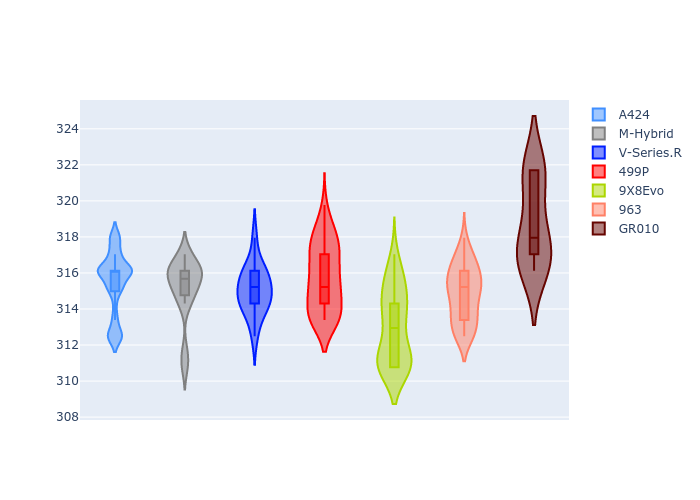

# Combined Plots

## Metadata

- BoP Accuracy: 93.17%
- Overall BoP Grade: A2
- Track: SPA
- Threshhold: 210.0kph

## BoP Table
| Manufacturer   | Car        | Weight   | Power   | PINC   | E/Stint   | FDS    |
|:---------------|:-----------|:---------|:--------|:-------|:----------|:-------|
| Alpine         | A424       | 1045kg   | 513.0kw | -      | 913MJ     | -      |
| BMW            | M-Hybrid   | 1038kg   | 510.0kw | -      | 907MJ     | -      |
| Cadillac       | V-Series.R | 1030kg   | 516.0kw | -      | 909MJ     | -      |
| Ferrari        | 499P       | 1053kg   | 508.0kw | -      | 902MJ     | 190kph |
| Peugeot        | 9X8Evo     | 1065kg   | 508.0kw | -      | 910MJ     | 190kph |
| Porsche        | 963        | 1037kg   | 507.0kw | -      | 904MJ     | -      |
| Toyota         | GR010      | 1064kg   | 515.0kw | -      | 917MJ     | 190kph |

## Performance Table
| Manufacturer   | Car        | RP      | QP      | Vavg      |   RDLC | BOP-Grade   | Match   |
|:---------------|:-----------|:--------|:--------|:----------|-------:|:------------|:--------|
| Alpine         | A424       | 2:06.47 | 2:02.48 | 307.89kph |   1.03 | ~A1         | 99.24%  |
| BMW            | M-Hybrid   | 2:06.55 | 2:02.35 | 307.58kph |   1.03 | ~A1         | 95.42%  |
| Cadillac       | V-Series.R | 2:06.45 | 2:02.50 | 307.46kph |   1.03 | ~A1         | 97.62%  |
| Ferrari        | 499P       | 2:06.18 | 2:02.00 | 308.16kph |   1.03 | ~A1         | 98.96%  |
| Peugeot        | 9X8Evo     | 2:07.16 | 2:03.10 | 305.44kph |   1.03 | +D2         | 64.66%  |
| Porsche        | 963        | 2:05.95 | 2:02.19 | 307.28kph |   1.03 | ~A1         | 96.30%  |
| Toyota         | GR010      | 2:06.51 | 2:02.10 | 311.07kph |   1.04 | ~A1         | 100.00% |

## Race Laptimes

## Quali Laptimes

## Topspeeds

## Laptimes Lineplot

