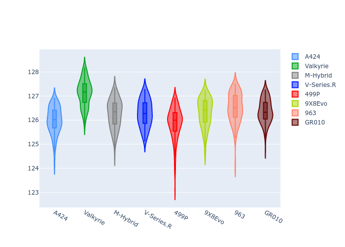
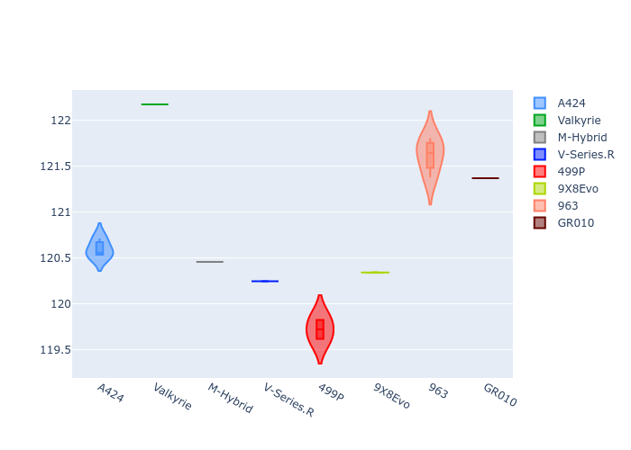
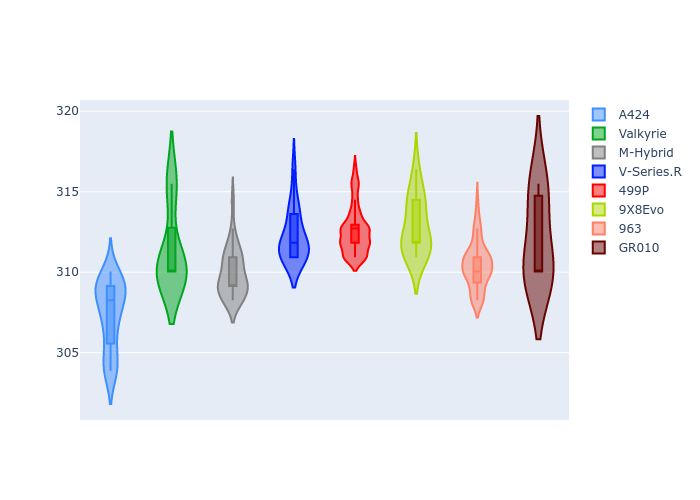
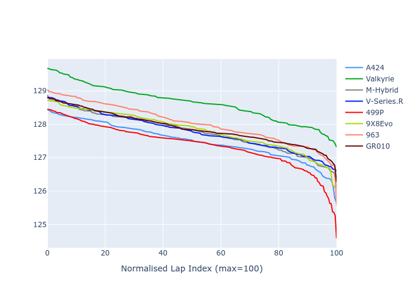

# Combined Plots

## Metadata

- BoP Accuracy: 93.73%
- Overall BoP Grade: A2
- Track: SPA
- Threshhold: 250.0kph

## BoP Table
| Manufacturer   | Car        | Weight   | Power   | PINC   | E/Stint   | FDS    |
|:---------------|:-----------|:---------|:--------|:-------|:----------|:-------|
| Alpine         | A424       | 1043kg   | 520.0kw | -4.40% | 902MJ     | -      |
| Aston Martin   | Valkyrie   | 1035kg   | 520.0kw | -2.70% | 908MJ     | -      |
| BMW            | M-Hybrid   | 1049kg   | 503.0kw | +1.20% | 907MJ     | -      |
| Cadillac       | V-Series.R | 1042kg   | 501.0kw | +3.80% | 906MJ     | -      |
| Ferrari        | 499P       | 1057kg   | 489.0kw | +3.70% | 897MJ     | 190kph |
| Peugeot        | 9X8Evo     | 1030kg   | 520.0kw | -3.70% | 902MJ     | 190kph |
| Porsche        | 963        | 1055kg   | 494.0kw | +3.40% | 905MJ     | -      |
| Toyota         | GR010      | 1069kg   | 480.0kw | +8.30% | 905MJ     | 190kph |

## Performance Table
| Manufacturer   | Car        | RP      | QP      | Vavg      |   RDLC | BOP-Grade   | Match   |
|:---------------|:-----------|:--------|:--------|:----------|-------:|:------------|:--------|
| Alpine         | A424       | 2:06.00 | 2:00.61 | 307.38kph |   1.04 | ~A1         | 98.81%  |
| Aston Martin   | Valkyrie   | 2:07.13 | 2:02.06 | 311.40kph |   1.04 | +D2         | 64.24%  |
| BMW            | M-Hybrid   | 2:06.27 | 2:00.51 | 309.93kph |   1.05 | ~A1         | 99.30%  |
| Cadillac       | V-Series.R | 2:06.28 | 2:00.26 | 312.25kph |   1.05 | ~A1         | 100.00% |
| Ferrari        | 499P       | 2:05.88 | 1:59.76 | 312.55kph |   1.05 | ~A1         | 95.41%  |
| Peugeot        | 9X8Evo     | 2:06.32 | 2:00.23 | 312.87kph |   1.05 | ~A1         | 100.00% |
| Porsche        | 963        | 2:06.52 | 2:01.61 | 310.44kph |   1.04 | -A2         | 92.07%  |
| Toyota         | GR010      | 2:06.38 | 2:01.43 | 312.02kph |   1.04 | ~A1         | 100.00% |

## Race Laptimes

## Quali Laptimes

## Topspeeds

## Laptimes Lineplot

