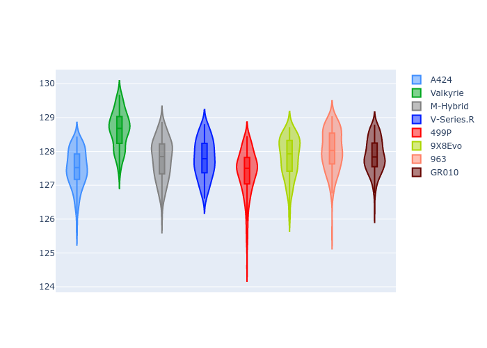

# Combined Plots

## Metadata

- BoP Accuracy: 93.55%
- Overall BoP Grade: A2
- Track: SPA
- Threshhold: 250.0kph
- Average Laptime: 2:07.85
- Average Quali Laptime: 2:02.26
- Average Topspeed: 315.66kph

## BoP Table
| Manufacturer   | Car        | Weight   | Power   | PINC   | E/Stint   | FDS    | RDP    | QDP    | TDP    |
|:---------------|:-----------|:---------|:--------|:-------|:----------|:-------|:-------|:-------|:-------|
| Alpine         | A424       | 1043kg   | 520.0kw | -4.40% | 902MJ     | -      | 56.00% | 37.50% | 12.72% |
| Aston Martin   | Valkyrie   | 1035kg   | 520.0kw | -2.70% | 908MJ     | -      | 54.85% | 33.33% | 1.23%  |
| BMW            | M-Hybrid   | 1049kg   | 503.0kw | +1.20% | 907MJ     | -      | 50.35% | 33.33% | 11.01% |
| Cadillac       | V-Series.R | 1042kg   | 501.0kw | +3.80% | 906MJ     | -      | 54.00% | 16.67% | 4.94%  |
| Ferrari        | 499P       | 1057kg   | 489.0kw | +3.70% | 897MJ     | 190kph | 53.04% | 50.00% | 8.49%  |
| Peugeot        | 9X8Evo     | 1030kg   | 520.0kw | -3.70% | 902MJ     | 190kph | 57.03% | 66.67% | 4.15%  |
| Porsche        | 963        | 1055kg   | 494.0kw | +3.40% | 905MJ     | -      | 50.93% | 50.00% | 18.51% |
| Toyota         | GR010      | 1069kg   | 480.0kw | +8.30% | 905MJ     | 190kph | 55.67% | 33.33% | 1.54%  |

## Performance Table
| Manufacturer   | Car        | RP      | QP      | Vavg      |   RDLC | BOP-Grade   | Match   |
|:---------------|:-----------|:--------|:--------|:----------|-------:|:------------|:--------|
| Alpine         | A424       | 2:07.50 | 2:02.06 | 311.88kph |   1.04 | ~A1         | 98.81%  |
| Aston Martin   | Valkyrie   | 2:08.64 | 2:03.53 | 315.96kph |   1.04 | +D2         | 63.41%  |
| BMW            | M-Hybrid   | 2:07.77 | 2:01.96 | 314.48kph |   1.05 | ~A1         | 99.30%  |
| Cadillac       | V-Series.R | 2:07.79 | 2:01.71 | 316.83kph |   1.05 | ~A1         | 100.00% |
| Ferrari        | 499P       | 2:07.39 | 2:01.20 | 317.13kph |   1.05 | ~A1         | 95.41%  |
| Peugeot        | 9X8Evo     | 2:07.82 | 2:01.68 | 317.46kph |   1.05 | ~A1         | 100.00% |
| Porsche        | 963        | 2:08.03 | 2:03.07 | 314.99kph |   1.04 | -A2         | 91.46%  |
| Toyota         | GR010      | 2:07.89 | 2:02.89 | 316.59kph |   1.04 | ~A1         | 100.00% |

## Race Laptimes

## Quali Laptimes

## Topspeeds

## Laptimes Lineplot

