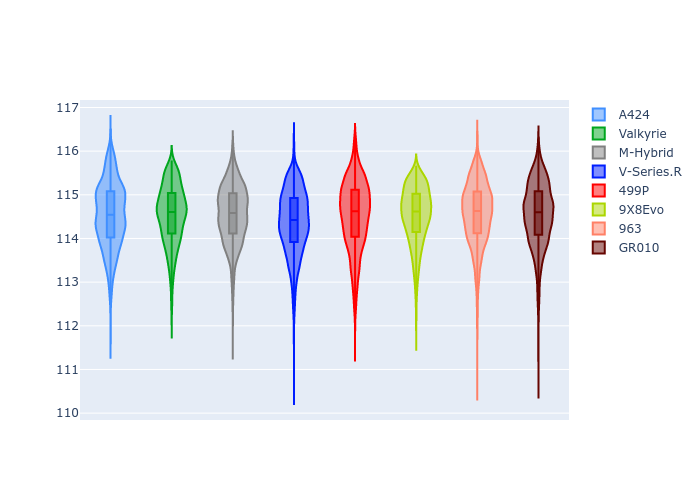
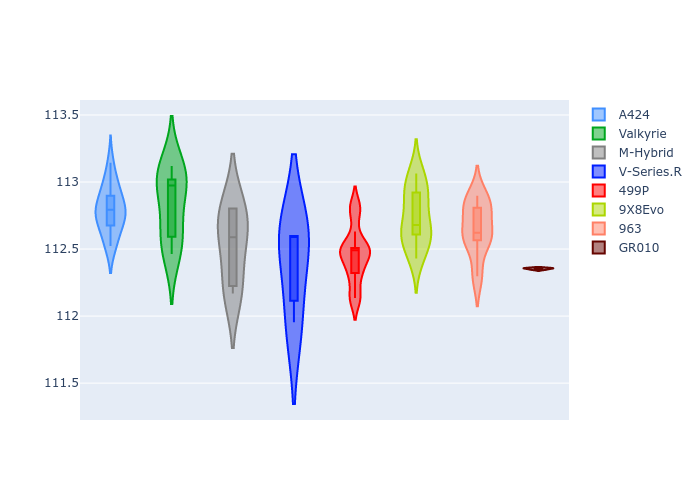
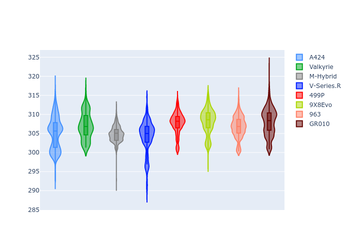
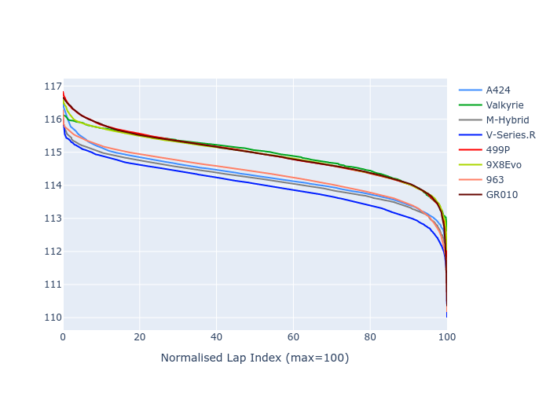

# Combined Plots

## Metadata

- BoP Accuracy: 99.87%
- Overall BoP Grade: A1
- Track: USA
- Threshhold: 250.0kph
- Average Laptime: 1:54.52
- Average Quali Laptime: 1:52.59
- Laptime Std Dev: 0.06 seconds
- Filtered Average Topspeed: 306.48kph

## BoP Table
| Manufacturer   | Car        | Weight   | Power   | PINC   | E/Stint   | FDS    | RDP    | QDP    | TDP    |
|:---------------|:-----------|:---------|:--------|:-------|:----------|:-------|:-------|:-------|:-------|
| Alpine         | A424       | 1055kg   | 511.0kw | +0.10% | 911MJ     | -      | 52.20% | 54.51% | 24.58% |
| Aston Martin   | Valkyrie   | 1033kg   | 518.0kw | -      | 909MJ     | -      | 53.39% | 54.11% | 23.71% |
| BMW            | M-Hybrid   | 1057kg   | 513.0kw | +0.10% | 911MJ     | -      | 53.47% | 52.95% | 33.73% |
| Cadillac       | V-Series.R | 1057kg   | 519.0kw | -      | 912MJ     | -      | 49.22% | 60.31% | 18.04% |
| Ferrari        | 499P       | 1058kg   | 503.0kw | -0.60% | 897MJ     | 190kph | 51.56% | 44.72% | 9.86%  |
| Peugeot        | 9X8Evo     | 1058kg   | 518.0kw | -0.10% | 915MJ     | 190kph | 50.17% | 49.36% | 17.73% |
| Porsche        | 963        | 1058kg   | 511.0kw | -0.10% | 907MJ     | -      | 50.78% | 41.25% | 27.61% |
| Toyota         | GR010      | 1061kg   | 502.0kw | -0.10% | 897MJ     | 190kph | 51.68% | 51.25% | 14.48% |

## Performance Table
| Manufacturer   | Car        | RP      | QP      | Vavg      |   RDLC | BOP-Grade   | Match   |
|:---------------|:-----------|:--------|:--------|:----------|-------:|:------------|:--------|
| Alpine         | A424       | 1:54.53 | 1:52.79 | 305.11kph |   1.02 | ~A1         | 99.92%  |
| Aston Martin   | Valkyrie   | 1:54.55 | 1:52.83 | 306.11kph |   1.02 | ~A1         | 100.00% |
| BMW            | M-Hybrid   | 1:54.55 | 1:52.53 | 305.07kph |   1.02 | ~A1         | 100.00% |
| Cadillac       | V-Series.R | 1:54.38 | 1:52.38 | 304.37kph |   1.02 | ~A1         | 99.88%  |
| Ferrari        | 499P       | 1:54.53 | 1:52.46 | 307.76kph |   1.02 | ~A1         | 99.49%  |
| Peugeot        | 9X8Evo     | 1:54.53 | 1:52.74 | 307.80kph |   1.02 | ~A1         | 100.00% |
| Porsche        | 963        | 1:54.57 | 1:52.65 | 307.20kph |   1.02 | ~A1         | 99.90%  |
| Toyota         | GR010      | 1:54.55 | 1:52.35 | 308.45kph |   1.02 | ~A1         | 99.76%  |

## Race Laptimes

## Quali Laptimes

## Topspeeds

## Laptimes Lineplot

