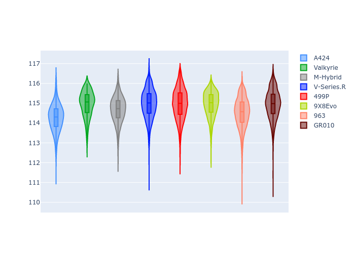
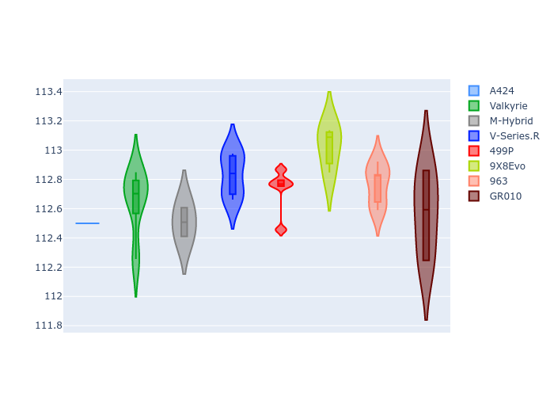

# Combined Plots

## Metadata

- BoP Accuracy: 99.51%
- Overall BoP Grade: A1
- Track: USA
- Threshhold: 210.0kph

## BoP Table
| Manufacturer   | Car        | Weight   | Power   | PINC   | E/Stint   | FDS    |
|:---------------|:-----------|:---------|:--------|:-------|:----------|:-------|
| Alpine         | A424       | 1067kg   | 520.0kw | -1.00% | 917MJ     | -      |
| Aston Martin   | Valkyrie   | 1040kg   | 506.0kw | +0.40% | 901MJ     | -      |
| BMW            | M-Hybrid   | 1061kg   | 512.0kw | +1.00% | 913MJ     | -      |
| Cadillac       | V-Series.R | 1054kg   | 510.0kw | +1.00% | 906MJ     | -      |
| Ferrari        | 499P       | 1074kg   | 508.0kw | -1.00% | 903MJ     | 190kph |
| Peugeot        | 9X8Evo     | 1051kg   | 510.0kw | -1.00% | 905MJ     | 190kph |
| Porsche        | 963        | 1067kg   | 516.0kw | -1.00% | 910MJ     | -      |
| Toyota         | GR010      | 1091kg   | 512.0kw | +1.00% | 912MJ     | 190kph |

## Performance Table
| Manufacturer   | Car        | RP      | QP      | Vavg      |   RDLC | BOP-Grade   | Match   |
|:---------------|:-----------|:--------|:--------|:----------|-------:|:------------|:--------|
| Alpine         | A424       | 1:55.35 | 1:51.34 | 303.40kph |   1.04 | ~A1         | 99.81%  |
| Aston Martin   | Valkyrie   | 1:56.09 | 1:51.24 | 303.39kph |   1.04 | ~A1         | 100.00% |
| BMW            | M-Hybrid   | 1:55.42 | 1:51.04 | 302.92kph |   1.04 | ~A1         | 99.53%  |
| Cadillac       | V-Series.R | 1:55.68 | 1:51.38 | 299.85kph |   1.04 | ~A1         | 99.96%  |
| Ferrari        | 499P       | 1:56.10 | 1:51.59 | 302.75kph |   1.04 | ~A1         | 99.79%  |
| Peugeot        | 9X8Evo     | 1:56.16 | 1:51.75 | 304.84kph |   1.04 | ~A1         | 97.20%  |
| Porsche        | 963        | 1:55.69 | 1:51.36 | 301.65kph |   1.04 | ~A1         | 99.86%  |
| Toyota         | GR010      | 1:56.08 | 1:51.46 | 304.10kph |   1.04 | ~A1         | 99.95%  |

## Race Laptimes

## Quali Laptimes

## Topspeeds

## Laptimes Lineplot

