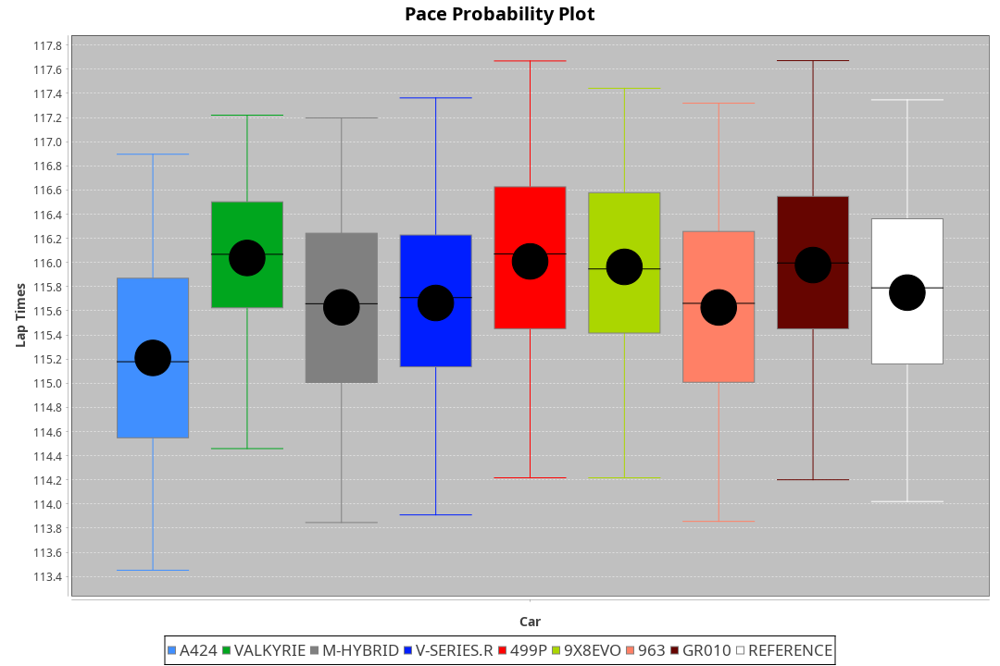
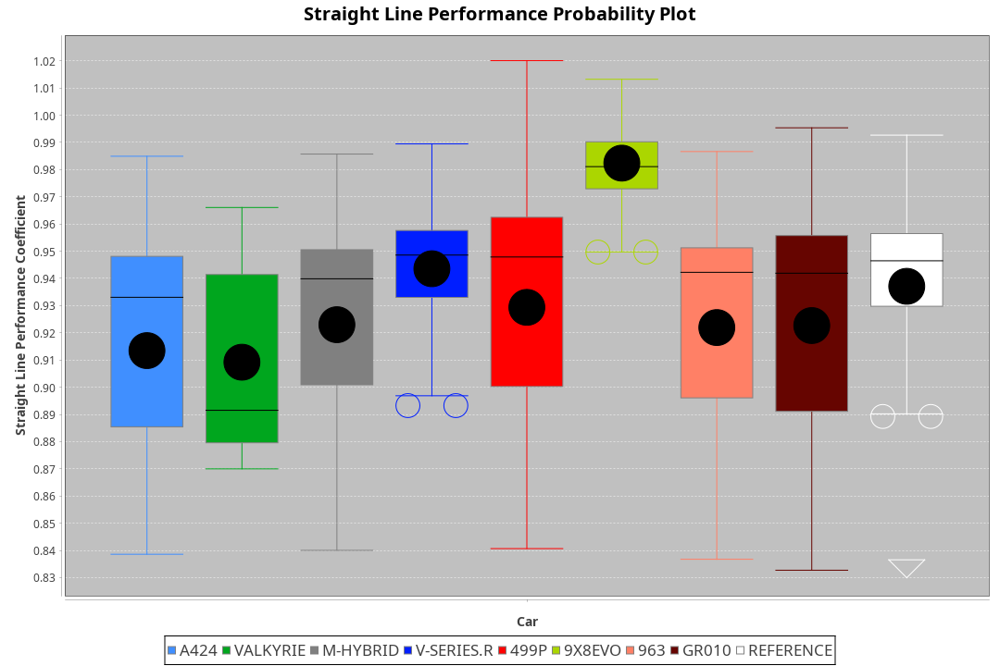
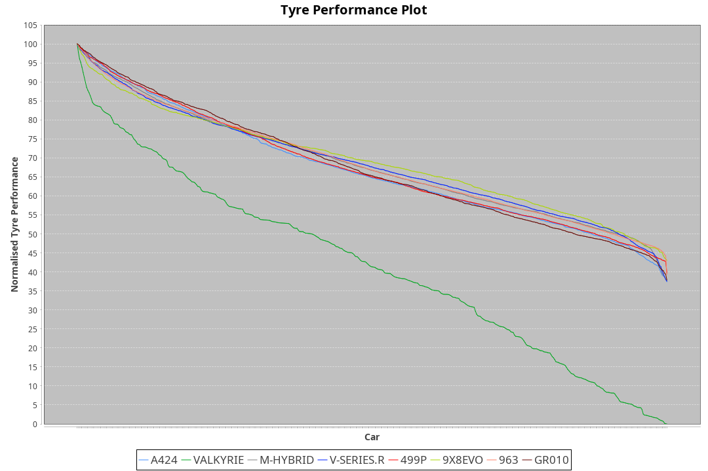

| Manufacturer | Car        | Weight | Power   | PINC    | E/Stint | FDS     |
|:-|:-|:-|:-|:-|:-|:-|
| Alpine       | A424       | 1055kg | 510.0kw | 1.90%   | 914MJ   |    -    |
| Aston Martin | Valkyrie   | 1034kg | 514.0kw | 1.10%   | 909MJ   |    -    |
| BMW          | M-Hybrid   | 1052kg | 513.0kw | 1.30%   | 913MJ   |    -    |
| Cadillac     | V-Series.R | 1050kg | 514.0kw | 1.10%   | 909MJ   |    -    |
| Ferrari      | 499P       | 1074kg | 520.0kw |    -    | 916MJ   | 200kph  |
| Peugeot      | 9X8Evo     | 1032kg | 510.0kw |    -    | 906MJ   | 190kph  |
| Porsche      | 963        | 1052kg | 506.0kw | 2.70%   | 909MJ   |    -    |
| Toyota       | GR010      | 1074kg | 520.0kw |    -    | 915MJ   | 200kph  |

### BoP Accuracy: 94.71%; Overall BoP Grade: A2
| Manufacturer | Car        | Type  | RP      | QP      | Weight | Power¹  | Threshhold | PINC    | Power²   | E/Stint | AVG Vmax  | FDS     | RDLC | L/Stint | BOP-Grade | Model Accuracy | Model Points | Match%  | SimDiff |
|:-|:-|:-|:-|:-|:-|:-|:-|:-|:-|:-|:-|:-|:-|:-|:-|:-|:-|:-|:-|
| Alpine       | A424       | LMDH  | 1:55.21 | 1:50.99 | 1055kg | 510.0kw | 210.0kph   | 1.90%   | 519.70kw |  914MJ  | 290.72kph |    -    | 1.02 | 34      | ~A1       | 98.45%         | 2220         | 98.21%  | +0.13   |
| Aston Martin | Valkyrie   | LMHNH | 1:55.20 | 1:50.39 | 1034kg | 514.0kw | 210.0kph   | 1.10%   | 519.70kw |  909MJ  | 292.53kph |    -    | 1.04 | 34      | +C2       | 100.00%        | 466          | 73.00%  | #       |
| BMW          | M-Hybrid   | LMDH  | 1:55.21 | 1:50.64 | 1052kg | 513.0kw | 210.0kph   | 1.30%   | 519.70kw |  913MJ  | 292.98kph |    -    | 1.02 | 34      | ~A1       | 100.00%        | 3339         | 100.00% | -0.05   |
| Cadillac     | V-Series.R | LMDH  | 1:55.21 | 1:50.56 | 1050kg | 514.0kw | 210.0kph   | 1.10%   | 519.70kw |  909MJ  | 294.70kph |    -    | 1.02 | 34      | ~A1       | 99.03%         | 6041         | 99.35%  | -0.24   |
| Ferrari      | 499P       | LMHHU | 1:55.28 | 1:50.53 | 1074kg | 520.0kw | 210.0kph   |    -    | 520.00kw |  916MJ  | 293.89kph | 200kph  | 1.03 | 34      | ~A1       | 99.97%         | 7286         | 100.00% | +0.59   |
| Peugeot      | 9X8Evo     | LMHHU | 1:55.20 | 1:50.78 | 1032kg | 510.0kw | 210.0kph   |    -    | 510.00kw |  906MJ  | 302.60kph | 190kph  | 1.03 | 34      | +B1       | 100.00%        | 1890         | 87.13%  | -0.12   |
| Porsche      | 963        | LMDH  | 1:55.22 | 1:50.62 | 1052kg | 506.0kw | 210.0kph   | 2.70%   | 519.70kw |  909MJ  | 292.55kph |    -    | 1.02 | 34      | ~A1       | 99.89%         | 15174        | 100.00% | +0.10   |
| Toyota       | GR010      | LMHHU | 1:55.21 | 1:50.57 | 1074kg | 520.0kw | 210.0kph   |    -    | 520.00kw |  915MJ  | 292.93kph | 200kph  | 1.04 | 34      | ~A1       | 99.82%         | 5457         | 100.00% | +0.56   |

## Power below Threshhold
| N/Nmax    | A424    | VALKYRIE | M-HYBRID | V-SERIES.R | 499P    | 9X8EVO  | 963     | GR010   |
|:-|:-|:-|:-|:-|:-|:-|:-|:-|
|  0.550    |  251    |  253     |  253     |  253       |  256    |  251    |  249    |  256    |
|  0.575    |  274    |  276     |  276     |  276       |  279    |  274    |  272    |  279    |
|  0.600    |  295    |  297     |  296     |  297       |  300    |  295    |  292    |  300    |
|  0.625    |  316    |  318     |  317     |  318       |  322    |  316    |  313    |  322    |
|  0.650    |  337    |  339     |  338     |  339       |  343    |  337    |  334    |  343    |
|  0.675    |  358    |  361     |  360     |  361       |  365    |  358    |  355    |  365    |
|  0.700    |  380    |  383     |  382     |  383       |  387    |  380    |  377    |  387    |
|  0.725    |  401    |  404     |  403     |  404       |  409    |  401    |  398    |  409    |
|  0.750    |  422    |  425     |  424     |  425       |  430    |  422    |  418    |  430    |
|  0.775    |  441    |  444     |  443     |  444       |  449    |  441    |  437    |  449    |
|  0.800    |  458    |  462     |  461     |  462       |  467    |  458    |  454    |  467    |
|  0.825    |  473    |  477     |  476     |  477       |  482    |  473    |  469    |  482    |
|  0.850    |  485    |  488     |  487     |  488       |  494    |  485    |  481    |  494    |
|  0.875    |  495    |  499     |  498     |  499       |  505    |  495    |  491    |  505    |
|  0.900    |  502    |  506     |  505     |  506       |  512    |  502    |  498    |  512    |
|  0.925    |  507    |  511     |  510     |  511       |  517    |  507    |  503    |  517    |
| **0.950** | **510** | **514**  | **513**  | **514**    | **520** | **510** | **506** | **520** |
|  0.975    |  508    |  512     |  511     |  512       |  518    |  508    |  504    |  518    |
|  1.000    |  505    |  508     |  507     |  508       |  514    |  505    |  501    |  514    |
|  1.025    |  436    |  439     |  438     |  439       |  444    |  436    |  432    |  444    |

## Power above Threshhold
| N/Nmax    | A424       | VALKYRIE   | M-HYBRID   | V-SERIES.R | 499P    | 9X8EVO  | 963        | GR010   |
|:-|:-|:-|:-|:-|:-|:-|:-|:-|
|  0.550    |  256.34    |  256.32    |  256.33    |  256.32    |  256    |  251    |  256.33    |  256    |
|  0.575    |  279.37    |  279.35    |  279.36    |  279.35    |  279    |  274    |  279.36    |  279    |
|  0.600    |  299.40    |  299.38    |  299.39    |  299.38    |  300    |  295    |  299.38    |  300    |
|  0.625    |  321.43    |  321.40    |  321.41    |  321.40    |  322    |  316    |  321.41    |  322    |
|  0.650    |  342.45    |  342.43    |  342.44    |  342.43    |  343    |  337    |  342.44    |  343    |
|  0.675    |  364.48    |  364.46    |  364.47    |  364.46    |  365    |  358    |  364.46    |  365    |
|  0.700    |  386.51    |  386.49    |  386.50    |  386.49    |  387    |  380    |  386.49    |  387    |
|  0.725    |  408.54    |  408.51    |  408.53    |  408.51    |  409    |  401    |  408.52    |  409    |
|  0.750    |  429.57    |  429.54    |  429.55    |  429.54    |  430    |  422    |  429.55    |  430    |
|  0.775    |  448.60    |  448.56    |  448.58    |  448.56    |  449    |  441    |  448.57    |  449    |
|  0.800    |  466.62    |  466.59    |  466.60    |  466.59    |  467    |  458    |  466.59    |  467    |
|  0.825    |  481.64    |  481.61    |  481.62    |  481.61    |  482    |  473    |  481.61    |  482    |
|  0.850    |  493.66    |  493.62    |  493.64    |  493.62    |  494    |  485    |  493.63    |  494    |
|  0.875    |  504.67    |  504.64    |  504.65    |  504.64    |  505    |  495    |  504.64    |  505    |
|  0.900    |  511.68    |  511.64    |  511.66    |  511.64    |  512    |  502    |  511.65    |  512    |
|  0.925    |  516.69    |  516.65    |  516.67    |  516.65    |  517    |  507    |  516.66    |  517    |
| **0.950** | **519.69** | **519.65** | **519.67** | **519.65** | **520** | **510** | **519.66** | **520** |
|  0.975    |  517.69    |  517.65    |  517.67    |  517.65    |  518    |  508    |  517.66    |  518    |
|  1.000    |  513.68    |  513.65    |  513.66    |  513.65    |  514    |  505    |  513.65    |  514    |
|  1.025    |  443.59    |  443.56    |  443.57    |  443.56    |  444    |  436    |  443.57    |  444    |
