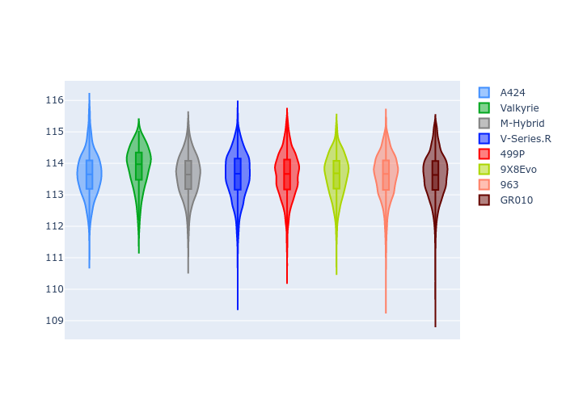
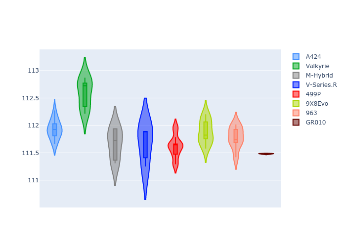
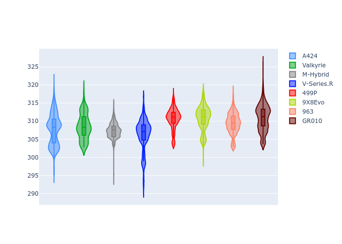
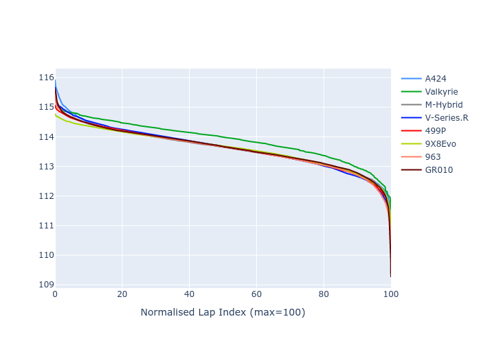

# Combined Plots

## Metadata

- BoP Accuracy: 99.74%
- Overall BoP Grade: A1
- Track: USA
- Threshhold: 0.0kph
- Average Laptime: 1:53.65
- Average Quali Laptime: 1:51.82
- Laptime Std Dev: 0.09 seconds
- Filtered Average Topspeed: 308.61kph

## BoP Table
| Manufacturer   | Car        | Weight   | Power   | PINC   | E/Stint   | FDS    | RDP    | QDP    | TDP    |
|:---------------|:-----------|:---------|:--------|:-------|:----------|:-------|:-------|:-------|:-------|
| Alpine         | A424       | 1035kg   | 509.0kw | -      | 906MJ     | -      | 51.38% | 57.54% | 26.10% |
| Aston Martin   | Valkyrie   | 1030kg   | 520.0kw | -      | 911MJ     | -      | 52.56% | 51.11% | 27.23% |
| BMW            | M-Hybrid   | 1035kg   | 512.0kw | -      | 907MJ     | -      | 52.62% | 53.36% | 32.99% |
| Cadillac       | V-Series.R | 1040kg   | 520.0kw | -      | 911MJ     | -      | 48.29% | 59.47% | 18.65% |
| Ferrari        | 499P       | 1067kg   | 516.0kw | -      | 911MJ     | 200kph | 51.25% | 43.28% | 10.17% |
| Peugeot        | 9X8Evo     | 1031kg   | 513.0kw | -      | 908MJ     | 200kph | 48.70% | 50.83% | 18.68% |
| Porsche        | 963        | 1030kg   | 507.0kw | -      | 901MJ     | -      | 50.57% | 42.80% | 29.05% |
| Toyota         | GR010      | 1066kg   | 515.0kw | -      | 910MJ     | 190kph | 51.03% | 51.78% | 14.64% |

## Performance Table
| Manufacturer   | Car        | RP      | QP      | Vavg      |   RDLC | BOP-Grade   | Match   |
|:---------------|:-----------|:--------|:--------|:----------|-------:|:------------|:--------|
| Alpine         | A424       | 1:53.63 | 1:52.10 | 307.02kph |   1.01 | ~A1         | 98.96%  |
| Aston Martin   | Valkyrie   | 1:53.90 | 1:52.63 | 308.78kph |   1.01 | ~A1         | 99.85%  |
| BMW            | M-Hybrid   | 1:53.62 | 1:51.73 | 307.16kph |   1.02 | ~A1         | 100.00% |
| Cadillac       | V-Series.R | 1:53.62 | 1:51.69 | 306.02kph |   1.02 | ~A1         | 99.70%  |
| Ferrari        | 499P       | 1:53.61 | 1:51.40 | 310.10kph |   1.02 | ~A1         | 100.00% |
| Peugeot        | 9X8Evo     | 1:53.60 | 1:51.98 | 310.01kph |   1.01 | ~A1         | 100.00% |
| Porsche        | 963        | 1:53.60 | 1:51.67 | 309.22kph |   1.02 | ~A1         | 99.92%  |
| Toyota         | GR010      | 1:53.63 | 1:51.39 | 310.53kph |   1.02 | ~A1         | 99.45%  |

## Race Laptimes

## Quali Laptimes

## Topspeeds

## Laptimes Lineplot

