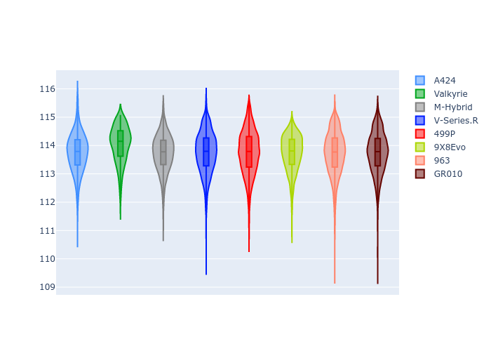
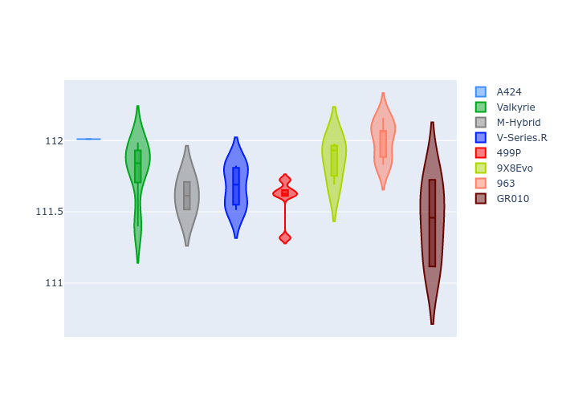

# Combined Plots

## Metadata

- BoP Accuracy: 99.79%
- Overall BoP Grade: A1
- Track: USA
- Threshhold: 0.0kph

## BoP Table
| Manufacturer   | Car        | Weight   | Power   | PINC   | E/Stint   | FDS    |
|:---------------|:-----------|:---------|:--------|:-------|:----------|:-------|
| Alpine         | A424       | 1037kg   | 509.0kw | -      | 907MJ     | -      |
| Aston Martin   | Valkyrie   | 1031kg   | 520.0kw | -      | 911MJ     | -      |
| BMW            | M-Hybrid   | 1040kg   | 512.0kw | -      | 908MJ     | -      |
| Cadillac       | V-Series.R | 1045kg   | 520.0kw | -      | 911MJ     | -      |
| Ferrari        | 499P       | 1062kg   | 517.0kw | -      | 912MJ     | 190kph |
| Peugeot        | 9X8Evo     | 1031kg   | 515.0kw | -      | 910MJ     | 190kph |
| Porsche        | 963        | 1039kg   | 511.0kw | -      | 905MJ     | -      |
| Toyota         | GR010      | 1062kg   | 518.0kw | -      | 912MJ     | 190kph |

## Performance Table
| Manufacturer   | Car        | RP      | QP      | Vavg      |   RDLC | BOP-Grade   | Match   |
|:---------------|:-----------|:--------|:--------|:----------|-------:|:------------|:--------|
| Alpine         | A424       | 1:54.78 | 1:50.80 | 305.04kph |   1.04 | ~A1         | 99.65%  |
| Aston Martin   | Valkyrie   | 1:54.78 | 1:50.04 | 307.03kph |   1.04 | ~A1         | 100.00% |
| BMW            | M-Hybrid   | 1:54.81 | 1:50.47 | 304.28kph |   1.04 | ~A1         | 100.00% |
| Cadillac       | V-Series.R | 1:54.81 | 1:50.56 | 302.07kph |   1.04 | ~A1         | 99.96%  |
| Ferrari        | 499P       | 1:54.80 | 1:50.37 | 306.78kph |   1.04 | ~A1         | 99.98%  |
| Peugeot        | 9X8Evo     | 1:54.81 | 1:50.50 | 308.92kph |   1.04 | ~A1         | 98.87%  |
| Porsche        | 963        | 1:54.78 | 1:50.52 | 304.34kph |   1.04 | ~A1         | 99.89%  |
| Toyota         | GR010      | 1:54.78 | 1:50.26 | 307.52kph |   1.04 | ~A1         | 99.97%  |

## Race Laptimes

## Quali Laptimes

## Topspeeds

## Laptimes Lineplot

