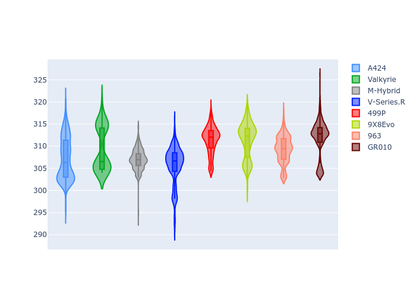

# Combined Plots

## Metadata

- BoP Accuracy: 99.76%
- Overall BoP Grade: A1
- Track: USA
- Threshhold: 0.0kph
- Average Laptime: 1:53.78
- Average Quali Laptime: 1:51.75
- Average Topspeed: 309.13kph

## BoP Table
| Manufacturer   | Car        | Weight   | Power   | PINC   | E/Stint   | FDS    | RDP    | QDP    | TDP    |
|:---------------|:-----------|:---------|:--------|:-------|:----------|:-------|:-------|:-------|:-------|
| Alpine         | A424       | 1035kg   | 510.0kw | -      | 907MJ     | -      | 51.64% | 59.31% | 26.80% |
| Aston Martin   | Valkyrie   | 1030kg   | 520.0kw | -      | 911MJ     | -      | 53.50% | 53.33% | 21.51% |
| BMW            | M-Hybrid   | 1035kg   | 512.0kw | -      | 907MJ     | -      | 52.89% | 56.22% | 33.41% |
| Cadillac       | V-Series.R | 1040kg   | 520.0kw | -      | 911MJ     | -      | 48.63% | 60.80% | 19.01% |
| Ferrari        | 499P       | 1057kg   | 517.0kw | -      | 911MJ     | 190kph | 51.38% | 44.98% | 9.83%  |
| Peugeot        | 9X8Evo     | 1031kg   | 519.0kw | -      | 914MJ     | 190kph | 48.87% | 52.78% | 15.41% |
| Porsche        | 963        | 1031kg   | 508.0kw | -      | 902MJ     | -      | 50.70% | 44.30% | 29.51% |
| Toyota         | GR010      | 1055kg   | 515.0kw | -      | 908MJ     | 190kph | 51.09% | 52.71% | 11.46% |

## Performance Table
| Manufacturer   | Car        | RP      | QP      | Vavg      |   RDLC | BOP-Grade   | Match   |
|:---------------|:-----------|:--------|:--------|:----------|-------:|:------------|:--------|
| Alpine         | A424       | 1:53.74 | 1:52.01 | 307.17kph |   1.02 | ~A1         | 99.05%  |
| Aston Martin   | Valkyrie   | 1:54.05 | 1:51.79 | 309.33kph |   1.02 | ~A1         | 100.00% |
| BMW            | M-Hybrid   | 1:53.73 | 1:51.61 | 307.01kph |   1.02 | ~A1         | 99.94%  |
| Cadillac       | V-Series.R | 1:53.75 | 1:51.68 | 305.67kph |   1.02 | ~A1         | 99.68%  |
| Ferrari        | 499P       | 1:53.75 | 1:51.59 | 311.37kph |   1.02 | ~A1         | 99.77%  |
| Peugeot        | 9X8Evo     | 1:53.73 | 1:51.87 | 311.31kph |   1.02 | ~A1         | 100.00% |
| Porsche        | 963        | 1:53.72 | 1:52.00 | 309.26kph |   1.02 | ~A1         | 99.86%  |
| Toyota         | GR010      | 1:53.74 | 1:51.43 | 311.90kph |   1.02 | ~A1         | 99.76%  |

## Race Laptimes

## Quali Laptimes

## Topspeeds

## Laptimes Lineplot

