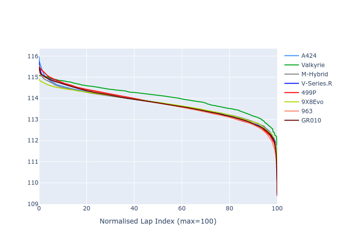

# Combined Plots

## Metadata

- BoP Accuracy: 99.90%
- Overall BoP Grade: A1
- Track: USA
- Threshhold: 0.0kph

## BoP Table
| Manufacturer   | Car        | Weight   | Power   | PINC   | E/Stint   | FDS    | RDP    | QDP    | TDP    |
|:---------------|:-----------|:---------|:--------|:-------|:----------|:-------|:-------|:-------|:-------|
| Alpine         | A424       | 1038kg   | 510.0kw | -      | 908MJ     | -      | 52.35% | 61.85% | 27.84% |
| Aston Martin   | Valkyrie   | 1031kg   | 519.0kw | -      | 910MJ     | -      | 53.59% | 53.33% | 21.51% |
| BMW            | M-Hybrid   | 1039kg   | 512.0kw | -      | 908MJ     | -      | 53.26% | 57.23% | 34.54% |
| Cadillac       | V-Series.R | 1045kg   | 520.0kw | -      | 911MJ     | -      | 47.80% | 56.73% | 19.63% |
| Ferrari        | 499P       | 1063kg   | 514.0kw | -      | 909MJ     | 190kph | 53.02% | 42.32% | 9.88%  |
| Peugeot        | 9X8Evo     | 1030kg   | 515.0kw | -      | 910MJ     | 190kph | 48.47% | 51.26% | 16.02% |
| Porsche        | 963        | 1039kg   | 511.0kw | -      | 905MJ     | -      | 50.87% | 45.25% | 30.77% |
| Toyota         | GR010      | 1061kg   | 511.0kw | -      | 906MJ     | 190kph | 52.43% | 57.12% | 12.82% |

## Performance Table
| Manufacturer   | Car        | RP      | QP      | Vavg      |   RDLC | BOP-Grade   | Match   |
|:---------------|:-----------|:--------|:--------|:----------|-------:|:------------|:--------|
| Alpine         | A424       | 1:54.86 | 1:50.73 | 304.94kph |   1.04 | ~A1         | 99.79%  |
| Aston Martin   | Valkyrie   | 1:54.87 | 1:50.09 | 306.82kph |   1.04 | ~A1         | 100.00% |
| BMW            | M-Hybrid   | 1:54.87 | 1:50.34 | 304.34kph |   1.04 | ~A1         | 100.00% |
| Cadillac       | V-Series.R | 1:54.86 | 1:50.37 | 301.83kph |   1.04 | ~A1         | 100.00% |
| Ferrari        | 499P       | 1:54.86 | 1:49.83 | 305.95kph |   1.05 | ~A1         | 99.83%  |
| Peugeot        | 9X8Evo     | 1:54.85 | 1:50.51 | 309.02kph |   1.04 | ~A1         | 100.00% |
| Porsche        | 963        | 1:54.88 | 1:50.43 | 304.71kph |   1.04 | ~A1         | 99.86%  |
| Toyota         | GR010      | 1:54.86 | 1:49.71 | 306.55kph |   1.05 | ~A1         | 99.76%  |

## Race Laptimes

## Quali Laptimes

## Topspeeds

## Laptimes Lineplot

