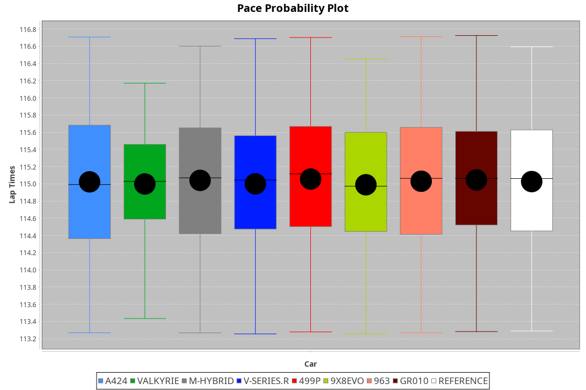
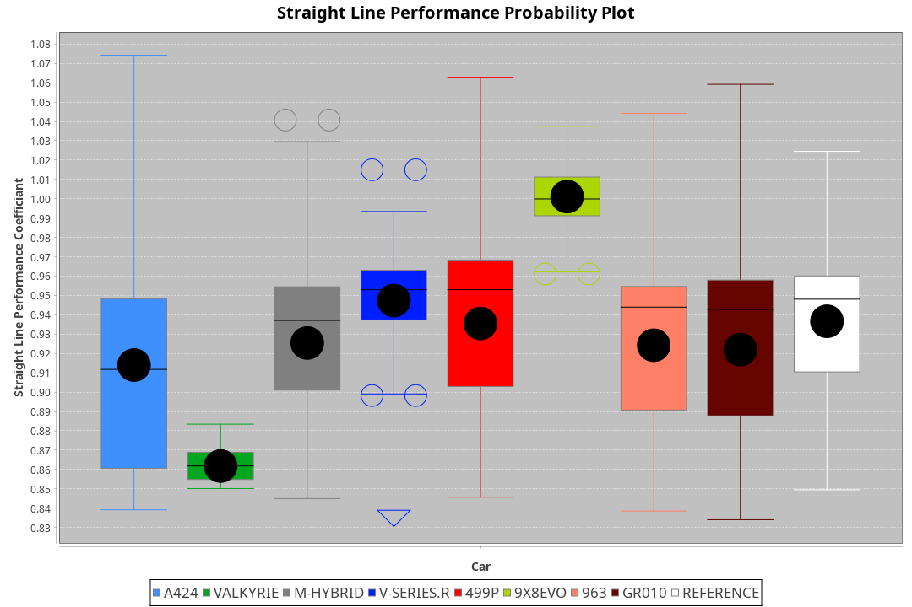
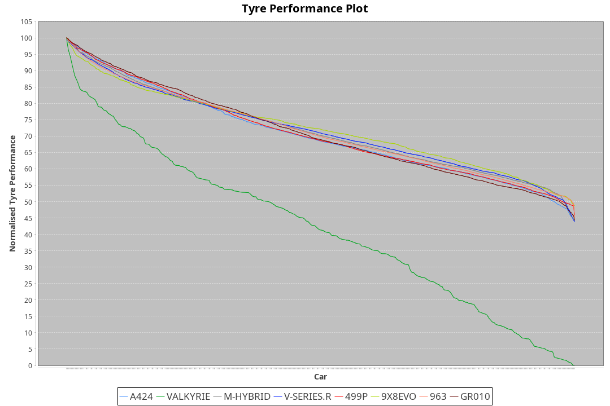

| Manufacturer | Car        | Weight | Power   | PINC    | E/Stint | FDS     |
|:-|:-|:-|:-|:-|:-|:-|
| Toyota       | GR010      | 1077kg | 520.0kw |    -    | 915MJ   | 190kph  |
| Ferrari      | 499P       | 1075kg | 520.0kw |    -    | 916MJ   | 190kph  |
| Cadillac     | V-Series.R | 1045kg | 517.0kw |    -    | 909MJ   |    -    |
| Porsche      | 963        | 1049kg | 515.0kw |    -    | 910MJ   |    -    |
| BMW          | M-Hybrid   | 1048kg | 516.0kw |    -    | 912MJ   |    -    |
| Alpine       | A424       | 1052kg | 515.0kw |    -    | 913MJ   |    -    |
| Aston Martin | Valkyrie   | 1031kg | 515.0kw |    -    | 907MJ   |    -    |
| Peugeot      | 9X8Evo     | 1030kg | 510.0kw |    -    | 905MJ   | 190kph  |

### BoP Accuracy: 94.67%; Overall BoP Grade: A2
| Manufacturer | Car        | Type  | RP      | QP      | Weight | Power¹  | Threshhold | PINC    | Power²   | E/Stint | AVG Vmax  | FDS     | RDLC | L/Stint | BOP-Grade | Model Accuracy | Model Points | Match%  | SimDiff |
|:-|:-|:-|:-|:-|:-|:-|:-|:-|:-|:-|:-|:-|:-|:-|:-|:-|:-|:-|:-|
| Alpine       | A424       | LMDH  | 1:54.99 | 1:50.51 | 1052kg | 515.0kw | 0.0kph     |    -    | 515.00kw |  913MJ  | 290.68kph |    -    | 1.02 | 34      | ~A1       | 96.10%         | 2390         | 97.05%  | +0.10   |
| Aston Martin | Valkyrie   | LMHNH | 1:54.98 | 1:49.99 | 1031kg | 515.0kw | 0.0kph     |    -    | 515.00kw |  907MJ  | 292.16kph |    -    | 1.05 | 34      | +C2       | 100.00%        | 466          | 73.44%  | #       |
| BMW          | M-Hybrid   | LMDH  | 1:54.99 | 1:50.24 | 1048kg | 516.0kw | 0.0kph     |    -    | 516.00kw |  912MJ  | 292.92kph |    -    | 1.02 | 34      | ~A1       | 100.00%        | 3339         | 100.00% | -0.06   |
| Cadillac     | V-Series.R | LMDH  | 1:54.97 | 1:50.37 | 1045kg | 517.0kw | 0.0kph     |    -    | 517.00kw |  909MJ  | 295.11kph |    -    | 1.02 | 34      | ~A1       | 99.56%         | 5841         | 99.54%  | -0.19   |
| Ferrari      | 499P       | LMHHU | 1:55.00 | 1:50.20 | 1075kg | 520.0kw | 0.0kph     |    -    | 520.00kw |  916MJ  | 293.50kph | 190kph  | 1.03 | 34      | ~A1       | 99.57%         | 7417         | 100.00% | +0.52   |
| Peugeot      | 9X8Evo     | LMHHU | 1:54.98 | 1:50.44 | 1030kg | 510.0kw | 0.0kph     |    -    | 510.00kw |  905MJ  | 302.72kph | 190kph  | 1.03 | 34      | +B1       | 100.00%        | 1891         | 87.47%  | -0.17   |
| Porsche      | 963        | LMDH  | 1:54.99 | 1:50.09 | 1049kg | 515.0kw | 0.0kph     |    -    | 515.00kw |  910MJ  | 292.74kph |    -    | 1.02 | 34      | ~A1       | 98.39%         | 16118        | 100.00% | +0.21   |
| Toyota       | GR010      | LMHHU | 1:55.00 | 1:50.32 | 1077kg | 520.0kw | 0.0kph     |    -    | 520.00kw |  915MJ  | 292.32kph | 190kph  | 1.03 | 34      | ~A1       | 99.90%         | 5196         | 99.84%  | +0.48   |

## Power below Threshhold
| N/Nmax    | A424    | VALKYRIE | M-HYBRID | V-SERIES.R | 499P    | 9X8EVO  | 963     | GR010   |
|:-|:-|:-|:-|:-|:-|:-|:-|:-|
|  0.550    |  254    |  254     |  254     |  255       |  256    |  251    |  254    |  256    |
|  0.575    |  277    |  277     |  277     |  278       |  279    |  274    |  277    |  279    |
|  0.600    |  297    |  297     |  298     |  298       |  300    |  295    |  297    |  300    |
|  0.625    |  319    |  319     |  319     |  320       |  322    |  316    |  319    |  322    |
|  0.650    |  340    |  340     |  340     |  341       |  343    |  337    |  340    |  343    |
|  0.675    |  362    |  362     |  362     |  363       |  365    |  358    |  362    |  365    |
|  0.700    |  383    |  383     |  384     |  385       |  387    |  380    |  383    |  387    |
|  0.725    |  405    |  405     |  406     |  407       |  409    |  401    |  405    |  409    |
|  0.750    |  426    |  426     |  427     |  427       |  430    |  422    |  426    |  430    |
|  0.775    |  445    |  445     |  446     |  446       |  449    |  441    |  445    |  449    |
|  0.800    |  463    |  463     |  463     |  464       |  467    |  458    |  463    |  467    |
|  0.825    |  478    |  478     |  478     |  479       |  482    |  473    |  478    |  482    |
|  0.850    |  489    |  489     |  490     |  491       |  494    |  485    |  489    |  494    |
|  0.875    |  500    |  500     |  501     |  502       |  505    |  495    |  500    |  505    |
|  0.900    |  507    |  507     |  508     |  509       |  512    |  502    |  507    |  512    |
|  0.925    |  512    |  512     |  513     |  514       |  517    |  507    |  512    |  517    |
| **0.950** | **515** | **515**  | **516**  | **517**    | **520** | **510** | **515** | **520** |
|  0.975    |  513    |  513     |  514     |  515       |  518    |  508    |  513    |  518    |
|  1.000    |  509    |  509     |  510     |  511       |  514    |  505    |  509    |  514    |
|  1.025    |  440    |  440     |  441     |  441       |  444    |  436    |  440    |  444    |

## Power above Threshhold
| N/Nmax    | A424    | VALKYRIE | M-HYBRID | V-SERIES.R | 499P    | 9X8EVO  | 963     | GR010   |
|:-|:-|:-|:-|:-|:-|:-|:-|:-|
|  0.550    |  254    |  254     |  254     |  255       |  256    |  251    |  254    |  256    |
|  0.575    |  277    |  277     |  277     |  278       |  279    |  274    |  277    |  279    |
|  0.600    |  297    |  297     |  298     |  298       |  300    |  295    |  297    |  300    |
|  0.625    |  319    |  319     |  319     |  320       |  322    |  316    |  319    |  322    |
|  0.650    |  340    |  340     |  340     |  341       |  343    |  337    |  340    |  343    |
|  0.675    |  362    |  362     |  362     |  363       |  365    |  358    |  362    |  365    |
|  0.700    |  383    |  383     |  384     |  385       |  387    |  380    |  383    |  387    |
|  0.725    |  405    |  405     |  406     |  407       |  409    |  401    |  405    |  409    |
|  0.750    |  426    |  426     |  427     |  427       |  430    |  422    |  426    |  430    |
|  0.775    |  445    |  445     |  446     |  446       |  449    |  441    |  445    |  449    |
|  0.800    |  463    |  463     |  463     |  464       |  467    |  458    |  463    |  467    |
|  0.825    |  478    |  478     |  478     |  479       |  482    |  473    |  478    |  482    |
|  0.850    |  489    |  489     |  490     |  491       |  494    |  485    |  489    |  494    |
|  0.875    |  500    |  500     |  501     |  502       |  505    |  495    |  500    |  505    |
|  0.900    |  507    |  507     |  508     |  509       |  512    |  502    |  507    |  512    |
|  0.925    |  512    |  512     |  513     |  514       |  517    |  507    |  512    |  517    |
| **0.950** | **515** | **515**  | **516**  | **517**    | **520** | **510** | **515** | **520** |
|  0.975    |  513    |  513     |  514     |  515       |  518    |  508    |  513    |  518    |
|  1.000    |  509    |  509     |  510     |  511       |  514    |  505    |  509    |  514    |
|  1.025    |  440    |  440     |  441     |  441       |  444    |  436    |  440    |  444    |
