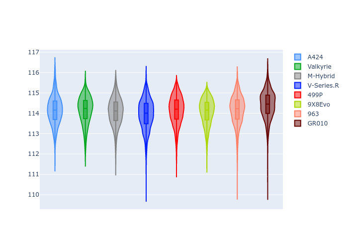
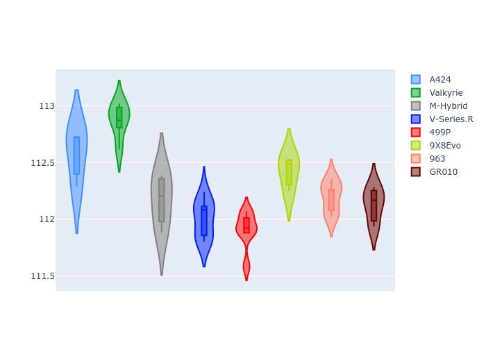
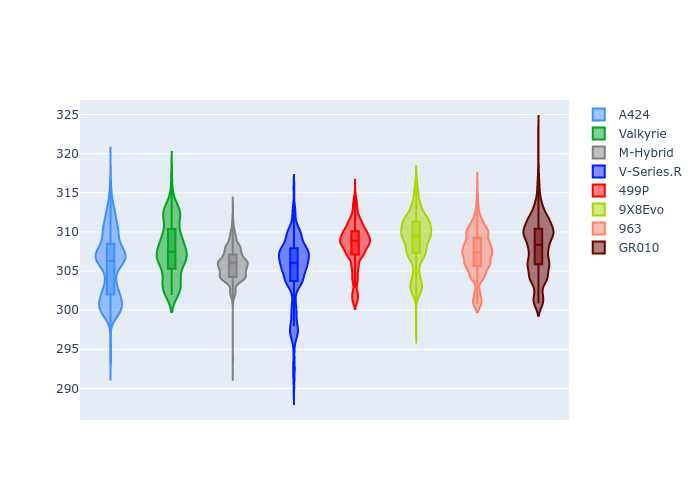
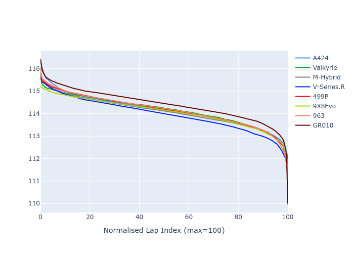

# Combined Plots

## Metadata

- BoP Accuracy: 98.97%
- Overall BoP Grade: A1
- Track: USA
- Threshhold: 250.0kph
- Average Laptime: 1:54.29
- Average Quali Laptime: 1:52.20
- Average Topspeed: 306.99kph

## BoP Table
| Manufacturer   | Car        | Weight   | Power   | PINC   | E/Stint   | FDS    | RDP    | QDP    | TDP    |
|:---------------|:-----------|:---------|:--------|:-------|:----------|:-------|:-------|:-------|:-------|
| Alpine         | A424       | 1058kg   | 515.0kw | +0.70% | 916MJ     | -      | 51.64% | 59.31% | 26.80% |
| Aston Martin   | Valkyrie   | 1031kg   | 508.0kw | -      | 900MJ     | -      | 53.50% | 53.33% | 21.51% |
| BMW            | M-Hybrid   | 1050kg   | 517.0kw | -      | 913MJ     | -      | 52.89% | 56.22% | 33.41% |
| Cadillac       | V-Series.R | 1040kg   | 520.0kw | -      | 911MJ     | -      | 48.63% | 60.80% | 19.01% |
| Ferrari        | 499P       | 1065kg   | 504.0kw | -0.60% | 899MJ     | 190kph | 51.38% | 44.98% | 9.83%  |
| Peugeot        | 9X8Evo     | 1055kg   | 516.0kw | -0.10% | 913MJ     | 190kph | 48.87% | 52.78% | 15.41% |
| Porsche        | 963        | 1053kg   | 514.0kw | -0.10% | 909MJ     | -      | 50.70% | 44.30% | 29.51% |
| Toyota         | GR010      | 1069kg   | 501.0kw | +0.10% | 898MJ     | 190kph | 51.09% | 52.71% | 11.46% |

## Performance Table
| Manufacturer   | Car        | RP      | QP      | Vavg      |   RDLC | BOP-Grade   | Match   |
|:---------------|:-----------|:--------|:--------|:----------|-------:|:------------|:--------|
| Alpine         | A424       | 1:53.89 | 1:52.19 | 306.44kph |   1.02 | ~A1         | 99.94%  |
| Aston Martin   | Valkyrie   | 1:54.78 | 1:52.49 | 306.62kph |   1.02 | ~A1         | 100.00% |
| BMW            | M-Hybrid   | 1:53.81 | 1:51.70 | 306.49kph |   1.02 | ~A1         | 100.00% |
| Cadillac       | V-Series.R | 1:53.62 | 1:51.55 | 305.67kph |   1.02 | ~A1         | 99.84%  |
| Ferrari        | 499P       | 1:54.77 | 1:52.37 | 307.13kph |   1.02 | ~A1         | 97.20%  |
| Peugeot        | 9X8Evo     | 1:54.54 | 1:52.69 | 307.99kph |   1.02 | ~A1         | 99.79%  |
| Porsche        | 963        | 1:53.97 | 1:52.07 | 308.12kph |   1.02 | ~A1         | 99.92%  |
| Toyota         | GR010      | 1:54.95 | 1:52.54 | 307.42kph |   1.02 | ~A1         | 95.06%  |

## Race Laptimes

## Quali Laptimes

## Topspeeds

## Laptimes Lineplot

